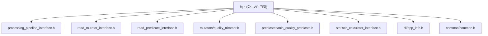

# API参考

<cite>
**本文档中引用的文件**  
- [fq.h](file://include/fqtools/fq.h)
- [processing_pipeline_interface.h](file://include/fqtools/processing/processing_pipeline_interface.h)
- [statistic_calculator_interface.h](file://include/fqtools/statistics/statistic_calculator_interface.h)
- [fastq_reader.h](file://include/fqtools/io/fastq_reader.h)
- [fastq_writer.h](file://include/fqtools/io/fastq_writer.h)
- [read_mutator_interface.h](file://include/fqtools/processing/read_mutator_interface.h)
- [read_predicate_interface.h](file://include/fqtools/processing/read_predicate_interface.h)
- [fastq_io.h](file://include/fqtools/io/fastq_io.h)
- [statistic_interface.h](file://include/fqtools/statistics/statistic_interface.h)
- [factory.cpp](file://src/processing/factory.cpp)
- [error.h](file://include/fqtools/error/error.h)
- [config.h](file://include/fqtools/config/config.h)
- [common.h](file://include/fqtools/common/common.h)
- [object_pool.h](file://include/fqtools/memory/object_pool.h)
</cite>

## 目录
1. [简介](#简介)
2. [公共API概览](#公共api概览)
3. [处理管道接口](#处理管道接口)
4. [统计计算器接口](#统计计算器接口)
5. [IO接口](#io接口)
6. [数据处理接口](#数据处理接口)
7. [错误处理](#错误处理)
8. [配置系统](#配置系统)
9. [工具与辅助类](#工具与辅助类)
10. [设计模式与架构](#设计模式与架构)
11. [集成与使用示例](#集成与使用示例)

## 简介
本API参考文档面向希望将fastq-tools作为C++库集成到其项目中的开发者。文档以`include/fqtools/fq.h`为入口点，系统性地记录了所有公开的头文件、类、函数、枚举和常量。重点文档化了处理流水线（processing_pipeline_interface.h）和统计计算器（statistic_calculator_interface.h）的接口，明确了每个方法的参数类型、默认值、返回值和可能抛出的异常。文档还解释了接口背后的设计模式，如工厂模式创建处理器实例，并提供了C++代码片段，展示如何在另一个项目中通过CMake的`find_package(FastQTools)`链接本库，并调用核心API执行FASTQ文件的读取、处理和分析。

## 公共API概览
`fq.h`是fastq-tools库的公共API门面，提供了一站式入口，聚合了所有对外公共接口。通过包含此头文件，开发者可以访问库的核心功能，包括数据处理、统计分析、IO操作等。



**图源**
- [fq.h](file://include/fqtools/fq.h#L1-L16)

**本节源**
- [fq.h](file://include/fqtools/fq.h#L1-L16)

## 处理管道接口
处理管道接口定义了FastQ数据处理管道的抽象接口，实现了命令行层与具体实现之间的解耦。该接口提供了完整的处理流程控制，包括输入输出设置、配置管理、处理器注册和执行等功能。

### ProcessingStatistics 结构体
记录FastQ数据处理过程中的各项统计指标，用于性能监控和结果分析。

| 成员变量 | 类型 | 描述 |
|---------|------|------|
| totalReads | uint64_t | 总读取数 |
| passedReads | uint64_t | 通过筛选的读取数 |
| filteredReads | uint64_t | 被过滤的读取数 |
| modifiedReads | uint64_t | 被修改的读取数 |
| errorReads | uint64_t | 出错的读取数 |
| inputBytes | uint64_t | 输入字节数（解压后的原始文本字节） |
| outputBytes | uint64_t | 输出字节数（写出前的原始文本字节） |
| elapsedMs | uint64_t | 处理时间（毫秒） |
| processingTimeMs | double | 处理时间（毫秒，浮点数，保留兼容） |
| throughputMbps | double | 吞吐量（MB/s） |

### ProcessingConfig 结构体
定义处理管道的各项配置参数，在接口级别定义以实现客户端解耦。

| 成员变量 | 类型 | 默认值 | 描述 |
|---------|------|--------|------|
| batchSize | size_t | 10000 | 批处理大小（每个批次的读取数量） |
| threadCount | size_t | 1 | 线程数量（1表示串行处理） |
| readChunkBytes | size_t | 1 * 1024 * 1024 | 读取块大小（字节） |
| zlibBufferBytes | size_t | 128 * 1024 | zlib缓冲区大小（字节） |
| writerBufferBytes | size_t | 128 * 1024 | 写入器缓冲区大小（字节） |
| batchCapacityBytes | size_t | 4 * 1024 * 1024 | 批次容量大小（字节） |
| memoryLimitBytes | size_t | 0 | 内存限制（0表示无限制） |
| maxInFlightBatches | size_t | 0 | 最大飞行中批次（0表示无限制） |

### ProcessingPipelineInterface 类
处理管道抽象接口，定义了FastQ数据处理管道的核心接口。

| 方法 | 参数 | 返回值 | 异常 | 描述 |
|------|------|--------|------|------|
| setInputPath | const std::string& inputPath | void | std::invalid_argument | 设置输入文件路径 |
| setOutputPath | const std::string& outputPath | void | std::invalid_argument | 设置输出文件路径 |
| setProcessingConfig | const ProcessingConfig& config | void | std::invalid_argument | 设置处理配置 |
| addReadMutator | std::unique_ptr<ReadMutatorInterface> mutator | void | 无 | 添加数据修改器 |
| addReadPredicate | std::unique_ptr<ReadPredicateInterface> predicate | void | 无 | 添加数据过滤器 |
| run | 无 | ProcessingStatistics | std::runtime_error | 执行数据处理 |

### 工厂函数
```cpp
auto createProcessingPipeline() -> std::unique_ptr<ProcessingPipelineInterface>;
```
创建并返回一个实现了`ProcessingPipelineInterface`接口的对象实例。该函数实现了工厂模式，隐藏了具体的实现类。

**本节源**
- [processing_pipeline_interface.h](file://include/fqtools/processing/processing_pipeline_interface.h#L1-L169)

## 统计计算器接口
统计计算器接口提供了对FASTQ数据执行各种统计分析的高级接口，实现了命令行层与具体实现之间的解耦。

### StatisticOptions 结构体
统计计算任务的配置选项。

| 成员变量 | 类型 | 默认值 | 描述 |
|---------|------|--------|------|
| inputFastqPath | std::string | 无 | 输入FASTQ文件路径 |
| outputStatPath | std::string | 无 | 输出统计文件路径 |
| batchSize | uint32_t | 50000 | 批处理大小 |
| threadCount | uint32_t | 4 | 线程数量 |
| readChunkBytes | size_t | 1 * 1024 * 1024 | 读取块大小（字节） |
| zlibBufferBytes | size_t | 128 * 1024 | zlib缓冲区大小（字节） |
| batchCapacityBytes | size_t | 4 * 1024 * 1024 | 批次容量大小（字节） |
| memoryLimitBytes | size_t | 0 | 内存限制（0表示无限制） |
| maxInFlightBatches | size_t | 0 | 最大飞行中批次（0表示无限制） |

### StatisticCalculatorInterface 类
统计计算任务的抽象接口。

| 方法 | 参数 | 返回值 | 异常 | 描述 |
|------|------|--------|------|------|
| run | 无 | void | 无 | 执行完整的统计生成过程 |

### 工厂函数
```cpp
auto createStatisticCalculator(const StatisticOptions& options) -> std::unique_ptr<StatisticCalculatorInterface>;
```
创建并返回一个实现了`StatisticCalculatorInterface`接口的对象实例。

**本节源**
- [statistic_calculator_interface.h](file://include/fqtools/statistics/statistic_calculator_interface.h#L1-L65)

## IO接口
IO接口提供了对FASTQ文件的读取和写入功能。

### FastqRecord 结构体
FastQ记录视图，零拷贝结构，仅指向FastqBatch中的内存。

| 成员变量 | 类型 | 描述 |
|---------|------|------|
| id | std::string_view | 序列ID（不含@） |
| comment | std::string_view | ID后的注释 |
| seq | std::string_view | 序列内容 |
| qual | std::string_view | 质量值内容 |
| plus | std::string_view | +行内容（通常为空或重复ID） |

### FastqBatch 类
FastQ批数据容器，拥有并管理一块连续内存，用于存储批量的FASTQ记录。

| 方法 | 参数 | 返回值 | 描述 |
|------|------|--------|------|
| clear | 无 | void | 清空数据（复用内存） |
| size | 无 | size_t | 返回记录数量 |
| empty | 无 | bool | 检查是否为空 |
| buffer | 无 | std::vector<char>& | 获取原始数据缓冲区 |
| records | 无 | std::vector<FastqRecord>& | 获取记录列表 |
| moveRemainderToStart | size_t validEndPos | size_t | 将未处理完的碎片移动到缓冲区头部 |

### FastqReader 类
FASTQ文件读取器。

| 构造函数 | 参数 | 描述 |
|----------|------|------|
| FastqReader | const std::string& path | 使用默认选项构造读取器 |
| FastqReader | const std::string& path, const FastqReaderOptions& options | 使用指定选项构造读取器 |

| 方法 | 参数 | 返回值 | 描述 |
|------|------|--------|------|
| nextBatch | FastqBatch& batch | bool | 读取下一个批次 |
| nextBatch | FastqBatch& batch, size_t maxRecords | bool | 读取下一个批次（最多maxRecords条记录） |
| isOpen | 无 | bool | 检查文件是否成功打开 |

### FastqWriter 类
FASTQ文件写入器。

| 构造函数 | 参数 | 描述 |
|----------|------|------|
| FastqWriter | const std::string& path | 使用默认选项构造写入器 |
| FastqWriter | const std::string& path, const FastqWriterOptions& options | 使用指定选项构造写入器 |

| 方法 | 参数 | 返回值 | 描述 |
|------|------|--------|------|
| write | const FastqBatch& batch | void | 写入一个批次 |
| write | const FastqRecord& record | void | 写入一条记录 |
| isOpen | 无 | bool | 检查文件是否成功打开 |
| totalUncompressedBytes | 无 | std::uint64_t | 获取总未压缩字节数 |

**本节源**
- [fastq_io.h](file://include/fqtools/io/fastq_io.h#L1-L118)
- [fastq_reader.h](file://include/fqtools/io/fastq_reader.h#L1-L46)
- [fastq_writer.h](file://include/fqtools/io/fastq_writer.h#L1-L42)

## 数据处理接口
数据处理接口定义了数据修改器和过滤器的抽象接口。

### ReadMutatorInterface 类
数据修改器接口。

| 方法 | 参数 | 返回值 | 描述 |
|------|------|--------|------|
| process | fq::io::FastqRecord& read | void | 处理一条FASTQ记录 |

### ReadPredicateInterface 类
数据过滤器接口。

| 方法 | 参数 | 返回值 | 描述 |
|------|------|--------|------|
| evaluate | const fq::io::FastqRecord& read | bool | 评估一条FASTQ记录是否符合条件 |

### 内置处理器
- **QualityTrimmer**: 质量修剪器，根据质量值修剪序列。
- **MinQualityPredicate**: 最小质量过滤器，过滤质量值低于阈值的序列。

**本节源**
- [read_mutator_interface.h](file://include/fqtools/processing/read_mutator_interface.h#L1-L13)
- [read_predicate_interface.h](file://include/fqtools/processing/read_predicate_interface.h#L1-L14)
- [quality_trimmer.h](file://include/fqtools/processing/mutators/quality_trimmer.h)
- [min_quality_predicate.h](file://include/fqtools/processing/predicates/min_quality_predicate.h)

## 错误处理
项目统一的异常处理框架，定义了所有异常的基类和特定异常类型。

### ErrorCategory 枚举
错误类别枚举。

| 值 | 描述 |
|----|------|
| IO | I/O错误 |
| Format | 格式错误 |
| Validation | 验证错误 |
| Processing | 处理错误 |
| Resource | 资源错误 |
| Configuration | 配置错误 |

### ErrorSeverity 枚举
错误严重性枚举。

| 值 | 描述 |
|----|------|
| Info | 信息 |
| Warning | 警告 |
| Error | 错误 |
| Critical | 严重错误 |

### FastQException 类
项目所有异常的基类。

| 方法 | 返回值 | 描述 |
|------|--------|------|
| category | ErrorCategory | 获取错误类别 |
| severity | ErrorSeverity | 获取错误严重性 |
| message | const std::string& | 获取错误消息 |
| what | const char* | 获取C风格错误消息 |
| isRecoverable | bool | 检查是否可恢复 |

### 特定异常类
- **IOError**: 表示I/O错误的异常。
- **FormatError**: 表示文件格式错误的异常。
- **ConfigurationError**: 表示配置错误的异常。

### ErrorHandler 类
单例错误处理器，用于分发和处理异常。

| 方法 | 参数 | 返回值 | 描述 |
|------|------|--------|------|
| instance | 无 | ErrorHandler& | 获取单例实例 |
| registerHandler | ErrorCategory category, HandlerFunc handler | void | 注册错误处理器 |
| handleError | const FastQException& error | bool | 处理错误 |

**本节源**
- [error.h](file://include/fqtools/error/error.h#L1-L149)

## 配置系统
灵活的配置管理系统，可以从文件、命令行参数和环境变量中加载配置。

### Configuration 类
配置管理类。

| 方法 | 参数 | 返回值 | 异常 | 描述 |
|------|------|--------|------|------|
| loadFromFile | const std::filesystem::path& configFile | void | ConfigurationError | 从配置文件加载配置 |
| loadFromArgs | int argc, char* argv[] | void | ConfigurationError | 从命令行参数加载配置 |
| loadFromEnv | 无 | void | 无 | 从环境变量加载配置 |
| get | std::string_view key | T | ConfigurationError | 获取配置值 |
| getOr | std::string_view key, T defaultValue | T | 无 | 获取配置值或默认值 |
| set | std::string_view key, T value | void | 无 | 设置配置值 |
| hasKey | std::string_view key | bool | 无 | 检查配置键是否存在 |

### 全局配置函数
```cpp
auto globalConfig() -> Configuration&;
template <typename T> auto getConfig(std::string_view key) -> T;
template <typename T> auto getConfigOr(std::string_view key, T defaultValue) -> T;
template <typename T> void setConfig(std::string_view key, T value);
```

**本节源**
- [config.h](file://include/fqtools/config/config.h#L1-L151)

## 工具与辅助类
通用工具和类，例如计时器、日志记录器和字符串处理函数。

### Timer 类
简单的计时器类，用于测量代码块的执行时间。

| 方法 | 参数 | 返回值 | 描述 |
|------|------|--------|------|
| report | 无 | void | 打印已过时间到标准输出 |
| elapsed | 无 | std::chrono::nanoseconds | 获取已过时间 |

### Logger 类
简单的单例日志记录器。

| 方法 | 参数 | 返回值 | 描述 |
|------|------|--------|------|
| instance | 无 | Logger& | 获取日志记录器实例 |
| log | Level level, std::string_view message | void | 记录日志消息 |
| setLevel | Level level | void | 设置日志级别 |
| debug | fmt::format_string<Args...> fmt, Args&&... args | void | 记录DEBUG级别日志 |
| info | fmt::format_string<Args...> fmt, Args&&... args | void | 记录INFO级别日志 |
| warn | fmt::format_string<Args...> fmt, Args&&... args | void | 记录WARN级别日志 |
| error | fmt::format_string<Args...> fmt, Args&&... args | void | 记录ERROR级别日志 |

### IDGenerator 类
线程安全的唯一ID生成器。

| 方法 | 返回值 | 描述 |
|------|--------|------|
| nextId | ID | 获取下一个唯一ID |
| reset | void | 重置ID生成器 |

### 字符串工具函数
- **split**: 按指定分隔符分割字符串。
- **trim**: 移除字符串首尾的空白字符。
- **join**: 使用指定分隔符连接一个字符串向量。

**本节源**
- [common.h](file://include/fqtools/common/common.h#L1-L206)

## 设计模式与架构
### 工厂模式
库广泛使用工厂模式来创建对象实例，隐藏了具体的实现类。例如：
- `createProcessingPipeline()` 创建处理管道实例。
- `createStatisticCalculator()` 创建统计计算器实例。

### PIMPL模式
使用PIMPL（Pointer to IMPLementation）模式隐藏实现细节，减少编译依赖。例如：
- `FastqReader` 和 `FastqWriter` 类使用`Impl`结构体指针。

### RAII
资源获取即初始化（RAII）模式用于自动管理资源，如内存和文件句柄。

### 策略模式
通过接口定义策略，允许在运行时选择不同的实现。例如：
- `ReadMutatorInterface` 和 `ReadPredicateInterface` 允许用户定义自定义的数据处理策略。

**本节源**
- [factory.cpp](file://src/processing/factory.cpp#L1-L31)
- [fastq_reader.h](file://include/fqtools/io/fastq_reader.h#L1-L46)
- [fastq_writer.h](file://include/fqtools/io/fastq_writer.h#L1-L42)

## 集成与使用示例
### CMake集成
在CMake项目中集成fastq-tools库：

```cmake
find_package(FastQTools REQUIRED)
target_link_libraries(your_target PRIVATE FastQTools::FastQTools)
```

### 使用示例
```cpp
#include "fqtools/fq.h"

int main() {
    // 创建处理管道
    auto pipeline = fq::processing::createProcessingPipeline();
    
    // 设置输入输出
    pipeline->setInputPath("input.fastq.gz");
    pipeline->setOutputPath("output.fastq.gz");
    
    // 配置处理参数
    fq::processing::ProcessingConfig config;
    config.batchSize = 5000;
    config.threadCount = 4;
    pipeline->setProcessingConfig(config);
    
    // 添加处理器
    auto trimmer = std::make_unique<fq::processing::QualityTrimmer>(20);
    pipeline->addReadMutator(std::move(trimmer));
    
    auto predicate = std::make_unique<fq::processing::MinQualityPredicate>(15);
    pipeline->addReadPredicate(std::move(predicate));
    
    // 执行处理
    try {
        auto stats = pipeline->run();
        std::cout << stats.toString() << std::endl;
    } catch (const fq::error::FastQException& e) {
        std::cerr << "Error: " << e.what() << std::endl;
        return 1;
    }
    
    return 0;
}
```

**本节源**
- [fq.h](file://include/fqtools/fq.h#L1-L16)
- [processing_pipeline_interface.h](file://include/fqtools/processing/processing_pipeline_interface.h#L1-L169)
- [error.h](file://include/fqtools/error/error.h#L1-L149)