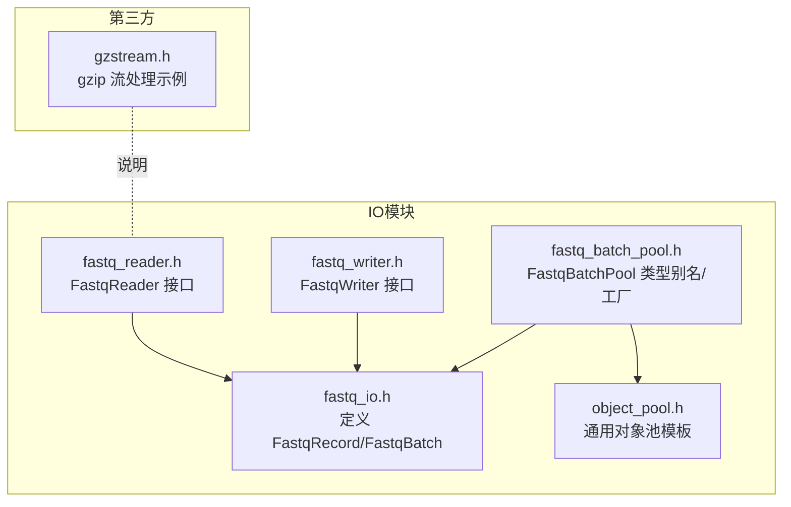
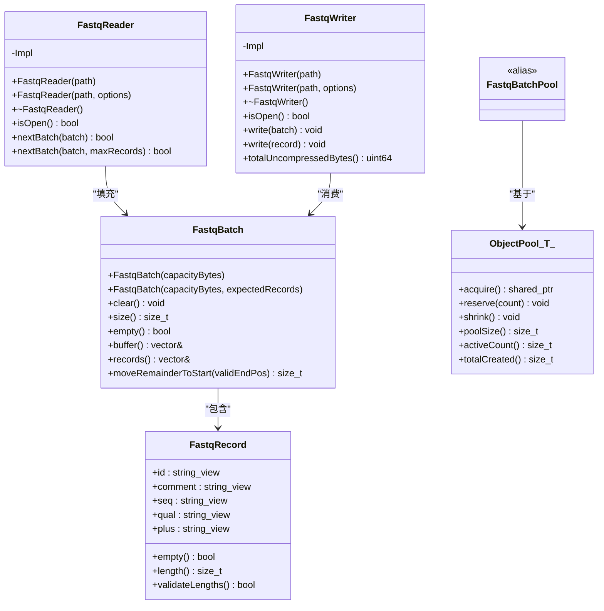
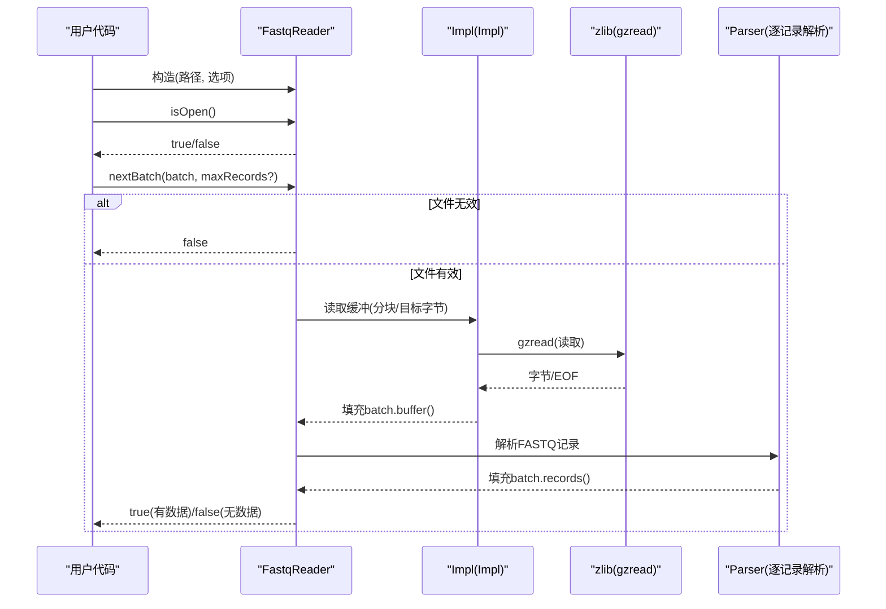
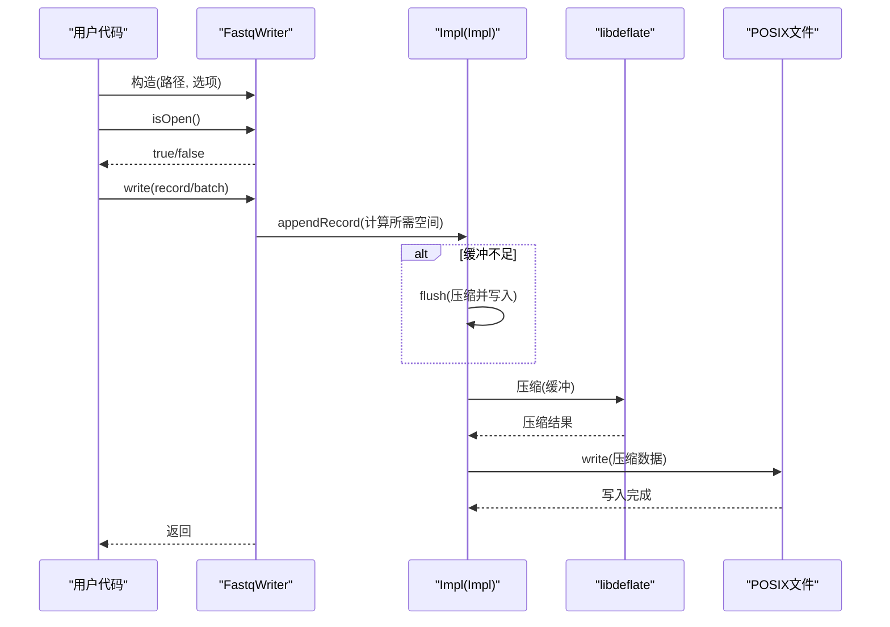
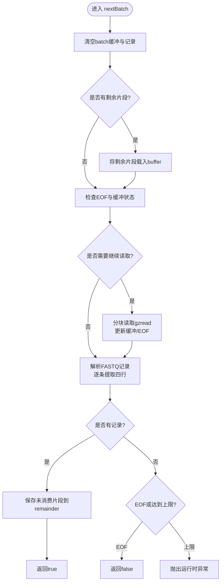
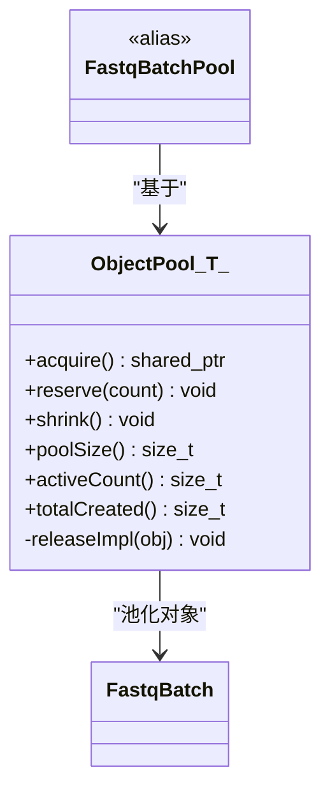
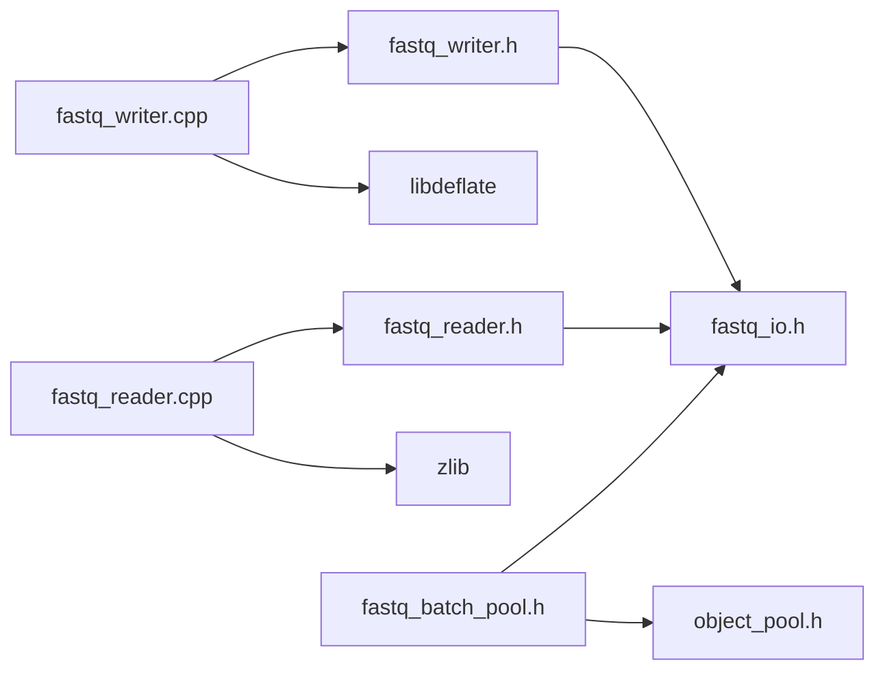

# IO模块API

<cite>
**本文引用的文件**
- [fastq_reader.h](file://include/fqtools/io/fastq_reader.h)
- [fastq_writer.h](file://include/fqtools/io/fastq_writer.h)
- [fastq_batch_pool.h](file://include/fqtools/io/fastq_batch_pool.h)
- [object_pool.h](file://include/fqtools/memory/object_pool.h)
- [fastq_io.h](file://include/fqtools/io/fastq_io.h)
- [fastq_reader.cpp](file://src/io/fastq_reader.cpp)
- [fastq_writer.cpp](file://src/io/fastq_writer.cpp)
- [gzstream.h](file://third_party/gzstream/include/gzstream.h)
- [test_fastq_reader.cpp](file://tests/unit/io/test_fastq_reader.cpp)
- [test_writer.cpp](file://tests/unit/io/test_writer.cpp)
- [test_object_pool.cpp](file://tests/unit/memory/test_object_pool.cpp)
- [CMakeLists.txt](file://CMakeLists.txt)
</cite>

## 目录
1. [简介](#简介)
2. [项目结构](#项目结构)
3. [核心组件](#核心组件)
4. [架构总览](#架构总览)
5. [详细组件分析](#详细组件分析)
6. [依赖关系分析](#依赖关系分析)
7. [性能考量](#性能考量)
8. [故障排查指南](#故障排查指南)
9. [结论](#结论)
10. [附录](#附录)

## 简介
本文件为FASTQ IO模块的API文档，面向需要直接控制FASTQ文件读写的开发者。重点覆盖以下内容：
- fastq_reader.h中的FastqReader类接口：构造函数参数、读取方法、流式处理与内存效率设计、异常处理。
- fastq_writer.h中的FastqWriter类接口：构造函数参数、写入方法、压缩输出（gzip）、统计未压缩字节。
- fastq_batch_pool.h中的批量数据处理内存管理机制，及其与通用对象池object_pool.h的关联。
- 提供代码片段路径，展示如何配置IO选项、打开文件流、读取FastqBatch数据块以及处理IO错误。
- 强调模块的流式处理特性与内存效率设计。

## 项目结构
IO模块位于include/fqtools/io目录，核心头文件如下：
- fastq_io.h：定义FastqRecord与FastqBatch等基础数据结构。
- fastq_reader.h：FASTQ读取器接口声明。
- fastq_writer.h：FASTQ写入器接口声明。
- fastq_batch_pool.h：FastqBatch专用对象池类型别名与工厂函数。
- object_pool.h：通用对象池模板类，FastqBatchPool基于此实现。
- 第三方压缩流：third_party/gzstream/include/gzstream.h（用于说明gzip流式处理思路，实际Reader/Writer使用zlib/libdeflate）。

图表来源
- [fastq_io.h](file://include/fqtools/io/fastq_io.h#L1-L118)
- [fastq_reader.h](file://include/fqtools/io/fastq_reader.h#L1-L46)
- [fastq_writer.h](file://include/fqtools/io/fastq_writer.h#L1-L42)
- [fastq_batch_pool.h](file://include/fqtools/io/fastq_batch_pool.h#L1-L57)
- [object_pool.h](file://include/fqtools/memory/object_pool.h#L1-L190)
- [gzstream.h](file://third_party/gzstream/include/gzstream.h#L1-L163)

章节来源
- [fastq_io.h](file://include/fqtools/io/fastq_io.h#L1-L118)
- [fastq_reader.h](file://include/fqtools/io/fastq_reader.h#L1-L46)
- [fastq_writer.h](file://include/fqtools/io/fastq_writer.h#L1-L42)
- [fastq_batch_pool.h](file://include/fqtools/io/fastq_batch_pool.h#L1-L57)
- [object_pool.h](file://include/fqtools/memory/object_pool.h#L1-L190)
- [gzstream.h](file://third_party/gzstream/include/gzstream.h#L1-L163)

## 核心组件
- FastqReader：提供流式读取FASTQ文件的能力，支持gzip压缩文件；通过FastqBatch批量返回记录，具备可配置的缓冲策略与边界检查。
- FastqWriter：提供流式写入FASTQ文件的能力，采用libdeflate进行gzip压缩；支持按记录或批次写入，并统计未压缩字节。
- FastqBatch：批量容器，持有连续内存，用于存放多个FastqRecord视图；提供清空与碎片移动等高效操作。
- FastqBatchPool：FastqBatch专用对象池，基于通用ObjectPool实现，支持预分配、重置回调、最大容量限制与自动归还。

章节来源
- [fastq_reader.h](file://include/fqtools/io/fastq_reader.h#L1-L46)
- [fastq_writer.h](file://include/fqtools/io/fastq_writer.h#L1-L42)
- [fastq_io.h](file://include/fqtools/io/fastq_io.h#L1-L118)
- [fastq_batch_pool.h](file://include/fqtools/io/fastq_batch_pool.h#L1-L57)
- [object_pool.h](file://include/fqtools/memory/object_pool.h#L1-L190)

## 架构总览
下图展示了FastqReader与FastqWriter的内部实现与关键依赖关系。

图表来源
- [fastq_reader.h](file://include/fqtools/io/fastq_reader.h#L1-L46)
- [fastq_writer.h](file://include/fqtools/io/fastq_writer.h#L1-L42)
- [fastq_io.h](file://include/fqtools/io/fastq_io.h#L1-L118)
- [object_pool.h](file://include/fqtools/memory/object_pool.h#L1-L190)
- [fastq_batch_pool.h](file://include/fqtools/io/fastq_batch_pool.h#L1-L57)

## 详细组件分析

### FastqReader 接口与实现
- 构造函数
  - FastqReader(const std::string& path)
  - FastqReader(const std::string& path, const FastqReaderOptions& options)
  - 选项结构体FastqReaderOptions包含：
    - readChunkBytes：单次读取块大小，默认1MB
    - zlibBufferBytes：zlib内部缓冲大小，默认128KB
    - maxBufferBytes：最大缓冲上限，0表示不限制
- 成员方法
  - isOpen()：检查底层文件句柄是否有效
  - nextBatch(FastqBatch& batch)：读取一批FASTQ记录，返回是否成功
  - nextBatch(FastqBatch& batch, size_t maxRecords)：限制最多读取的记录数
- 实现要点
  - 使用zlib的gzread进行流式读取，支持gzip压缩文件
  - 通过分块读取与目标字节数策略控制内存占用
  - 解析FASTQ格式：逐条解析@、序列、+、质量四行，遇到不完整记录会缓存剩余片段
  - 当达到maxBufferBytes且无法解析完整记录时抛出异常
  - EOF检测与错误处理：gzread返回负值时抛出运行时异常
- 异常处理
  - 格式错误：当记录起始不是'@'或第三行不是'+'时抛出运行时异常
  - IO错误：zlib读取失败时抛出运行时异常
  - 缓冲上限：超过maxBufferBytes仍未解析完整记录时抛出运行时异常

图表来源
- [fastq_reader.cpp](file://src/io/fastq_reader.cpp#L1-L255)
- [fastq_reader.h](file://include/fqtools/io/fastq_reader.h#L1-L46)

章节来源
- [fastq_reader.h](file://include/fqtools/io/fastq_reader.h#L1-L46)
- [fastq_reader.cpp](file://src/io/fastq_reader.cpp#L1-L255)

### FastqWriter 接口与实现
- 构造函数
  - FastqWriter(const std::string& path)
  - FastqWriter(const std::string& path, const FastqWriterOptions& options)
  - 选项结构体FastqWriterOptions包含：
    - zlibBufferBytes：输出缓冲大小，默认128KB
    - outputBufferBytes：输出缓冲大小，默认128KB
- 成员方法
  - isOpen()：检查底层文件描述符是否有效
  - write(const FastqBatch& batch)：写入一批FASTQ记录
  - write(const FastqRecord& record)：写入单条FASTQ记录
  - totalUncompressedBytes()：返回累计未压缩字节数
- 实现要点
  - 使用POSIX open/write进行文件写入
  - 使用libdeflate进行gzip压缩，压缩级别默认6
  - 内部缓冲满或单条记录过大时触发flush，必要时扩容缓冲
  - 统计未压缩字节，便于后续分析
- 异常处理
  - 打开文件失败：抛出运行时异常
  - 分配压缩器失败：抛出运行时异常
  - 写入短写：当前实现记录日志，未抛出异常（建议上层捕获）

图表来源
- [fastq_writer.cpp](file://src/io/fastq_writer.cpp#L1-L146)
- [fastq_writer.h](file://include/fqtools/io/fastq_writer.h#L1-L42)

章节来源
- [fastq_writer.h](file://include/fqtools/io/fastq_writer.h#L1-L42)
- [fastq_writer.cpp](file://src/io/fastq_writer.cpp#L1-L146)

### FastqBatch 与 FastqRecord
- FastqRecord
  - 字段：id、comment、seq、qual、plus（string_view零拷贝视图）
  - 辅助方法：empty()、length()、validateLengths()（校验序列与质量长度一致）
- FastqBatch
  - 容器：内部维护连续字符缓冲与记录向量
  - 方法：clear()、size()/empty()、迭代器、buffer()/records()访问器、moveRemainderToStart()用于碎片移动
  - 设计：通过预留容量与就地操作减少分配次数，提升流式处理效率

图表来源
- [fastq_reader.cpp](file://src/io/fastq_reader.cpp#L1-L255)
- [fastq_io.h](file://include/fqtools/io/fastq_io.h#L1-L118)

章节来源
- [fastq_io.h](file://include/fqtools/io/fastq_io.h#L1-L118)
- [fastq_reader.cpp](file://src/io/fastq_reader.cpp#L1-L255)

### FastqBatchPool 与 ObjectPool
- FastqBatchPool
  - 类型别名：using FastqBatchPool = fq::memory::ObjectPool<FastqBatch>
  - 工厂函数：createFastqBatchPool(initialSize, maxSize)返回shared_ptr，内部使用默认重置函数resetFastqBatch
  - 重置函数：resetFastqBatch(FastqBatch& batch)调用batch.clear()，保留容量但清空内容
- ObjectPool<T>
  - acquire()：返回shared_ptr，析构时自动归还；支持重置回调resetFunc
  - reserve(count)：预分配对象
  - shrink()：收缩池，释放未使用对象
  - 监控方法：poolSize()/activeCount()/totalCreated()
  - 最大容量：maxSize==0表示无限制；超过上限的对象不再归还，直接销毁
- 关联关系
  - FastqBatchPool基于ObjectPool<FastqBatch>实现，利用shared_ptr自定义删除器与weak_ptr避免循环引用
  - 适用于高频创建/销毁的场景，显著降低内存分配开销

图表来源
- [object_pool.h](file://include/fqtools/memory/object_pool.h#L1-L190)
- [fastq_batch_pool.h](file://include/fqtools/io/fastq_batch_pool.h#L1-L57)

章节来源
- [fastq_batch_pool.h](file://include/fqtools/io/fastq_batch_pool.h#L1-L57)
- [object_pool.h](file://include/fqtools/memory/object_pool.h#L1-L190)
- [test_object_pool.cpp](file://tests/unit/memory/test_object_pool.cpp#L1-L286)

## 依赖关系分析
- 依赖库
  - zlib：用于FastqReader的zlib流读取与错误码查询
  - libdeflate：用于FastqWriter的gzip压缩
  - BZip2、LibLZMA：CMake中声明依赖（用于其他模块），IO模块主要使用zlib/libdeflate
- 头文件依赖
  - fastq_reader.h/fastq_writer.h依赖fastq_io.h
  - fastq_batch_pool.h依赖fastq_io.h与object_pool.h
  - 实现文件fastq_reader.cpp/fastq_writer.cpp分别实现读取与写入逻辑

图表来源
- [fastq_reader.cpp](file://src/io/fastq_reader.cpp#L1-L255)
- [fastq_writer.cpp](file://src/io/fastq_writer.cpp#L1-L146)
- [fastq_reader.h](file://include/fqtools/io/fastq_reader.h#L1-L46)
- [fastq_writer.h](file://include/fqtools/io/fastq_writer.h#L1-L42)
- [fastq_batch_pool.h](file://include/fqtools/io/fastq_batch_pool.h#L1-L57)
- [object_pool.h](file://include/fqtools/memory/object_pool.h#L1-L190)
- [CMakeLists.txt](file://CMakeLists.txt#L66-L78)

章节来源
- [CMakeLists.txt](file://CMakeLists.txt#L66-L78)
- [fastq_reader.cpp](file://src/io/fastq_reader.cpp#L1-L255)
- [fastq_writer.cpp](file://src/io/fastq_writer.cpp#L1-L146)

## 性能考量
- 流式处理与内存效率
  - FastqReader采用分块读取与目标字节策略，结合maxBufferBytes限制，避免一次性加载整个文件到内存。
  - FastqBatch通过连续缓冲与就地解析，减少多次分配与拷贝；moveRemainderToStart使用memmove语义，避免额外分配。
  - FastqWriter内部缓冲与libdeflate压缩，按需flush，降低系统调用次数。
- 对象池优化
  - FastqBatchPool复用FastqBatch对象，减少频繁分配/释放带来的开销；配合resetFastqBatch保留容量，进一步提升吞吐。
- 压缩格式
  - Reader通过zlib支持gzip；Writer通过libdeflate输出gzip；未见.bzip2/.xz原生支持，如需请使用外部工具或替换实现。

[本节为通用性能讨论，不直接分析具体文件]

## 故障排查指南
- 常见异常与定位
  - 格式错误：当记录起始不是'@'或第三行不是'+'时抛出运行时异常。检查输入文件是否为合法FASTQ格式。
  - IO错误：zlib读取返回负值时抛出运行时异常。检查文件路径、权限与磁盘空间。
  - 缓冲上限：超过maxBufferBytes仍未解析完整记录时抛出运行时异常。适当增大maxBufferBytes或检查数据完整性。
  - 打开文件失败：Writer构造阶段open失败抛出运行时异常。检查路径与权限。
  - 分配压缩器失败：libdeflate分配失败抛出运行时异常。检查系统资源与依赖库版本。
- 单元测试参考
  - 读取器测试：验证基本读取、ID/注释/序列/质量字段正确性，以及EOF后无数据。
  - 写入器测试：验证写入两条记录、文件非空、可被gzopen读取。
  - 对象池测试：验证acquire/reuse、自动归还、预分配、监控方法、并发安全性与集成测试。

章节来源
- [fastq_reader.cpp](file://src/io/fastq_reader.cpp#L1-L255)
- [fastq_writer.cpp](file://src/io/fastq_writer.cpp#L1-L146)
- [test_fastq_reader.cpp](file://tests/unit/io/test_fastq_reader.cpp#L1-L76)
- [test_writer.cpp](file://tests/unit/io/test_writer.cpp#L1-L64)
- [test_object_pool.cpp](file://tests/unit/memory/test_object_pool.cpp#L1-L286)

## 结论
- FastqReader与FastqWriter提供了高效的流式FASTQ读写能力，支持gzip压缩与批量处理。
- FastqBatchPool通过对象池机制显著降低内存分配开销，适合高吞吐场景。
- 代码路径清晰，异常处理明确，便于在生产环境中稳定使用。
- 若需.bzip2/.xz支持，可在现有框架基础上扩展压缩后端。

[本节为总结性内容，不直接分析具体文件]

## 附录

### API速查表（构造与方法）
- FastqReader
  - 构造：FastqReader(path)、FastqReader(path, options)
  - 方法：isOpen()、nextBatch(batch)、nextBatch(batch, maxRecords)
  - 选项：readChunkBytes、zlibBufferBytes、maxBufferBytes
- FastqWriter
  - 构造：FastqWriter(path)、FastqWriter(path, options)
  - 方法：isOpen()、write(batch)、write(record)、totalUncompressedBytes()
  - 选项：zlibBufferBytes、outputBufferBytes
- FastqBatch
  - 方法：clear()、size()/empty()、buffer()/records()、moveRemainderToStart()
- FastqBatchPool
  - 工厂：createFastqBatchPool(initialSize, maxSize)
  - 类型别名：using FastqBatchPool = ObjectPool<FastqBatch>

章节来源
- [fastq_reader.h](file://include/fqtools/io/fastq_reader.h#L1-L46)
- [fastq_writer.h](file://include/fqtools/io/fastq_writer.h#L1-L42)
- [fastq_io.h](file://include/fqtools/io/fastq_io.h#L1-L118)
- [fastq_batch_pool.h](file://include/fqtools/io/fastq_batch_pool.h#L1-L57)
- [object_pool.h](file://include/fqtools/memory/object_pool.h#L1-L190)

### 代码片段路径示例
- 配置IO选项与打开文件流
  - Reader选项：参见FastqReaderOptions字段定义
    - [fastq_reader.h](file://include/fqtools/io/fastq_reader.h#L11-L16)
  - Writer选项：参见FastqWriterOptions字段定义
    - [fastq_writer.h](file://include/fqtools/io/fastq_writer.h#L11-L15)
- 读取FastqBatch数据块
  - 基本读取流程与边界检查
    - [fastq_reader.cpp](file://src/io/fastq_reader.cpp#L53-L252)
  - 单元测试示例（构造Reader、读取Batch、断言）
    - [test_fastq_reader.cpp](file://tests/unit/io/test_fastq_reader.cpp#L43-L69)
- 写入FASTQ记录
  - 写入单条/批量记录与flush逻辑
    - [fastq_writer.cpp](file://src/io/fastq_writer.cpp#L94-L143)
  - 单元测试示例（构造Writer、写入两条记录、验证gzip文件）
    - [test_writer.cpp](file://tests/unit/io/test_writer.cpp#L25-L61)
- 对象池使用
  - 创建FastqBatchPool与acquire/release
    - [fastq_batch_pool.h](file://include/fqtools/io/fastq_batch_pool.h#L41-L54)
  - 对象池行为验证（预分配、自动归还、监控）
    - [test_object_pool.cpp](file://tests/unit/memory/test_object_pool.cpp#L44-L165)