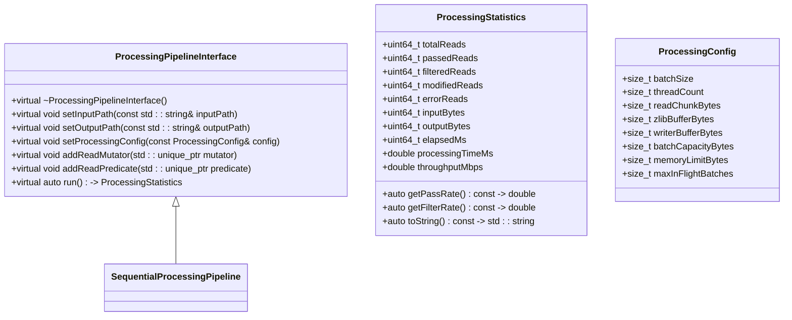
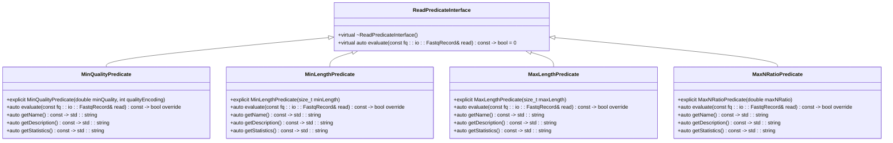
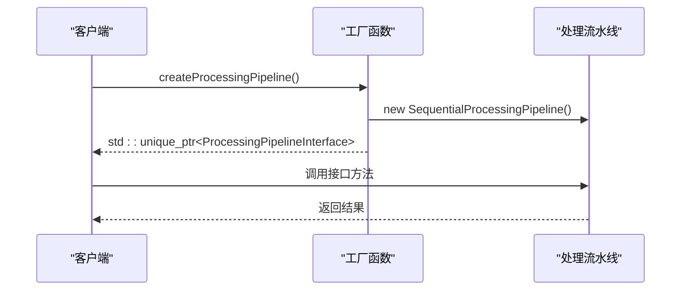
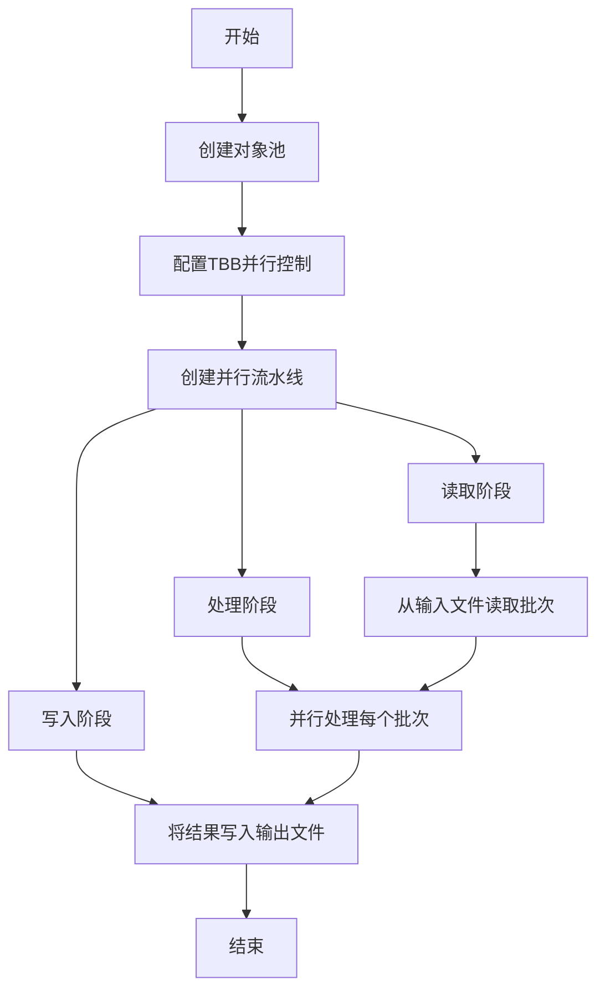

# 处理流水线API

<cite>
**本文档引用的文件**   
- [processing_pipeline_interface.h](file://include/fqtools/processing/processing_pipeline_interface.h)
- [read_mutator_interface.h](file://include/fqtools/processing/read_mutator_interface.h)
- [read_predicate_interface.h](file://include/fqtools/processing/read_predicate_interface.h)
- [quality_trimmer.h](file://include/fqtools/processing/mutators/quality_trimmer.h)
- [min_quality_predicate.h](file://include/fqtools/processing/predicates/min_quality_predicate.h)
- [processing_pipeline.cpp](file://src/processing/processing_pipeline.cpp)
- [quality_trimmer.cpp](file://src/processing/mutators/quality_trimmer.cpp)
- [min_quality_predicate.cpp](file://src/processing/predicates/min_quality_predicate.cpp)
- [factory.cpp](file://src/processing/factory.cpp)
- [filter_command.cpp](file://src/cli/commands/filter_command.cpp)
</cite>

## 目录
1. [简介](#简介)
2. [核心组件](#核心组件)
3. [处理流水线接口](#处理流水线接口)
4. [读段修饰器接口](#读段修饰器接口)
5. [过滤谓词接口](#过滤谓词接口)
6. [工厂模式与实例创建](#工厂模式与实例创建)
7. [并行处理机制](#并行处理机制)
8. [性能考量](#性能考量)
9. [代码示例](#代码示例)

## 简介
本文档详细阐述了FastQ工具库中的处理流水线API，重点介绍`processing_pipeline_interface.h`中定义的公共接口。文档涵盖了处理流水线的创建、配置和执行方法，以及如何通过工厂模式注入自定义的读段修饰器（mutators）和过滤谓词（predicates）。同时，解释了`read_mutator_interface.h`和`read_predicate_interface.h`的抽象设计，以及如何实现这些接口来扩展功能。以`quality_trimmer.h`和`min_quality_predicate.h`为例，提供了实现自定义处理逻辑的完整代码示例，并说明了流水线的并行处理机制和性能考量。

## 核心组件
处理流水线API的核心组件包括处理流水线接口、读段修饰器接口、过滤谓词接口、处理统计信息和处理配置。这些组件共同构成了一个灵活、可扩展的数据处理框架，支持串行和并行处理模式。

**本节来源**
- [processing_pipeline_interface.h](file://include/fqtools/processing/processing_pipeline_interface.h#L25-L71)

## 处理流水线接口
`ProcessingPipelineInterface`是处理流水线的核心抽象接口，定义了FastQ数据处理管道的完整控制流程。该接口实现了命令行层与具体实现之间的解耦，支持多种实现方式，如串行处理和并行处理。

### 处理统计信息
`ProcessingStatistics`结构体记录了FastQ数据处理过程中的各项统计指标，用于性能监控和结果分析。它包含了总读取数、通过筛选的读取数、被过滤的读取数、被修改的读取数、出错的读取数、输入字节数、输出字节数、处理时间（毫秒）和吞吐量（MB/s）等关键指标。

### 处理配置
`ProcessingConfig`结构体定义了处理管道的各项配置参数，包括批处理大小、线程数量、读取块大小、zlib缓冲区大小、写入器缓冲区大小、批处理容量大小、内存限制和最大飞行中批次等关键性能参数。

### 接口方法
`ProcessingPipelineInterface`提供了以下核心方法：
- `setInputPath`: 设置输入文件路径
- `setOutputPath`: 设置输出文件路径
- `setProcessingConfig`: 设置处理配置
- `addReadMutator`: 添加数据修改器
- `addReadPredicate`: 添加数据过滤器
- `run`: 执行数据处理并返回统计信息



**图示来源**
- [processing_pipeline_interface.h](file://include/fqtools/processing/processing_pipeline_interface.h#L82-L166)

**本节来源**
- [processing_pipeline_interface.h](file://include/fqtools/processing/processing_pipeline_interface.h#L82-L166)

## 读段修饰器接口
`ReadMutatorInterface`是数据修改器的抽象基类，定义了对读取数据进行转换处理的统一接口。所有自定义的读段修饰器都必须继承并实现此接口。

### 接口设计
`ReadMutatorInterface`是一个简单的抽象类，只包含一个纯虚函数`process`，该函数接收一个`FastqRecord`引用并对其进行修改。这种设计使得任何实现了该接口的类都可以被注入到处理流水线中，实现灵活的功能扩展。

### 实现示例
`QualityTrimmer`是`ReadMutatorInterface`的一个具体实现，用于根据质量阈值修剪读段。它支持三种修剪模式：两端修剪、5'端修剪和3'端修剪。该实现还包含了AVX2指令集的优化，以提高处理性能。

```mermaid
classDiagram
class ReadMutatorInterface {
+virtual ~ReadMutatorInterface()
+virtual void process(fq : : io : : FastqRecord& read) = 0
}
class QualityTrimmer {
+enum class TrimMode { Both, FivePrime, ThreePrime }
+QualityTrimmer(double qualityThreshold, size_t minLength, TrimMode mode, int qualityEncoding)
+void process(fq : : io : : FastqRecord& read) override
+auto getName() const -> std : : string
+auto getDescription() const -> std : : string
+void reset()
}
class LengthTrimmer {
+enum class TrimStrategy { FixedLength, MaxLength, FromStart, FromEnd }
+LengthTrimmer(size_t targetLength, TrimStrategy strategy)
+void process(fq : : io : : FastqRecord& read) override
+auto getName() const -> std : : string
+auto getDescription() const -> std : : string
+void reset()
}
class AdapterTrimmer {
+AdapterTrimmer(const std : : vector<std : : string>& adapterSequences, size_t minOverlap, size_t maxMismatches)
+void process(fq : : io : : FastqRecord& read) override
+auto getName() const -> std : : string
+auto getDescription() const -> std : : string
+void reset()
}
ReadMutatorInterface <|-- QualityTrimmer
ReadMutatorInterface <|-- LengthTrimmer
ReadMutatorInterface <|-- AdapterTrimmer
```

**图示来源**
- [read_mutator_interface.h](file://include/fqtools/processing/read_mutator_interface.h#L6-L10)
- [quality_trimmer.h](file://include/fqtools/processing/mutators/quality_trimmer.h#L13-L90)

**本节来源**
- [read_mutator_interface.h](file://include/fqtools/processing/read_mutator_interface.h#L6-L10)
- [quality_trimmer.h](file://include/fqtools/processing/mutators/quality_trimmer.h#L13-L90)

## 过滤谓词接口
`ReadPredicateInterface`是数据过滤器的抽象基类，定义了筛选符合条件的读取的统一接口。所有自定义的过滤谓词都必须继承并实现此接口。

### 接口设计
`ReadPredicateInterface`是一个简单的抽象类，只包含一个纯虚函数`evaluate`，该函数接收一个`const FastqRecord`引用并返回一个布尔值，表示该读取是否通过筛选。这种设计使得任何实现了该接口的类都可以被注入到处理流水线中，实现灵活的筛选逻辑。

### 实现示例
`MinQualityPredicate`是`ReadPredicateInterface`的一个具体实现，用于根据平均质量阈值过滤读段。它计算每个读段的平均质量，并与预设的阈值进行比较，只有平均质量高于阈值的读段才会通过筛选。



**图示来源**
- [read_predicate_interface.h](file://include/fqtools/processing/read_predicate_interface.h#L7-L11)
- [min_quality_predicate.h](file://include/fqtools/processing/predicates/min_quality_predicate.h#L12-L79)

**本节来源**
- [read_predicate_interface.h](file://include/fqtools/processing/read_predicate_interface.h#L7-L11)
- [min_quality_predicate.h](file://include/fqtools/processing/predicates/min_quality_predicate.h#L12-L79)

## 工厂模式与实例创建
处理流水线API采用了工厂模式来创建处理管道实例，隐藏了具体的实现类，实现了客户端与实现之间的解耦。

### 工厂函数
`createProcessingPipeline`是一个工厂函数，创建并返回一个实现了`ProcessingPipelineInterface`接口的对象实例。该函数返回一个`std::unique_ptr<ProcessingPipelineInterface>`，调用者负责管理返回的实例生命周期。

### 实现细节
在`factory.cpp`中，`createProcessingPipeline`函数的具体实现是创建一个`SequentialProcessingPipeline`的实例。这种设计使得客户端代码无需知道具体的实现类，只需要通过工厂函数获取接口实例即可。



**图示来源**
- [factory.cpp](file://src/processing/factory.cpp#L26-L28)

**本节来源**
- [factory.cpp](file://src/processing/factory.cpp#L26-L28)

## 并行处理机制
处理流水线支持并行处理模式，利用Intel TBB（Threading Building Blocks）库实现高效的并行数据处理。

### 并行流水线
当配置的线程数大于1时，处理流水线会使用TBB的`parallel_pipeline`功能来实现并行处理。并行流水线由三个阶段组成：
1. **读取阶段**：串行有序地从输入文件读取数据批次
2. **处理阶段**：并行地处理每个数据批次
3. **写入阶段**：串行有序地将处理结果写入输出文件

### 对象池
为了减少内存分配开销，处理流水线使用了`FastqBatch`对象池。对象池预分配了多个`FastqBatch`对象，供并行流水线的各个阶段复用，从而避免了频繁的内存分配和释放。



**本节来源**
- [processing_pipeline.cpp](file://src/processing/processing_pipeline.cpp#L138-L235)

## 性能考量
处理流水线的设计充分考虑了性能优化，包括批处理、并行处理、内存管理和I/O优化等方面。

### 批处理
处理流水线采用批处理模式，将多个读段组合成一个批次进行处理。这减少了函数调用开销和I/O操作次数，提高了处理效率。

### 内存管理
通过使用`FastqBatch`对象池和预分配内存，处理流水线减少了动态内存分配的开销，避免了内存碎片，提高了内存使用效率。

### I/O优化
处理流水线对读取和写入操作进行了优化，包括使用合适的缓冲区大小、预读取和异步I/O等技术，以最大化I/O吞吐量。

**本节来源**
- [processing_pipeline.cpp](file://src/processing/processing_pipeline.cpp#L1-L238)

## 代码示例
以下是一个使用处理流水线API的完整代码示例：

```cpp
// 创建处理流水线实例
auto pipeline = fq::processing::createProcessingPipeline();

// 设置输入输出路径
pipeline->setInputPath("input.fastq");
pipeline->setOutputPath("output.fastq");

// 配置处理参数
fq::processing::ProcessingConfig config;
config.batchSize = 10000;
config.threadCount = 4;
pipeline->setProcessingConfig(config);

// 添加过滤谓词
pipeline->addReadPredicate(std::make_unique<fq::processing::MinQualityPredicate>(20.0, 33));
pipeline->addReadPredicate(std::make_unique<fq::processing::MinLengthPredicate>(50));

// 添加读段修饰器
pipeline->addReadMutator(std::make_unique<fq::processing::QualityTrimmer>(20.0, 50, 
    fq::processing::QualityTrimmer::TrimMode::Both, 33));

// 执行处理
auto stats = pipeline->run();

// 输出统计信息
std::cout << stats.toString() << std::endl;
```

**本节来源**
- [filter_command.cpp](file://src/cli/commands/filter_command.cpp#L26-L152)