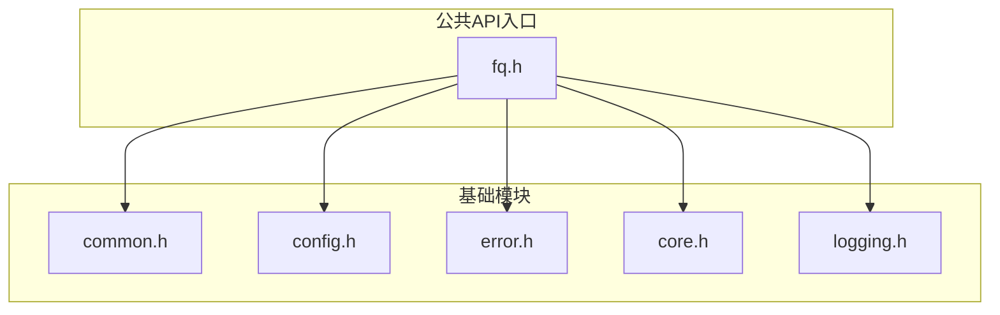
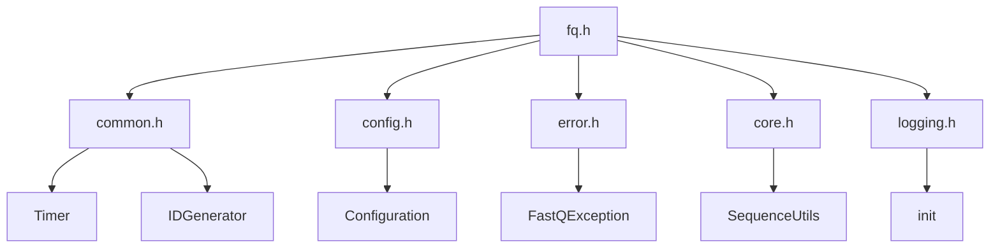
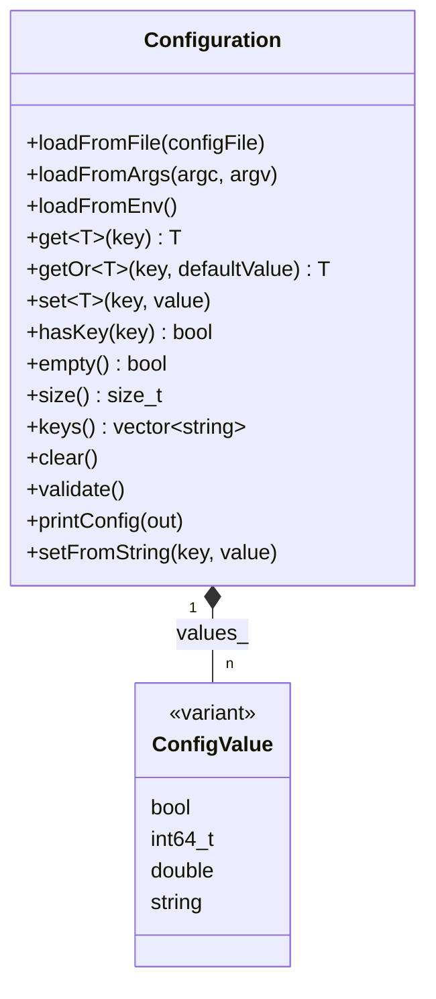
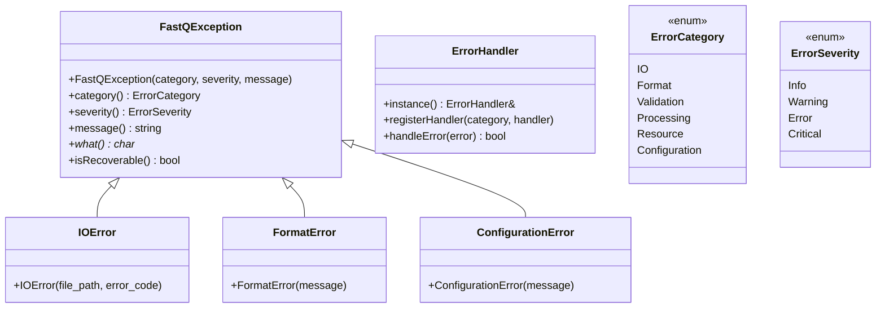
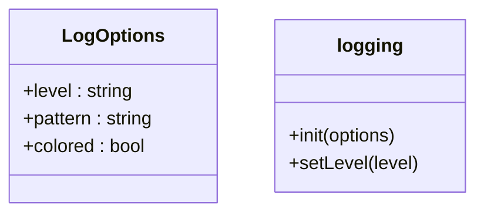
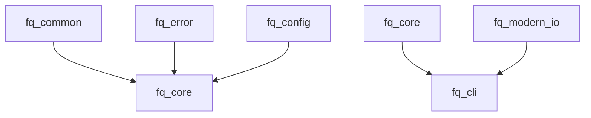

# 核心API

<cite>
**本文档引用的文件**   
- [fq.h](file://include/fqtools/fq.h)
- [core.h](file://include/fqtools/core/core.h)
- [common.h](file://include/fqtools/common/common.h)
- [config.h](file://include/fqtools/config/config.h)
- [error.h](file://include/fqtools/error/error.h)
- [logging.h](file://include/fqtools/logging.h)
</cite>

## 目录
1. [简介](#简介)
2. [项目结构](#项目结构)
3. [核心组件](#核心组件)
4. [架构概述](#架构概述)
5. [详细组件分析](#详细组件分析)
6. [依赖分析](#依赖分析)
7. [性能考虑](#性能考虑)
8. [故障排除指南](#故障排除指南)
9. [结论](#结论)
10. [附录](#附录) (如有必要)

## 简介
本文档旨在为fastq-tools项目创建详尽的核心API文档，聚焦于项目的基础公共接口。以fq.h为总入口，系统性地记录core、common、config、error和logging模块的公开类、函数、枚举和常量。文档详细说明了核心初始化、全局配置管理（config.h）、错误处理机制（error.h）和日志记录（logging.h）的使用方法，并解释了这些基础组件如何为上层功能提供支持。所有内容均与头文件中的Doxygen注释严格一致，并明确指出这些头文件是库集成的公共API边界。

## 项目结构
fastq-tools项目的结构遵循模块化设计原则，将功能划分为独立的模块。核心公共API位于`include/fqtools/`目录下，其中`fq.h`作为总入口头文件，聚合了所有对外公共接口。基础模块包括`common`（通用工具）、`config`（配置管理）、`error`（错误处理）、`core`（核心功能）和`logging`（日志记录）。这些模块通过CMake构建系统进行管理，依赖方向自下而上，确保了良好的模块化和可维护性。

**Diagram sources**
- [fq.h](file://include/fqtools/fq.h#L1-L16)
- [common.h](file://include/fqtools/common/common.h#L1-L206)
- [config.h](file://include/fqtools/config/config.h#L1-L151)
- [error.h](file://include/fqtools/error/error.h#L1-L149)
- [logging.h](file://include/fqtools/logging.h#L1-L62)

**Section sources**
- [fq.h](file://include/fqtools/fq.h#L1-L16)
- [CMakeLists.txt](file://CMakeLists.txt#L1-L100)

## 核心组件
本节深入分析fastq-tools项目的核心组件，包括其公共类、函数、枚举和常量。这些组件构成了库的基础，为上层应用提供了必要的功能支持。

**Section sources**
- [fq.h](file://include/fqtools/fq.h#L1-L16)
- [core.h](file://include/fqtools/core/core.h#L1-L359)
- [common.h](file://include/fqtools/common/common.h#L1-L206)
- [config.h](file://include/fqtools/config/config.h#L1-L151)
- [error.h](file://include/fqtools/error/error.h#L1-L149)
- [logging.h](file://include/fqtools/logging.h#L1-L62)

## 架构概述
fastq-tools的架构设计遵循分层原则，从基础的通用工具到核心功能，再到应用层。`fq.h`作为公共API的单一入口，简化了用户的集成过程。`common`模块提供了如计时器、ID生成器等通用工具；`config`模块负责全局配置的加载和管理；`error`模块定义了统一的异常处理框架；`core`模块包含了FastQ数据处理的核心逻辑；`logging`模块则提供了日志记录功能。这些模块通过清晰的接口进行交互，确保了系统的稳定性和可扩展性。

**Diagram sources**
- [fq.h](file://include/fqtools/fq.h#L1-L16)
- [common.h](file://include/fqtools/common/common.h#L1-L206)
- [config.h](file://include/fqtools/config/config.h#L1-L151)
- [error.h](file://include/fqtools/error/error.h#L1-L149)
- [core.h](file://include/fqtools/core/core.h#L1-L359)
- [logging.h](file://include/fqtools/logging.h#L1-L62)

## 详细组件分析
本节对fastq-tools项目的关键组件进行彻底分析，包括其设计原理、实现细节和使用方法。

### 核心初始化分析
`fq.h`作为项目的总入口头文件，通过包含所有必要的公共头文件，为用户提供了一站式的API访问。这种设计简化了用户的集成过程，避免了繁琐的头文件包含。

**Section sources**
- [fq.h](file://include/fqtools/fq.h#L1-L16)

### 全局配置管理分析
`config.h`模块提供了灵活的配置管理系统，支持从文件、命令行参数和环境变量中加载配置。`Configuration`类是该模块的核心，提供了`loadFromFile`、`loadFromArgs`和`loadFromEnv`等方法来加载配置，并通过`get`和`set`模板方法来访问和修改配置项。

**Diagram sources**
- [config.h](file://include/fqtools/config/config.h#L1-L151)

### 错误处理机制分析
`error.h`模块定义了统一的异常处理框架，所有异常均继承自`FastQException`基类。该框架支持多种错误类别（如IO、格式、验证等）和严重性级别（如信息、警告、错误等），并通过`ErrorHandler`单例来分发和处理异常。

**Diagram sources**
- [error.h](file://include/fqtools/error/error.h#L1-L149)

### 日志记录分析
`logging.h`模块提供了简洁的日志记录接口，通过`init`函数初始化日志系统，并支持设置日志级别和格式。该模块基于spdlog库实现，确保了高性能和灵活性。

**Diagram sources**
- [logging.h](file://include/fqtools/logging.h#L1-L62)

## 依赖分析
fastq-tools项目通过CMake构建系统管理其依赖关系。基础模块如`fq_common`和`fq_error`被`fq_core`等上层模块所依赖，确保了依赖方向的清晰和稳定。`fq_cli`作为应用层，依赖于所有基础模块，实现了命令行工具的功能。

**Diagram sources**
- [CMakeLists.txt](file://CMakeLists.txt#L1-L100)
- [fq_core](file://src/core/CMakeLists.txt#L1-L16)
- [fq_cli](file://src/cli/CMakeLists.txt#L1-L21)

**Section sources**
- [CMakeLists.txt](file://CMakeLists.txt#L1-L100)
- [fq_core](file://src/core/CMakeLists.txt#L1-L16)
- [fq_cli](file://src/cli/CMakeLists.txt#L1-L21)

## 性能考虑
在设计和实现fastq-tools时，性能是一个重要的考虑因素。例如，`Timer`类提供了精确的计时功能，帮助开发者分析代码性能；`PerformanceMetrics`类则用于收集和报告处理过程中的性能指标。此外，配置中的`threadCount`和`batchSize`等参数允许用户根据具体需求调整处理性能。

## 故障排除指南
当使用fastq-tools时，可能会遇到各种问题。建议首先检查配置文件是否正确，确保输入文件路径有效。如果遇到异常，可以通过`ErrorHandler`注册自定义处理函数来捕获和处理特定类型的错误。同时，启用调试日志可以帮助定位问题。

**Section sources**
- [error.h](file://include/fqtools/error/error.h#L1-L149)
- [common.h](file://include/fqtools/common/common.h#L1-L206)

## 结论
本文档详细介绍了fastq-tools项目的核心API，涵盖了从初始化到配置管理、错误处理和日志记录的各个方面。通过遵循这些指导，开发者可以有效地集成和使用fastq-tools库，构建高效、可靠的FastQ数据处理应用。