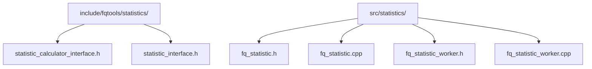
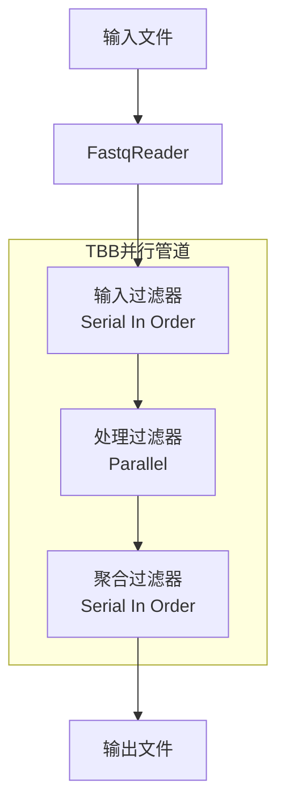
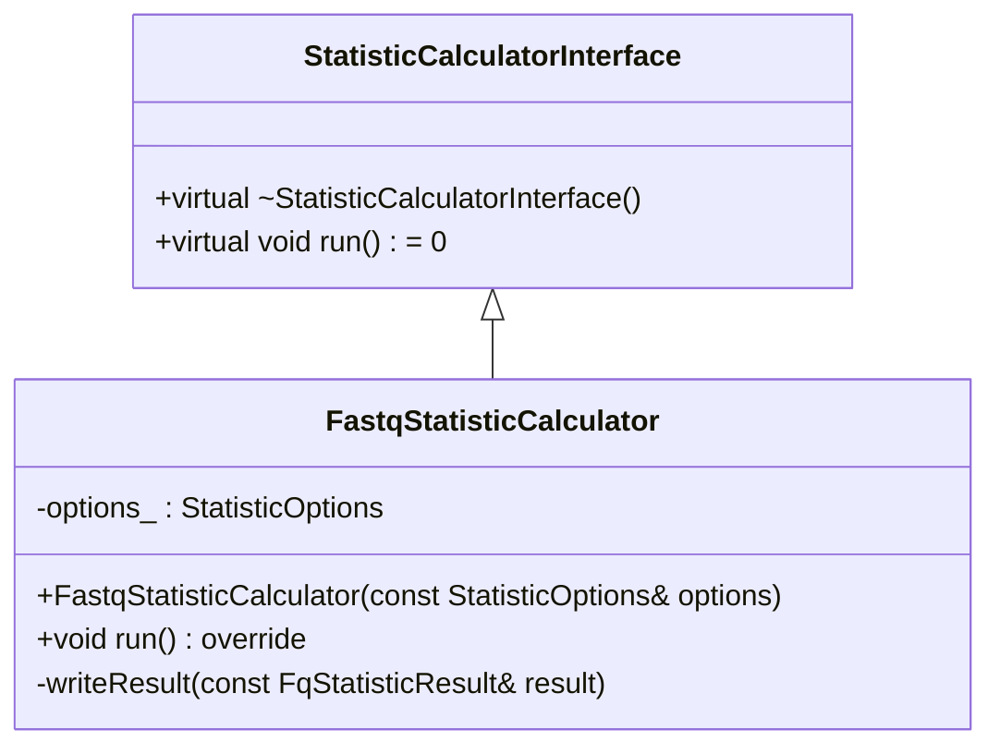
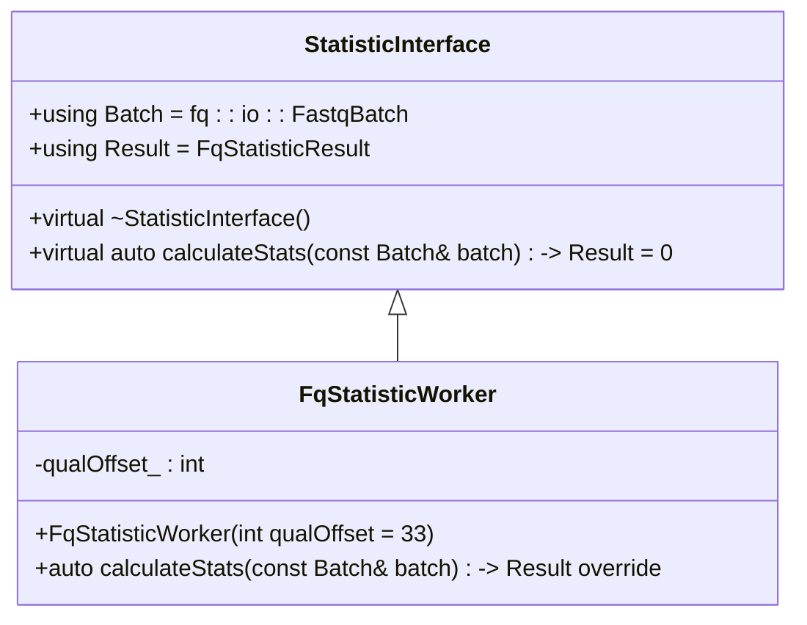
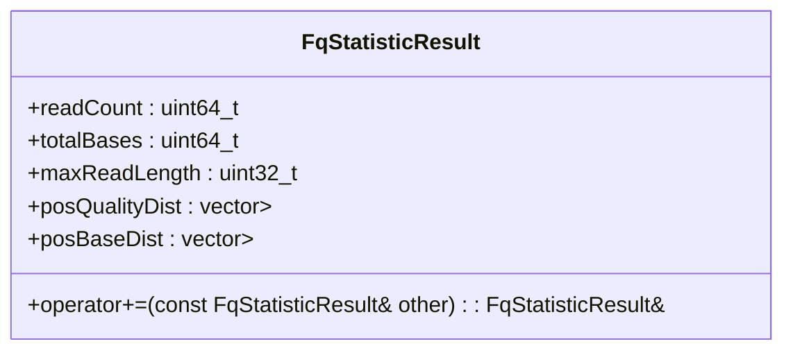
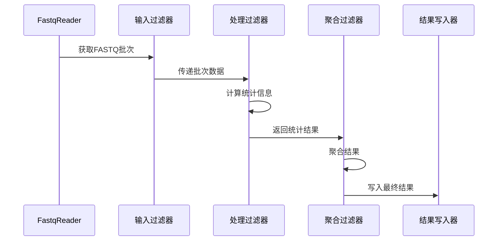
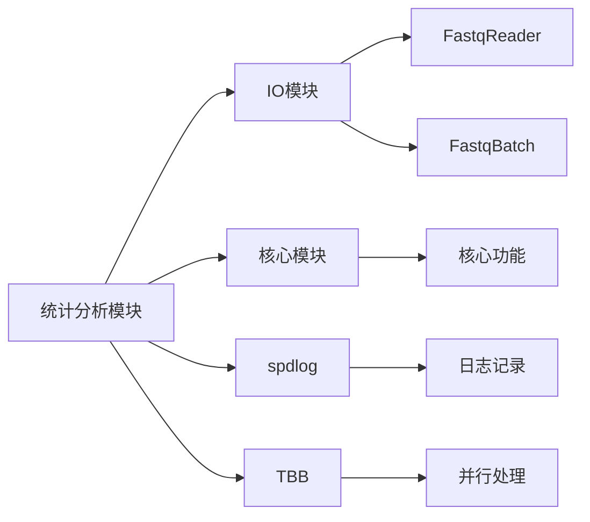

# 统计分析API

<cite>
**本文档引用的文件**
- [statistic_calculator_interface.h](file://include/fqtools/statistics/statistic_calculator_interface.h)
- [statistic_interface.h](file://include/fqtools/statistics/statistic_interface.h)
- [fq_statistic.h](file://src/statistics/fq_statistic.h)
- [fq_statistic.cpp](file://src/statistics/fq_statistic.cpp)
- [fq_statistic_worker.h](file://src/statistics/fq_statistic_worker.h)
- [fq_statistic_worker.cpp](file://src/statistics/fq_statistic_worker.cpp)
- [test_statistics.cpp](file://tests/unit/statistics/test_statistics.cpp)
- [basic_stats.sh](file://examples/basic_usage/basic_stats.sh)
- [stat_command.cpp](file://src/cli/commands/stat_command.cpp)
</cite>

## 目录
1. [简介](#简介)
2. [项目结构](#项目结构)
3. [核心组件](#核心组件)
4. [架构概述](#架构概述)
5. [详细组件分析](#详细组件分析)
6. [依赖分析](#依赖分析)
7. [性能考虑](#性能考虑)
8. [故障排除指南](#故障排除指南)
9. [结论](#结论)

## 简介
本API文档面向需要集成FASTQ统计功能的开发者，系统性地记录了统计分析模块的公共接口。文档详细解释了如何配置统计选项、启动分析任务以及获取结果。通过`statistic_calculator_interface.h`中定义的接口，开发者可以创建统计计算器实例并执行完整的统计生成过程。同时，文档阐述了`statistic_interface.h`中各种统计指标（如碱基质量、长度分布、GC含量）的抽象定义，并提供了C++代码示例展示如何在程序中处理输入数据流，并以JSON或文本格式输出分析报告。

## 项目结构
统计分析模块位于`include/fqtools/statistics/`和`src/statistics/`目录下，采用清晰的分层架构。头文件定义了公共接口和数据结构，而实现文件则包含了具体的统计逻辑和处理流程。

**Diagram sources**
- [statistic_calculator_interface.h](file://include/fqtools/statistics/statistic_calculator_interface.h)
- [statistic_interface.h](file://include/fqtools/statistics/statistic_interface.h)
- [fq_statistic.h](file://src/statistics/fq_statistic.h)
- [fq_statistic_worker.h](file://src/statistics/fq_statistic_worker.h)

**Section sources**
- [statistic_calculator_interface.h](file://include/fqtools/statistics/statistic_calculator_interface.h)
- [statistic_interface.h](file://include/fqtools/statistics/statistic_interface.h)

## 核心组件

统计分析模块的核心组件包括：
- `StatisticCalculatorInterface`：高层统计计算任务的抽象接口
- `StatisticOptions`：统计计算任务的配置选项结构体
- `StatisticInterface`：统计计算的抽象接口
- `FastqStatisticCalculator`：统计计算器的具体实现
- `FqStatisticWorker`：处理FASTQ记录批次并生成统计信息的工作器

这些组件共同构成了一个灵活且高性能的统计分析系统，支持并行处理和内存优化。

**Section sources**
- [statistic_calculator_interface.h](file://include/fqtools/statistics/statistic_calculator_interface.h#L29-L40)
- [statistic_interface.h](file://include/fqtools/statistics/statistic_interface.h#L36-L47)
- [fq_statistic.h](file://src/statistics/fq_statistic.h#L58-L89)
- [fq_statistic_worker.h](file://src/statistics/fq_statistic_worker.h#L37-L62)

## 架构概述

统计分析模块采用TBB并行管道架构，实现了高效的多阶段处理流程。该架构将统计过程分解为三个主要阶段：输入过滤、并行处理和结果聚合。

**Diagram sources**
- [fq_statistic.cpp](file://src/statistics/fq_statistic.cpp#L121-L153)

## 详细组件分析

### 统计计算器接口分析

`StatisticCalculatorInterface`是高层统计计算任务的抽象接口，它解耦了命令行层与统计实现，提供了灵活的高阶处理能力。

#### 接口定义

**Diagram sources**
- [statistic_calculator_interface.h](file://include/fqtools/statistics/statistic_calculator_interface.h#L46-L54)
- [fq_statistic.h](file://src/statistics/fq_statistic.h#L58-L89)

**Section sources**
- [statistic_calculator_interface.h](file://include/fqtools/statistics/statistic_calculator_interface.h#L46-L64)
- [fq_statistic.h](file://src/statistics/fq_statistic.h#L58-L89)
- [fq_statistic.cpp](file://src/statistics/fq_statistic.cpp#L82-L158)

### 统计指标接口分析

`StatisticInterface`定义了统计计算的抽象接口，允许用户扩展以执行自定义的统计分析。

#### 接口关系

**Diagram sources**
- [statistic_interface.h](file://include/fqtools/statistics/statistic_interface.h#L36-L47)
- [fq_statistic_worker.h](file://src/statistics/fq_statistic_worker.h#L37-L62)

**Section sources**
- [statistic_interface.h](file://include/fqtools/statistics/statistic_interface.h#L36-L51)
- [fq_statistic_worker.h](file://src/statistics/fq_statistic_worker.h#L37-L62)
- [fq_statistic_worker.cpp](file://src/statistics/fq_statistic_worker.cpp#L1-L73)

### 统计结果结构分析

`FqStatisticResult`结构体存储了FASTQ文件统计分析的结果数据，包括读取数量、长度分布、位置质量分数分布和位置碱基分布等信息。

#### 数据结构

**Diagram sources**
- [fq_statistic.h](file://src/statistics/fq_statistic.h#L33-L48)

**Section sources**
- [fq_statistic.h](file://src/statistics/fq_statistic.h#L33-L48)
- [fq_statistic.cpp](file://src/statistics/fq_statistic.cpp#L34-L67)

### 统计流程分析

统计分析的完整流程通过TBB并行管道实现，包含三个主要阶段的数据处理。

#### 处理流程

**Diagram sources**
- [fq_statistic.cpp](file://src/statistics/fq_statistic.cpp#L121-L153)

**Section sources**
- [fq_statistic.cpp](file://src/statistics/fq_statistic.cpp#L87-L158)

## 依赖分析

统计分析模块与其他模块存在明确的依赖关系，形成了一个松耦合的系统架构。

**Diagram sources**
- [CMakeLists.txt](file://src/statistics/CMakeLists.txt#L15-L21)
- [fq_statistic.cpp](file://src/statistics/fq_statistic.cpp#L13-L14)

**Section sources**
- [CMakeLists.txt](file://src/statistics/CMakeLists.txt#L1-L24)
- [fq_statistic.cpp](file://src/statistics/fq_statistic.cpp#L11-L28)

## 性能考虑

统计分析模块在设计时充分考虑了性能优化，采用了多种技术来提高处理效率：

1. **并行处理**：使用TBB并行管道实现多线程处理，充分利用多核CPU资源
2. **内存管理**：通过配置选项控制内存使用，支持内存限制和批处理大小调整
3. **流式处理**：采用流式读取方式，避免一次性加载大文件到内存
4. **批量处理**：使用批次处理机制减少I/O操作次数

这些优化措施使得模块能够高效处理大型FASTQ文件，同时保持较低的内存占用。

## 故障排除指南

在使用统计分析API时可能遇到以下常见问题及解决方案：

**Section sources**
- [fq_statistic.cpp](file://src/statistics/fq_statistic.cpp#L117-L119)
- [fq_statistic.cpp](file://src/statistics/fq_statistic.cpp#L161-L165)
- [test_statistics.cpp](file://tests/unit/statistics/test_statistics.cpp#L77-L83)

## 结论

FASTQ统计分析API提供了一套完整且高效的工具，用于对FASTQ数据进行统计分析。通过清晰的接口设计和模块化架构，开发者可以轻松集成统计功能到自己的应用程序中。API支持灵活的配置选项、并行处理和内存优化，能够高效处理各种规模的FASTQ文件。建议开发者参考提供的代码示例和测试用例，以更好地理解和使用该API。