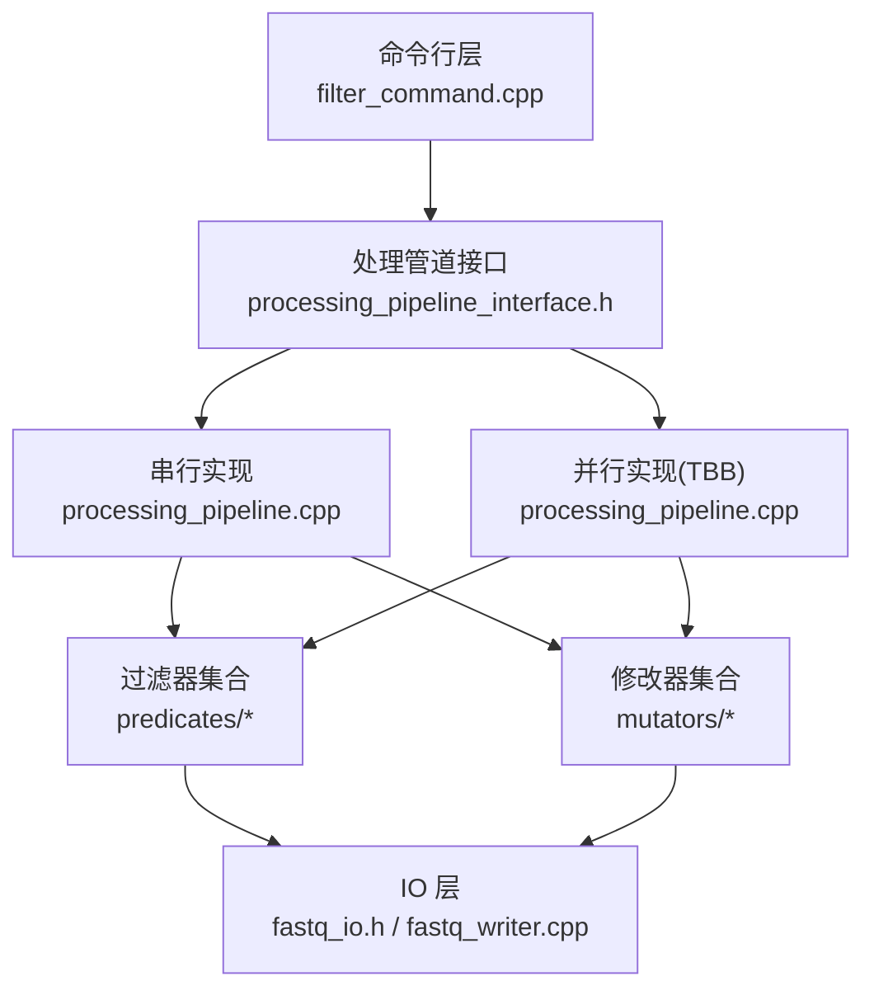
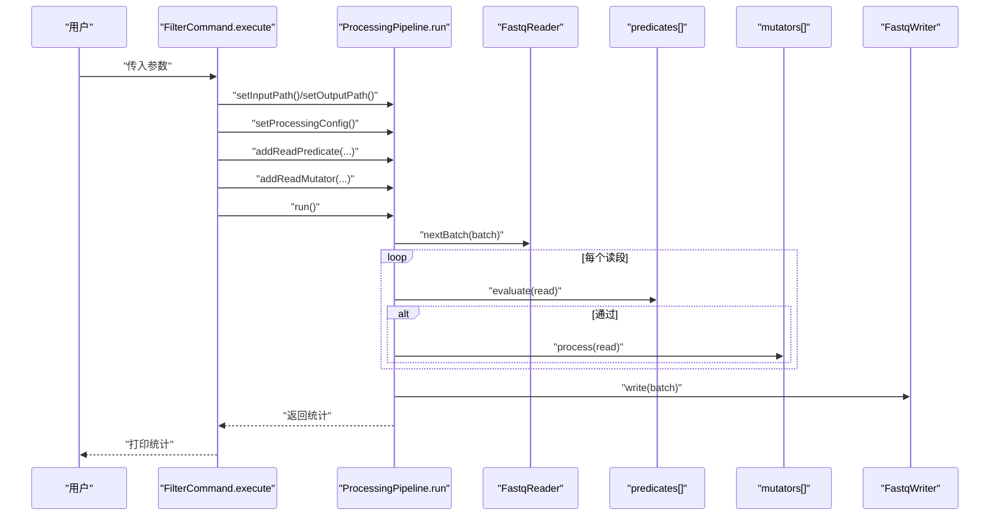
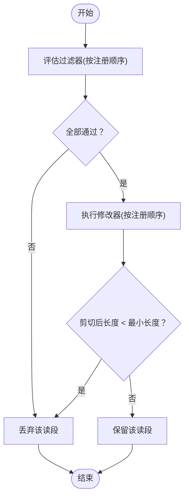
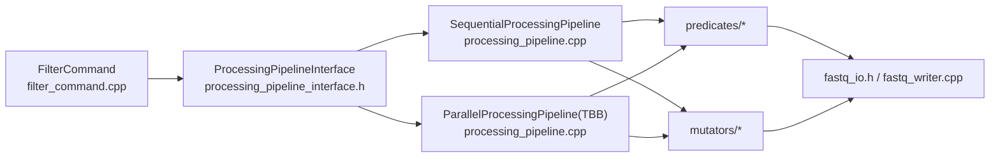

# filter 命令

<cite>
**本文引用的文件列表**
- [filter_command.cpp](file://src/cli/commands/filter_command.cpp)
- [filter_command.h](file://src/cli/commands/filter_command.h)
- [quality_trimmer.h](file://include/fqtools/processing/mutators/quality_trimmer.h)
- [quality_trimmer.cpp](file://src/processing/mutators/quality_trimmer.cpp)
- [min_quality_predicate.h](file://include/fqtools/processing/predicates/min_quality_predicate.h)
- [min_quality_predicate.cpp](file://src/processing/predicates/min_quality_predicate.cpp)
- [processing_pipeline_interface.h](file://include/fqtools/processing/processing_pipeline_interface.h)
- [processing_pipeline.cpp](file://src/processing/processing_pipeline.cpp)
- [fastq_io.h](file://include/fqtools/io/fastq_io.h)
- [fastq_writer.cpp](file://src/io/fastq_writer.cpp)
- [test_writer.cpp](file://tests/unit/io/test_writer.cpp)
- [main.cpp](file://src/cli/main.cpp)
</cite>

## 目录
1. [简介](#简介)
2. [项目结构](#项目结构)
3. [核心组件](#核心组件)
4. [架构总览](#架构总览)
5. [详细组件分析](#详细组件分析)
6. [依赖关系分析](#依赖关系分析)
7. [性能与内存特性](#性能与内存特性)
8. [常见问题解答](#常见问题解答)
9. [结论](#结论)
10. [附录：使用示例与参数对照表](#附录使用示例与参数对照表)

## 简介
本文件为 fastq-tools 仓库中 filter 子命令的权威使用文档。该命令用于对 FASTQ 读段进行过滤与质量剪切，支持基于质量、长度、N 碱基比例等多种过滤条件，并可对读段进行 5'、3' 或两端的质量剪切。文档将详细说明各参数含义、执行顺序与组合逻辑、输出文件格式与压缩能力、内存使用特性，并提供实用示例与常见问题解答，帮助用户在保证数据质量的同时最大化保留可用读段。

## 项目结构
filter 命令位于命令行层，通过处理管道接口与底层 IO、过滤器与修改器解耦协作，形成清晰的分层架构：
- 命令行层：解析参数、构建处理管线、注册过滤器与修改器、运行并打印统计
- 处理层：统一的 ProcessingPipelineInterface 抽象，支持串行与并行（TBB）两种执行模式
- 过滤器层：基于读段的谓词（如最低平均质量、最小/最大长度、最大 N 比例）
- 修改器层：对读段进行原位修改（如质量剪切）
- IO 层：FASTQ 读写，支持 .gz/.bz2/.xz 等压缩格式（由外部库提供）

图表来源
- [filter_command.cpp](file://src/cli/commands/filter_command.cpp#L32-L154)
- [processing_pipeline_interface.h](file://include/fqtools/processing/processing_pipeline_interface.h#L82-L168)
- [processing_pipeline.cpp](file://src/processing/processing_pipeline.cpp#L37-L235)
- [fastq_io.h](file://include/fqtools/io/fastq_io.h#L12-L118)
- [fastq_writer.cpp](file://src/io/fastq_writer.cpp#L1-L80)

章节来源
- [filter_command.cpp](file://src/cli/commands/filter_command.cpp#L32-L154)
- [processing_pipeline_interface.h](file://include/fqtools/processing/processing_pipeline_interface.h#L82-L168)
- [processing_pipeline.cpp](file://src/processing/processing_pipeline.cpp#L37-L235)
- [fastq_io.h](file://include/fqtools/io/fastq_io.h#L12-L118)
- [fastq_writer.cpp](file://src/io/fastq_writer.cpp#L1-L80)

## 核心组件
- 过滤器（Predicates）
  - 最低平均质量：基于质量字符串计算平均值，低于阈值则过滤
  - 最小长度：小于阈值则过滤
  - 最大长度：大于阈值则过滤
  - 最大 N 比例：N 碱基占比超过阈值则过滤
- 修改器（Mutators）
  - 质量剪切：按阈值与模式（5'、3'、两端）剪切低质量尾部；若剪切后长度仍小于最小长度，则整条读段被过滤
- 处理管道（ProcessingPipelineInterface）
  - 统一的 addReadPredicate/addReadMutator/run 接口，支持串行与并行执行
  - 统计信息包含总读段数、通过数、过滤数、修改数、输入/输出字节、耗时与吞吐

章节来源
- [min_quality_predicate.h](file://include/fqtools/processing/predicates/min_quality_predicate.h#L12-L79)
- [min_quality_predicate.cpp](file://src/processing/predicates/min_quality_predicate.cpp#L11-L136)
- [quality_trimmer.h](file://include/fqtools/processing/mutators/quality_trimmer.h#L13-L42)
- [quality_trimmer.cpp](file://src/processing/mutators/quality_trimmer.cpp#L15-L146)
- [processing_pipeline_interface.h](file://include/fqtools/processing/processing_pipeline_interface.h#L27-L168)

## 架构总览
filter 命令的执行流程如下：
- 解析命令行参数，设置输入/输出路径与处理配置
- 根据参数注册过滤器与修改器（顺序即注册顺序）
- 执行处理管道：逐批读取、依次评估过滤器、通过后执行修改器、最后写回
- 打印处理统计

图表来源
- [filter_command.cpp](file://src/cli/commands/filter_command.cpp#L93-L151)
- [processing_pipeline.cpp](file://src/processing/processing_pipeline.cpp#L94-L136)
- [processing_pipeline_interface.h](file://include/fqtools/processing/processing_pipeline_interface.h#L121-L155)

## 详细组件分析

### 过滤与剪切的执行顺序与组合逻辑
- 顺序规则
  - 过滤器：按注册顺序依次评估，任一失败即整条读段被过滤
  - 修改器：仅对通过所有过滤器的读段执行，按注册顺序依次应用
  - 最终判定：若修改器导致读段长度小于最小长度（质量剪切时），则整条读段被过滤
- 组合策略
  - 质量剪切与长度过滤可同时生效：先按质量剪切，再检查长度阈值
  - N 比例与长度/质量过滤可叠加：先按 N 比例过滤，再按长度/质量过滤，最后按质量剪切

图表来源
- [processing_pipeline.cpp](file://src/processing/processing_pipeline.cpp#L94-L136)
- [quality_trimmer.cpp](file://src/processing/mutators/quality_trimmer.cpp#L24-L69)

章节来源
- [processing_pipeline.cpp](file://src/processing/processing_pipeline.cpp#L94-L136)
- [quality_trimmer.cpp](file://src/processing/mutators/quality_trimmer.cpp#L24-L69)

### 参数详解与行为说明
- 输入/输出
  - --input/-i：必需，输入 FASTQ 文件路径
  - --output/-o：必需，输出 FASTQ 文件路径
- 并发与批处理
  - --threads/-t：线程数，默认 1（串行）
  - --batch-size：每批读段数，默认 10000
  - --read-chunk-bytes：读取块大小（字节），默认 1048576
  - --batch-capacity-bytes：批缓冲容量（字节），默认 4194304
  - --writer-buffer-bytes：写缓冲大小（字节），默认 131072
  - --in-flight：最大并发批数（0 自动），默认 0
  - --memory-limit-gb：并发批内存上限（GB，0 无限制），默认 10
- 质量编码
  - --quality-encoding：质量编码偏移（33 或 64），默认 33
- 过滤条件
  - --min-quality：最低平均质量阈值（基于质量字符串计算）
  - --min-length：最小读段长度
  - --max-length：最大读段长度
  - --max-n-ratio：最大 N 碱基比例（0.0-1.0）
- 质量剪切
  - --trim-quality：剪切阈值
  - --trim-mode：剪切模式，可选 five/three/both，默认 both
- 帮助
  - --help/-h：打印帮助

章节来源
- [filter_command.cpp](file://src/cli/commands/filter_command.cpp#L32-L154)

### 关键实现要点
- 质量编码与阈值比较
  - 质量字符按编码偏移换算为数值后与阈值比较，决定是否保留
- 质量剪切算法
  - 5' 剪切：从左向右扫描，找到第一个不低于阈值的位置作为新起点
  - 3' 剪切：从右向左扫描，找到最后一个不低于阈值的位置作为新终点
  - AVX2 加速路径：当目标阈值与编码满足范围时，使用 SIMD 比较加速
  - 剪切后若长度小于最小长度（默认 1），则整条读段被过滤
- 统计与输出
  - 统计信息包含总读段、通过、过滤、修改、输入/输出字节、耗时与吞吐
  - 输出文件名后缀决定压缩格式（见下节）

章节来源
- [quality_trimmer.cpp](file://src/processing/mutators/quality_trimmer.cpp#L71-L146)
- [min_quality_predicate.cpp](file://src/processing/predicates/min_quality_predicate.cpp#L11-L53)
- [processing_pipeline_interface.h](file://include/fqtools/processing/processing_pipeline_interface.h#L27-L52)

## 依赖关系分析
- 命令行层依赖处理管道接口，通过工厂函数创建具体实现
- 处理管道依赖 IO 层（读/写）与过滤器/修改器集合
- 过滤器/修改器均实现统一接口，便于扩展与组合
- 并发执行通过 TBB 并行流水线实现，令牌数受线程数与内存限制共同约束

图表来源
- [filter_command.cpp](file://src/cli/commands/filter_command.cpp#L26-L31)
- [processing_pipeline_interface.h](file://include/fqtools/processing/processing_pipeline_interface.h#L158-L168)
- [processing_pipeline.cpp](file://src/processing/processing_pipeline.cpp#L138-L235)
- [fastq_io.h](file://include/fqtools/io/fastq_io.h#L12-L118)
- [fastq_writer.cpp](file://src/io/fastq_writer.cpp#L1-L80)

章节来源
- [filter_command.cpp](file://src/cli/commands/filter_command.cpp#L26-L31)
- [processing_pipeline_interface.h](file://include/fqtools/processing/processing_pipeline_interface.h#L158-L168)
- [processing_pipeline.cpp](file://src/processing/processing_pipeline.cpp#L138-L235)
- [fastq_io.h](file://include/fqtools/io/fastq_io.h#L12-L118)
- [fastq_writer.cpp](file://src/io/fastq_writer.cpp#L1-L80)

## 性能与内存特性
- 并发模型
  - 单线程：串行处理，适合小文件或内存受限场景
  - 多线程：使用 TBB 并行流水线，令牌数受 --in-flight 与 --memory-limit-gb 共同限制
- 内存控制
  - 批处理容量与批缓冲大小直接影响内存占用
  - 内存上限按 GB 计算，实际令牌数会根据上限与批容量动态调整
- I/O 与压缩
  - 写入侧使用 libdeflate 进行 GZIP 压缩，缓冲区大小可调
  - 输出文件名后缀决定压缩格式（.gz/.bz2/.xz 等由外部库支持）

章节来源
- [processing_pipeline.cpp](file://src/processing/processing_pipeline.cpp#L163-L175)
- [fastq_writer.cpp](file://src/io/fastq_writer.cpp#L1-L80)

## 常见问题解答
- 为什么某些读段被完全丢弃？
  - 可能原因：质量剪切后长度小于最小长度（默认 1）；或未通过任何过滤器（如最低平均质量不足、长度不在范围内、N 比例过高）
- 如何平衡数据保留与质量？
  - 降低 --min-quality 或 --max-n-ratio，提高 --min-length 或 --max-length，或调整 --trim-quality 与 --trim-mode
  - 在保证下游分析质量的前提下，适度放宽阈值可提升保留率
- 输出文件格式与压缩
  - 输出文件名后缀决定压缩格式（.gz/.bz2/.xz 等），由底层库自动识别并写入对应格式
- 何时需要调整并发参数？
  - 大文件或高吞吐需求时，适当增加 --threads 与 --batch-size；同时关注 --memory-limit-gb 以避免内存压力

章节来源
- [quality_trimmer.cpp](file://src/processing/mutators/quality_trimmer.cpp#L24-L69)
- [min_quality_predicate.cpp](file://src/processing/predicates/min_quality_predicate.cpp#L11-L53)
- [fastq_writer.cpp](file://src/io/fastq_writer.cpp#L1-L80)

## 结论
filter 命令通过清晰的过滤器与修改器组合，提供了灵活而高效的 FASTQ 读段过滤与质量剪切能力。其执行顺序明确、统计完善、并发可控，并支持多样的压缩输出格式。合理设置参数可在保证质量的同时最大化保留可用读段，满足多样化的下游分析需求。

## 附录：使用示例与参数对照表

### 示例
- 去除低质量读段并进行 3' 端剪切
  - 命令：指定 --min-quality 与 --trim-quality，并将 --trim-mode 设为 three
- 仅按长度过滤并保留两端高质量区域
  - 命令：指定 --min-length 与 --max-length，不设置 --trim-quality
- 严格质量控制并剪切两端
  - 命令：设置 --min-quality 与 --trim-quality，--trim-mode 设为 both

说明：以上示例为参数组合思路，具体命令请参考“参数详解与行为说明”部分。

### 参数对照表
- 输入/输出
  - --input/-i：输入 FASTQ 文件（必需）
  - --output/-o：输出 FASTQ 文件（必需）
- 并发与批处理
  - --threads/-t：线程数（默认 1）
  - --batch-size：每批读段数（默认 10000）
  - --read-chunk-bytes：读取块大小（默认 1048576）
  - --batch-capacity-bytes：批缓冲容量（默认 4194304）
  - --writer-buffer-bytes：写缓冲大小（默认 131072）
  - --in-flight：最大并发批数（默认 0，自动）
  - --memory-limit-gb：并发批内存上限（默认 10）
- 质量编码
  - --quality-encoding：质量编码偏移（33 或 64，默认 33）
- 过滤条件
  - --min-quality：最低平均质量
  - --min-length：最小读段长度
  - --max-length：最大读段长度
  - --max-n-ratio：最大 N 比例（0.0-1.0）
- 质量剪切
  - --trim-quality：剪切阈值
  - --trim-mode：剪切模式（five/three/both，默认 both）
- 帮助
  - --help/-h：打印帮助

章节来源
- [filter_command.cpp](file://src/cli/commands/filter_command.cpp#L32-L154)