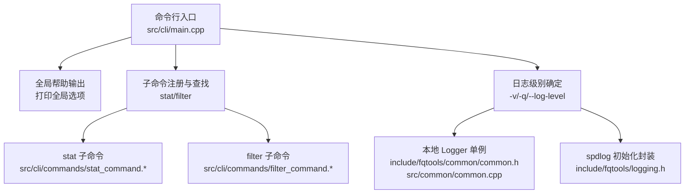
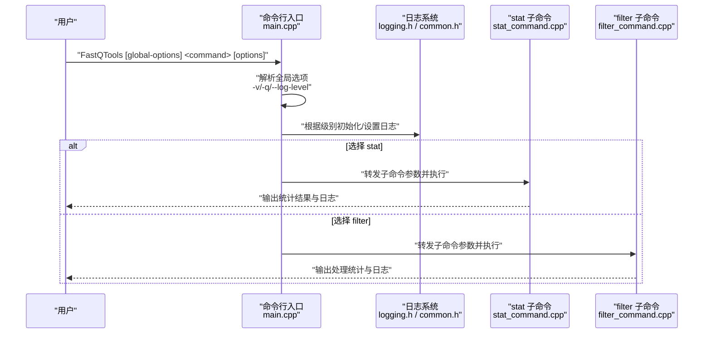
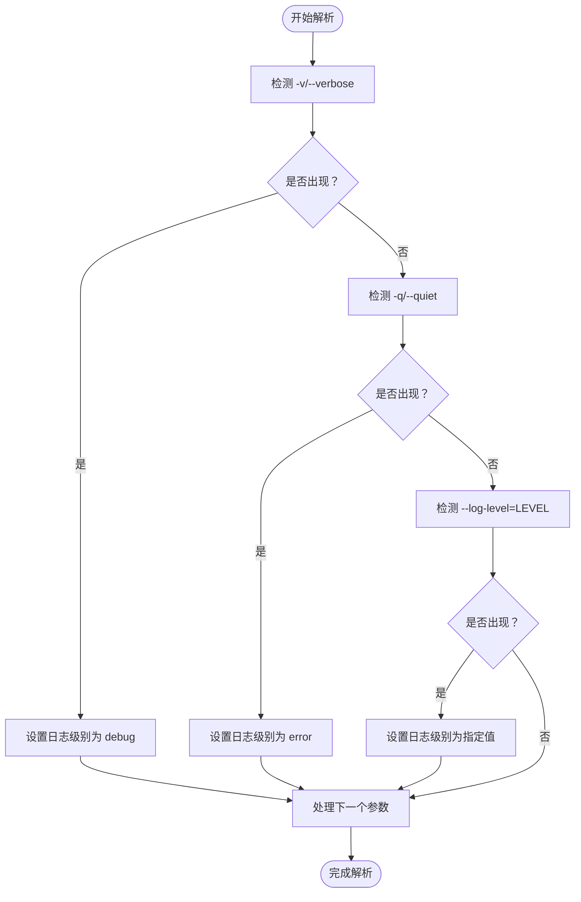
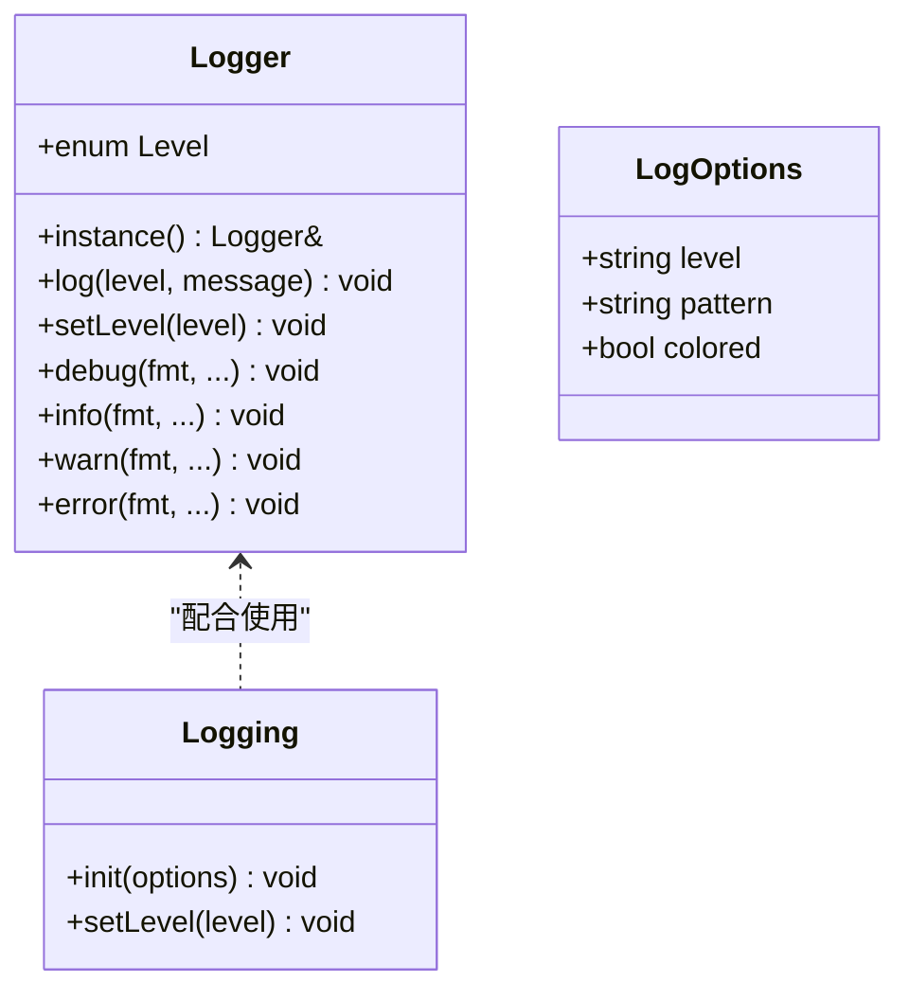
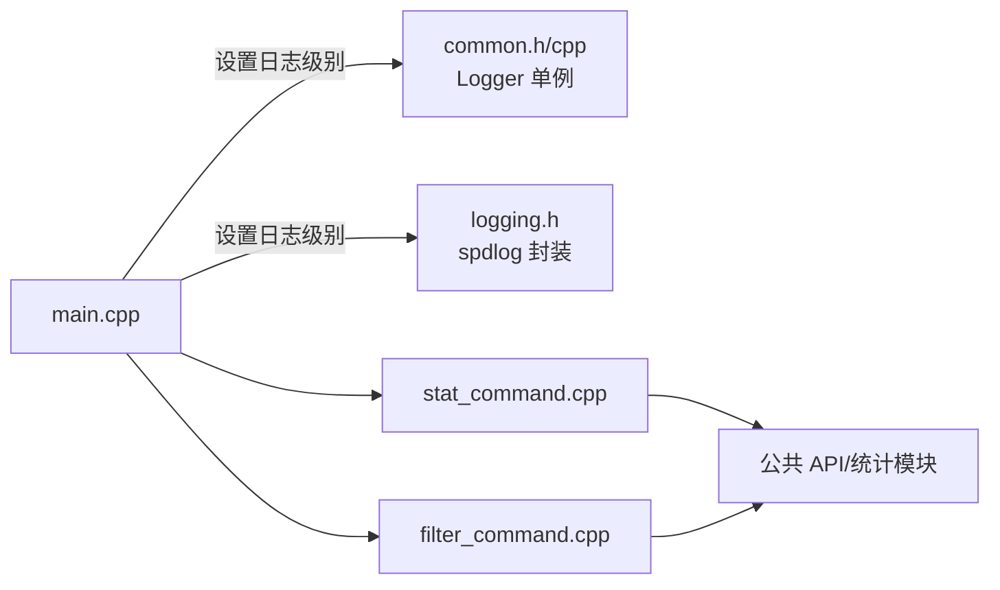

# 全局选项

<cite>
**本文档引用的文件**
- [main.cpp](file://src/cli/main.cpp)
- [logging.h](file://include/fqtools/logging.h)
- [common.h](file://include/fqtools/common/common.h)
- [common.cpp](file://src/common/common.cpp)
- [stat_command.h](file://src/cli/commands/stat_command.h)
- [stat_command.cpp](file://src/cli/commands/stat_command.cpp)
- [filter_command.cpp](file://src/cli/commands/filter_command.cpp)
- [test_cli.sh](file://tests/e2e/test_cli.sh)
</cite>

## 目录
1. [简介](#简介)
2. [项目结构](#项目结构)
3. [核心组件](#核心组件)
4. [架构总览](#架构总览)
5. [详细组件分析](#详细组件分析)
6. [依赖关系分析](#依赖关系分析)
7. [性能考量](#性能考量)
8. [故障排查指南](#故障排查指南)
9. [结论](#结论)
10. [附录](#附录)

## 简介
本文件面向使用者与维护者，系统性说明在命令行入口中解析的“全局”日志相关选项，覆盖以下跨命令通用选项：
- -v/--verbose：启用调试日志
- -q/--quiet：仅输出错误
- --log-level：自定义日志级别（trace/debug/info/warn/error）

这些选项的作用是统一控制程序的日志输出行为与调试信息详细程度；它们必须出现在子命令之前，以便命令行入口正确解析并生效。文档还解释了日志系统的实现机制（基于 spdlog 的封装与本地 Logger 单例），以及高日志级别对性能的潜在影响，并给出默认日志行为与错误退出码的通用规则。

## 项目结构
围绕全局选项的关键文件与职责如下：
- 命令行入口与全局选项解析：src/cli/main.cpp
- 日志系统封装（spdlog）：include/fqtools/logging.h
- 本地 Logger 单例（兼容旧实现路径）：include/fqtools/common/common.h 与 src/common/common.cpp
- 子命令示例（stat/filter）：src/cli/commands/stat_command.* 与 src/cli/commands/filter_command.*

图表来源
- [main.cpp](file://src/cli/main.cpp#L35-L116)
- [logging.h](file://include/fqtools/logging.h#L1-L61)
- [common.h](file://include/fqtools/common/common.h#L81-L169)
- [common.cpp](file://src/common/common.cpp#L56-L107)
- [stat_command.cpp](file://src/cli/commands/stat_command.cpp#L1-L78)
- [filter_command.cpp](file://src/cli/commands/filter_command.cpp#L1-L165)

章节来源
- [main.cpp](file://src/cli/main.cpp#L35-L116)

## 核心组件
- 全局选项解析器：负责识别 -v/--verbose、-q/--quiet、--log-level=LEVEL，并据此设置日志级别；随后将剩余参数转交给子命令。
- 日志系统封装：
  - 基于 spdlog 的初始化与级别设置（include/fqtools/logging.h）
  - 本地 Logger 单例（include/fqtools/common/common.h 与 src/common/common.cpp），提供按级别输出能力
- 子命令：stat 与 filter 在各自命令中使用公共 API 与统计/处理流水线，日志级别影响其输出与调试信息可见性。

章节来源
- [main.cpp](file://src/cli/main.cpp#L35-L116)
- [logging.h](file://include/fqtools/logging.h#L1-L61)
- [common.h](file://include/fqtools/common/common.h#L81-L169)
- [common.cpp](file://src/common/common.cpp#L56-L107)

## 架构总览
全局选项在命令行入口处被解析，决定日志级别，再进入子命令执行流程。子命令内部通过公共 API 使用统计/处理模块，日志级别控制其输出与调试信息的详细程度。

图表来源
- [main.cpp](file://src/cli/main.cpp#L35-L116)
- [logging.h](file://include/fqtools/logging.h#L1-L61)
- [stat_command.cpp](file://src/cli/commands/stat_command.cpp#L1-L78)
- [filter_command.cpp](file://src/cli/commands/filter_command.cpp#L1-L165)

## 详细组件分析

### 全局选项解析与日志级别设定
- 选项识别与优先级
  - -v/--verbose：将日志级别设为调试
  - -q/--quiet：将日志级别设为错误
  - --log-level=LEVEL：直接设置为指定级别（trace/debug/info/warn/error）
- 位置要求
  - 必须位于子命令之前，否则会被当作子命令参数处理，导致解析失败或行为异常
- 默认行为
  - 若未显式指定，则默认使用 info 级别
- 帮助输出
  - 全局帮助会列出上述三个选项及可用子命令

图表来源
- [main.cpp](file://src/cli/main.cpp#L43-L72)

章节来源
- [main.cpp](file://src/cli/main.cpp#L35-L116)

### 日志系统实现机制
- spdlog 封装
  - 提供 LogOptions 结构体与 init/setLevel 函数，支持 trace/debug/info/warn/error/critical/off 等级别
  - 通过 spdlog::set_level 设置全局级别，支持自定义 pattern
- 本地 Logger 单例
  - 提供 Level 枚举与日志输出方法，按当前级别阈值过滤输出
  - 支持 debug/info/warn/error 等格式化输出
- 命令行入口中的使用
  - 根据全局选项设置本地 Logger 的级别（Debug/Error/Info）
  - 同时也会调用 spdlog 初始化（通过封装），确保全局日志一致性

图表来源
- [common.h](file://include/fqtools/common/common.h#L81-L169)
- [common.cpp](file://src/common/common.cpp#L56-L107)
- [logging.h](file://include/fqtools/logging.h#L1-L61)

章节来源
- [logging.h](file://include/fqtools/logging.h#L1-L61)
- [common.h](file://include/fqtools/common/common.h#L81-L169)
- [common.cpp](file://src/common/common.cpp#L56-L107)

### 子命令中的日志行为
- stat 子命令
  - 作为示例展示在调试模式下运行时，日志输出会更详细，便于观察处理进度
  - 通过公共 API 调用统计计算器，日志级别影响其内部输出
- filter 子命令
  - 同样受全局日志级别影响，调试模式下可看到更多中间状态与统计信息

章节来源
- [stat_command.h](file://src/cli/commands/stat_command.h#L1-L43)
- [stat_command.cpp](file://src/cli/commands/stat_command.cpp#L1-L78)
- [filter_command.cpp](file://src/cli/commands/filter_command.cpp#L1-L165)

### 使用示例
- 在调试模式下运行 stat 命令以查看详细处理进度
  - 示例命令：FastQTools -v stat --input ... --output ...
  - 或：FastQTools --log-level=debug stat ...
- 仅输出错误
  - 示例命令：FastQTools -q stat ...
  - 或：FastQTools --log-level=error stat ...

章节来源
- [main.cpp](file://src/cli/main.cpp#L124-L136)
- [stat_command.cpp](file://src/cli/commands/stat_command.cpp#L1-L78)
- [filter_command.cpp](file://src/cli/commands/filter_command.cpp#L1-L165)

## 依赖关系分析
- 命令行入口依赖
  - 子命令注册与分发：stat/filter
  - 日志级别设置：本地 Logger 与 spdlog 封装
- 子命令依赖
  - 公共 API 与统计/处理模块（由 stat/filter 内部使用）
- 测试验证
  - 端到端脚本验证 --quiet 模式下 banner 的抑制行为

图表来源
- [main.cpp](file://src/cli/main.cpp#L35-L116)
- [logging.h](file://include/fqtools/logging.h#L1-L61)
- [common.h](file://include/fqtools/common/common.h#L81-L169)
- [common.cpp](file://src/common/common.cpp#L56-L107)
- [stat_command.cpp](file://src/cli/commands/stat_command.cpp#L1-L78)
- [filter_command.cpp](file://src/cli/commands/filter_command.cpp#L1-L165)

章节来源
- [test_cli.sh](file://tests/e2e/test_cli.sh#L84-L91)

## 性能考量
- 高日志级别（如 trace/debug）会增加日志生成与输出开销，可能降低整体处理速度
- 建议在生产环境使用默认 info 或更低级别，仅在调试问题时临时提升到 debug
- 对于高频 I/O 或大规模数据处理场景，建议避免使用 trace 级别

## 故障排查指南
- 选项位置错误
  - 将全局选项放在子命令之后会导致解析失败或行为异常
  - 正确顺序：FastQTools [global-options] <command> [options]
- 未知子命令
  - 当子命令不存在时，入口会输出错误并打印全局帮助
- 退出码规则
  - 成功：0
  - 异常/错误：非0（例如未知子命令、异常抛出等）
- 验证 --quiet 模式
  - 端到端测试脚本验证了 --quiet 模式下 banner 的抑制行为

章节来源
- [main.cpp](file://src/cli/main.cpp#L95-L116)
- [test_cli.sh](file://tests/e2e/test_cli.sh#L84-L91)

## 结论
全局日志选项 -v/--verbose、-q/--quiet、--log-level=LEVEL 提供了统一且灵活的日志控制方式。它们必须置于子命令之前，以便命令行入口正确解析。默认日志级别为 info；在调试模式下可获得更详细的处理进度信息。高日志级别会带来性能开销，应谨慎使用。遵循本文档的使用示例与注意事项，可在保证可观测性的前提下获得稳定高效的运行表现。

## 附录
- 默认日志行为
  - 未指定时使用 info 级别
- 错误退出码通用规则
  - 成功：0；异常/错误：非0