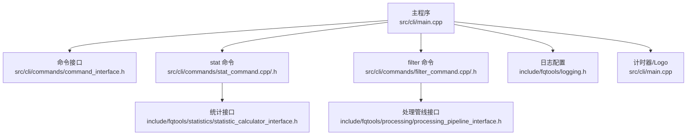
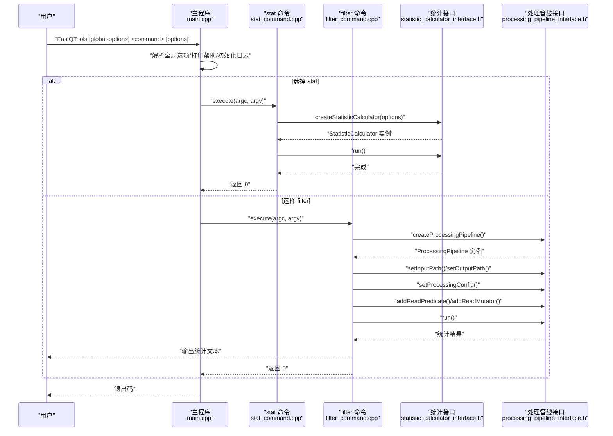
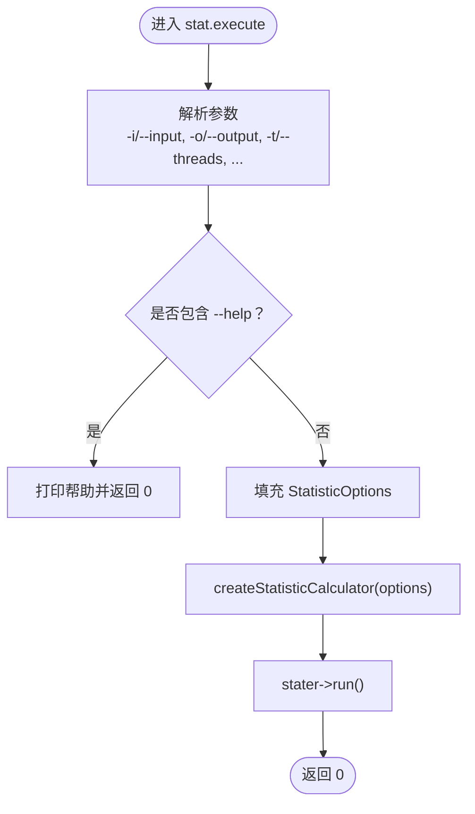
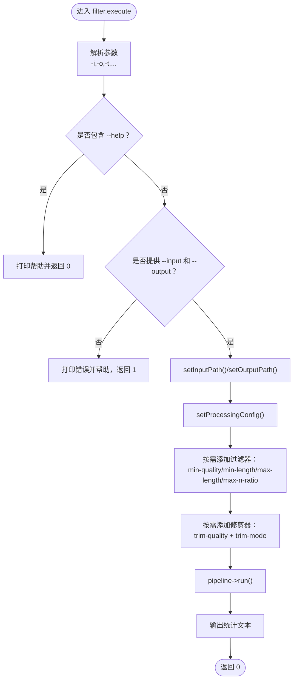
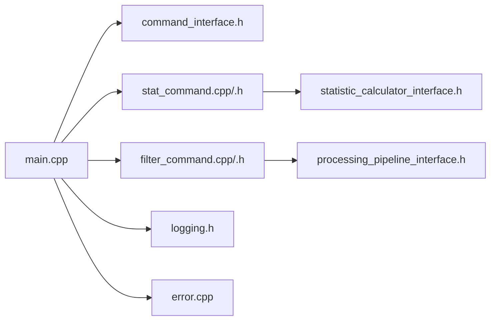

# 命令行使用指南

<cite>
**本文引用的文件**
- [src/cli/main.cpp](file://src/cli/main.cpp)
- [src/cli/commands/command_interface.h](file://src/cli/commands/command_interface.h)
- [src/cli/commands/stat_command.h](file://src/cli/commands/stat_command.h)
- [src/cli/commands/stat_command.cpp](file://src/cli/commands/stat_command.cpp)
- [src/cli/commands/filter_command.h](file://src/cli/commands/filter_command.h)
- [src/cli/commands/filter_command.cpp](file://src/cli/commands/filter_command.cpp)
- [include/fqtools/statistics/statistic_calculator_interface.h](file://include/fqtools/statistics/statistic_calculator_interface.h)
- [include/fqtools/processing/processing_pipeline_interface.h](file://include/fqtools/processing/processing_pipeline_interface.h)
- [include/fqtools/logging.h](file://include/fqtools/logging.h)
- [include/fqtools/common/common.h](file://include/fqtools/common/common.h)
- [src/common/common.cpp](file://src/common/common.cpp)
- [src/error/error.cpp](file://src/error/error.cpp)
- [examples/basic_usage/basic_stats.sh](file://examples/basic_usage/basic_stats.sh)
- [tests/e2e/test_cli.sh](file://tests/e2e/test_cli.sh)
</cite>

## 目录
1. [简介](#简介)
2. [项目结构](#项目结构)
3. [核心组件](#核心组件)
4. [架构总览](#架构总览)
5. [详细组件分析](#详细组件分析)
6. [依赖关系分析](#依赖关系分析)
7. [性能注意事项](#性能注意事项)
8. [故障排查指南](#故障排查指南)
9. [结论](#结论)
10. [附录](#附录)

## 简介
本指南面向使用者，提供 FastQTools 命令行工具的完整使用说明。内容涵盖：
- 整体设计与通用选项（日志级别、静默模式）
- 核心子命令：stat 与 filter 的参数、行为与组合使用
- 实用命令示例（含先过滤再统计的管道思路）
- 错误处理与退出码说明

## 项目结构
FastQTools 的 CLI 采用“主程序 + 子命令接口 + 具体命令实现”的分层设计：
- 主程序负责解析全局选项、打印帮助、初始化日志与计时器，并将参数转发给具体子命令
- 子命令通过统一的命令接口执行各自逻辑
- 统计与过滤分别对接统计计算器与处理管线接口，实现解耦与可扩展

图表来源
- [src/cli/main.cpp](file://src/cli/main.cpp#L35-L116)
- [src/cli/commands/command_interface.h](file://src/cli/commands/command_interface.h#L21-L56)
- [src/cli/commands/stat_command.cpp](file://src/cli/commands/stat_command.cpp#L11-L67)
- [src/cli/commands/filter_command.cpp](file://src/cli/commands/filter_command.cpp#L32-L154)
- [include/fqtools/statistics/statistic_calculator_interface.h](file://include/fqtools/statistics/statistic_calculator_interface.h#L29-L63)
- [include/fqtools/processing/processing_pipeline_interface.h](file://include/fqtools/processing/processing_pipeline_interface.h#L112-L143)
- [include/fqtools/logging.h](file://include/fqtools/logging.h#L16-L60)

章节来源
- [src/cli/main.cpp](file://src/cli/main.cpp#L35-L116)
- [src/cli/commands/command_interface.h](file://src/cli/commands/command_interface.h#L21-L56)

## 核心组件
- 主程序入口：解析全局选项（--verbose、--quiet、--log-level）、打印帮助、初始化日志与计时器、分发子命令
- 命令接口：统一的 execute/getName/getDescription 接口，便于新增子命令
- stat 命令：解析统计相关参数，构造统计选项并通过统计接口执行
- filter 命令：解析过滤/修剪相关参数，构建处理管线配置，注册过滤器与修剪器，执行并输出统计

章节来源
- [src/cli/main.cpp](file://src/cli/main.cpp#L35-L116)
- [src/cli/commands/command_interface.h](file://src/cli/commands/command_interface.h#L21-L56)
- [src/cli/commands/stat_command.cpp](file://src/cli/commands/stat_command.cpp#L11-L67)
- [src/cli/commands/filter_command.cpp](file://src/cli/commands/filter_command.cpp#L32-L154)

## 架构总览
下面的序列图展示了主程序如何将参数分发到具体子命令，并由子命令调用各自的接口执行任务。

图表来源
- [src/cli/main.cpp](file://src/cli/main.cpp#L90-L116)
- [src/cli/commands/stat_command.cpp](file://src/cli/commands/stat_command.cpp#L47-L67)
- [src/cli/commands/filter_command.cpp](file://src/cli/commands/filter_command.cpp#L93-L154)
- [include/fqtools/statistics/statistic_calculator_interface.h](file://include/fqtools/statistics/statistic_calculator_interface.h#L29-L63)
- [include/fqtools/processing/processing_pipeline_interface.h](file://include/fqtools/processing/processing_pipeline_interface.h#L112-L143)

## 详细组件分析

### 通用选项与全局行为
- 全局选项
  - -v, --verbose：启用调试日志
  - -q, --quiet：抑制非错误输出
  - --log-level=LEVEL：设置日志级别（trace, debug, info, warn, error）
- 帮助
  - --help/-h：打印全局帮助；子命令也可单独 --help
- 日志与计时
  - 主程序根据全局选项设置日志级别，并打印项目 Logo 与启动计时器
- 退出码
  - 成功：0
  - 子命令未知或执行异常：1

章节来源
- [src/cli/main.cpp](file://src/cli/main.cpp#L35-L116)
- [include/fqtools/logging.h](file://include/fqtools/logging.h#L16-L60)

### stat 命令
- 功能：对 FASTQ 文件生成统计信息
- 命令名：stat
- 描述：Generate statistics for a FASTQ file
- 关键参数
  - -i, --input：输入 FASTQ 文件（必填）
  - -o, --output：输出统计文件（必填）
  - -t, --threads：线程数（默认 1）
  - --batch-size：每批读取条数（默认 50000）
  - --read-chunk-bytes：读取块大小（字节，默认 1048576）
  - --batch-capacity-bytes：批缓冲容量（字节，默认 4194304）
  - --zlib-buffer-bytes：zlib 内部缓冲大小（字节，默认 131072）
  - --in-flight：最大并发批数（0=自动，默认 0）
  - --memory-limit-gb：并发批内存上限（GB，0=无限制，默认 10）
  - -h, --help：打印帮助
- 行为说明
  - 解析参数后，构造统计选项并通过统计接口执行计算
  - 成功返回 0；参数缺失或解析失败会打印帮助并返回非 0
- 输出
  - 将统计结果写入指定输出文件（具体字段以统计实现为准）

图表来源
- [src/cli/commands/stat_command.cpp](file://src/cli/commands/stat_command.cpp#L11-L67)
- [include/fqtools/statistics/statistic_calculator_interface.h](file://include/fqtools/statistics/statistic_calculator_interface.h#L29-L63)

章节来源
- [src/cli/commands/stat_command.h](file://src/cli/commands/stat_command.h#L18-L41)
- [src/cli/commands/stat_command.cpp](file://src/cli/commands/stat_command.cpp#L11-L67)
- [include/fqtools/statistics/statistic_calculator_interface.h](file://include/fqtools/statistics/statistic_calculator_interface.h#L29-L63)

### filter 命令
- 功能：过滤与修剪 FASTQ 文件
- 命令名：filter
- 描述：Filter and trim FastQ files
- 关键参数
  - -i, --input：输入 FASTQ 文件（必填）
  - -o, --output：输出 FASTQ 文件（必填）
  - -t, --threads：线程数（默认 1）
  - --batch-size：每批读取条数（默认 10000）
  - --read-chunk-bytes：读取块大小（字节，默认 1048576）
  - --batch-capacity-bytes：批缓冲容量（字节，默认 4194304）
  - --zlib-buffer-bytes：zlib 内部缓冲大小（字节，默认 131072）
  - --writer-buffer-bytes：写入器缓冲大小（字节，默认 131072）
  - --in-flight：最大并发批数（0=自动，默认 0）
  - --memory-limit-gb：并发批内存上限（GB，0=无限制，默认 10）
  - --quality-encoding：质量编码偏移（33 或 64，默认 33）
  - --min-quality：最小平均质量阈值
  - --min-length：最小读长
  - --max-length：最大读长
  - --max-n-ratio：最大 N 比例（0.0-1.0）
  - --trim-quality：修剪质量阈值
  - --trim-mode：修剪模式（both、five、three，默认 both）
  - -h, --help：打印帮助
- 行为说明
  - 必须同时提供 --input 与 --output，否则报错并打印帮助
  - 将参数映射到处理管线配置，并按顺序注册过滤器与修剪器
  - 过滤器组合逻辑：按添加顺序依次执行，任一过滤器失败则丢弃该读
  - 修剪器：基于阈值与模式对两端进行修剪
  - 执行完成后输出统计文本
- 过滤器与修剪器
  - 过滤器（满足任一即丢弃）
    - 最小平均质量：--min-quality
    - 最小读长：--min-length
    - 最大读长：--max-length
    - 最大 N 比例：--max-n-ratio
  - 修剪器（可选）
    - 质量修剪：--trim-quality + --trim-mode
  - 组合逻辑
    - 先按过滤器链过滤，再按修剪器处理，最后写出

图表来源
- [src/cli/commands/filter_command.cpp](file://src/cli/commands/filter_command.cpp#L32-L154)
- [include/fqtools/processing/processing_pipeline_interface.h](file://include/fqtools/processing/processing_pipeline_interface.h#L112-L143)

章节来源
- [src/cli/commands/filter_command.h](file://src/cli/commands/filter_command.h#L21-L71)
- [src/cli/commands/filter_command.cpp](file://src/cli/commands/filter_command.cpp#L32-L154)
- [include/fqtools/processing/processing_pipeline_interface.h](file://include/fqtools/processing/processing_pipeline_interface.h#L112-L143)

## 依赖关系分析
- 主程序依赖命令接口与具体命令实现
- stat 命令依赖统计接口与工厂函数
- filter 命令依赖处理管线接口与工厂函数
- 日志系统通过独立头文件提供配置能力
- 错误处理通过错误模块提供异常类型与处理器

图表来源
- [src/cli/main.cpp](file://src/cli/main.cpp#L35-L116)
- [src/cli/commands/command_interface.h](file://src/cli/commands/command_interface.h#L21-L56)
- [src/cli/commands/stat_command.cpp](file://src/cli/commands/stat_command.cpp#L11-L67)
- [src/cli/commands/filter_command.cpp](file://src/cli/commands/filter_command.cpp#L32-L154)
- [include/fqtools/statistics/statistic_calculator_interface.h](file://include/fqtools/statistics/statistic_calculator_interface.h#L29-L63)
- [include/fqtools/processing/processing_pipeline_interface.h](file://include/fqtools/processing/processing_pipeline_interface.h#L112-L143)
- [include/fqtools/logging.h](file://include/fqtools/logging.h#L16-L60)
- [src/error/error.cpp](file://src/error/error.cpp#L16-L45)

章节来源
- [src/cli/main.cpp](file://src/cli/main.cpp#L35-L116)
- [src/error/error.cpp](file://src/error/error.cpp#L16-L45)

## 性能注意事项
- 线程数与批大小
  - -t/--threads：提升并发度，注意 CPU 与 I/O 资源
  - --batch-size：增大批次可减少调度开销，但会增加内存占用
- 缓冲与内存
  - --read-chunk-bytes、--batch-capacity-bytes、--zlib-buffer-bytes、--writer-buffer-bytes：根据磁盘与内存条件调整
  - --in-flight 与 --memory-limit-gb：控制并发批数与内存上限，避免 OOM
- 修剪与过滤
  - 质量修剪与长度过滤会增加额外处理开销，建议按需开启

[本节为通用建议，不直接分析具体文件]

## 故障排查指南
- 退出码
  - 0：成功
  - 1：子命令未知、参数解析失败、执行异常
- 常见问题
  - 缺少必要参数：filter 需同时提供 --input 与 --output
  - 输入/输出路径不可用：检查权限与路径
  - 内存不足：降低 --batch-size、--threads 或提高 --memory-limit-gb
- 日志级别
  - 使用 -v/--verbose 提升日志级别，或 --log-level=LEVEL 指定级别
  - 使用 -q/--quiet 抑制非错误输出
- 异常与错误
  - 代码中定义了多种异常类型（IO、格式、配置等），可在上层捕获并处理
  - 主程序在异常时返回 1

章节来源
- [src/cli/main.cpp](file://src/cli/main.cpp#L95-L116)
- [src/error/error.cpp](file://src/error/error.cpp#L16-L45)
- [include/fqtools/logging.h](file://include/fqtools/logging.h#L16-L60)

## 结论
本指南基于源码梳理了 FastQTools 的 CLI 设计与使用方法。通过统一的命令接口与解耦的统计/处理接口，用户可以灵活地使用 stat 与 filter 子命令完成 FASTQ 数据的统计与过滤/修剪工作。建议结合性能参数与日志级别进行调优，并在生产环境中关注内存与 I/O 资源的平衡。

[本节为总结性内容，不直接分析具体文件]

## 附录

### 实用命令示例
- 基本统计
  - 使用示例脚本演示了如何调用 stat 命令并输出统计结果
  - 参考路径：[examples/basic_usage/basic_stats.sh](file://examples/basic_usage/basic_stats.sh#L104-L121)
- 端到端测试中的使用
  - 测试脚本验证了 --help、--quiet 等行为
  - 参考路径：[tests/e2e/test_cli.sh](file://tests/e2e/test_cli.sh#L55-L115)

章节来源
- [examples/basic_usage/basic_stats.sh](file://examples/basic_usage/basic_stats.sh#L104-L121)
- [tests/e2e/test_cli.sh](file://tests/e2e/test_cli.sh#L55-L115)

### 参数与行为对照（来自源码）
- stat 命令参数
  - -i/--input、-o/--output、-t/--threads、--batch-size、--read-chunk-bytes、--batch-capacity-bytes、--zlib-buffer-bytes、--in-flight、--memory-limit-gb、-h/--help
  - 参考路径：[src/cli/commands/stat_command.cpp](file://src/cli/commands/stat_command.cpp#L11-L33)
- filter 命令参数
  - -i/--input、-o/--output、-t/--threads、--batch-size、--read-chunk-bytes、--batch-capacity-bytes、--zlib-buffer-bytes、--writer-buffer-bytes、--in-flight、--memory-limit-gb、--quality-encoding、--min-quality、--min-length、--max-length、--max-n-ratio、--trim-quality、--trim-mode、-h/--help
  - 参考路径：[src/cli/commands/filter_command.cpp](file://src/cli/commands/filter_command.cpp#L32-L67)

章节来源
- [src/cli/commands/stat_command.cpp](file://src/cli/commands/stat_command.cpp#L11-L33)
- [src/cli/commands/filter_command.cpp](file://src/cli/commands/filter_command.cpp#L32-L67)