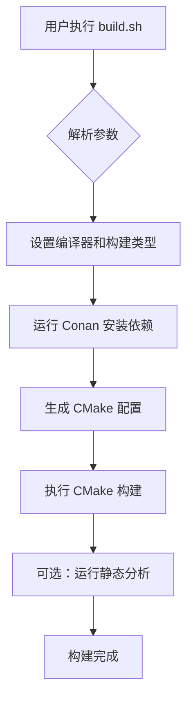
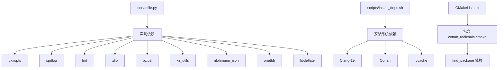
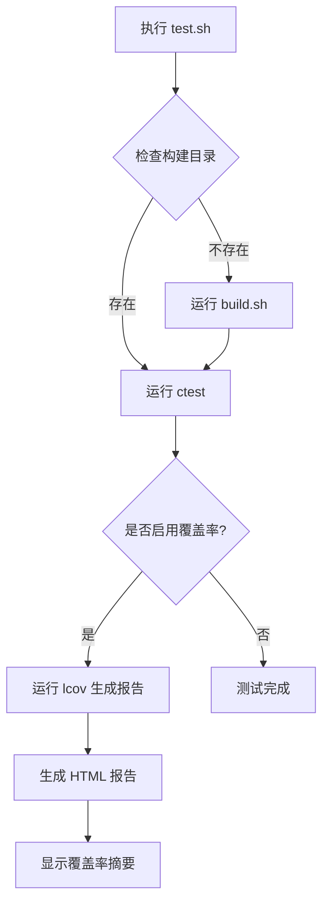

# 开发指南

<cite>
**本文档引用的文件**  
- [CMakeLists.txt](file://CMakeLists.txt)
- [conanfile.py](file://conanfile.py)
- [commitlint.config.js](file://commitlint.config.js)
- [.clang-format](file://.clang-format)
- [scripts/build.sh](file://scripts/build.sh)
- [scripts/test.sh](file://scripts/test.sh)
- [scripts/lint.sh](file://scripts/lint.sh)
- [scripts/install_deps.sh](file://scripts/install_deps.sh)
- [cmake/modules/common.cmake](file://cmake/modules/common.cmake)
- [cmake/modules/fq_common.cmake](file://cmake/modules/fq_common.cmake)
- [cmake/modules/fq_config.cmake](file://cmake/modules/fq_config.cmake)
- [cmake/FastQToolsConfig.cmake.in](file://cmake/FastQToolsConfig.cmake.in)
- [docs/dev/coding-standards.md](file://docs/dev/coding-standards.md)
- [docs/git_commit_guide.md](file://docs/git_commit_guide.md)
- [CONTRIBUTING.md](file://CONTRIBUTING.md)
</cite>

## 目录
1. [构建系统](#构建系统)
2. [依赖管理](#依赖管理)
3. [编码规范](#编码规范)
4. [测试流程](#测试流程)
5. [CI/CD工作流](#cicd工作流)
6. [贡献流程](#贡献流程)

## 构建系统

本项目的构建系统基于 CMake，采用模块化配置，支持现代 C++20 特性，并通过统一的脚本简化开发流程。

主 `CMakeLists.txt` 文件定义了项目的基本配置，包括 C++20 标准、编译器版本检查、编译选项和依赖查找。项目通过 `add_subdirectory(src)` 将源码组织为多个子模块，每个模块独立管理其源文件和依赖。

模块化 CMake 配置位于 `cmake/modules/` 目录下，为不同功能模块（如 `fq_common`、`fq_config`）提供独立的构建逻辑。例如，`fq_common.cmake` 定义了 `fq_common` 库的源文件、头文件路径、编译特性和链接依赖。

要添加新的源文件，只需在相应模块的 CMakeLists.txt 文件中将其添加到 `add_library` 或 `add_executable` 的源文件列表中。例如，在 `src/common/CMakeLists.txt` 中添加新的 `.cpp` 文件即可自动纳入构建。

构建过程由 `scripts/build.sh` 统一管理，支持多种编译器（GCC、Clang）、构建类型（Debug、Release 等）和高级选项（如 Sanitizer、覆盖率分析）。该脚本自动处理 Conan 依赖安装、CMake 配置和编译过程。

**图示来源**
- [CMakeLists.txt](file://CMakeLists.txt#L1-L180)
- [scripts/build.sh](file://scripts/build.sh#L1-L319)
- [cmake/modules/fq_common.cmake](file://cmake/modules/fq_common.cmake#L1-L40)

**节来源**
- [CMakeLists.txt](file://CMakeLists.txt#L1-L180)
- [scripts/build.sh](file://scripts/build.sh#L1-L319)
- [cmake/modules/common.cmake](file://cmake/modules/common.cmake#L1-L63)

## 依赖管理

项目使用 Conan 作为依赖管理工具，通过 `conanfile.py` 定义所有第三方库的版本和配置。

`conanfile.py` 中声明了项目所需的所有依赖，包括 `cxxopts`、`spdlog`、`fmt`、`zlib`、`bzip2`、`xz_utils`、`nlohmann_json`、`onetbb` 和 `libdeflate`。Conan 负责在构建前自动下载、编译或安装这些依赖，并生成 CMake 工具链文件。

在 `CMakeLists.txt` 中，通过检测 `conan_toolchain.cmake` 文件的存在来决定是否使用 Conan 管理的依赖。如果检测到该文件，则包含它并使用 `find_package` 查找 Conan 提供的包。

依赖安装由 `scripts/install_deps.sh` 脚本管理，该脚本支持安装开发和运行时依赖。开发依赖包括构建工具（CMake、Ninja）、编译器（Clang-19）、包管理器（Conan）和调试工具（GDB、Valgrind）。

**图示来源**
- [conanfile.py](file://conanfile.py#L1-L53)
- [CMakeLists.txt](file://CMakeLists.txt#L57-L78)
- [scripts/install_deps.sh](file://scripts/install_deps.sh#L1-L282)

**节来源**
- [conanfile.py](file://conanfile.py#L1-L53)
- [CMakeLists.txt](file://CMakeLists.txt#L57-L78)
- [scripts/install_deps.sh](file://scripts/install_deps.sh#L1-L282)

## 编码规范

项目遵循严格的编码规范，确保代码风格一致性和可维护性。

### 命名约定

- **路径与文件名**: 使用 `snake_case`（如 `src/utils/file_parser.cpp`）
- **文档文件**: 使用 `kebab-case`（如 `docs/dev/git-guidelines.md`）
- **脚本文件**: 使用 `snake_case`（如 `scripts/build.sh`）
- **类与结构体**: 使用 `PascalCase`（如 `class FastQReader`）
- **函数与方法**: 使用 `camelCase`（如 `void processBatch()`）
- **局部变量与参数**: 使用 `camelCase`（如 `int readCount`）
- **成员变量**: 使用 `camelCase` 并以尾部下划线结尾（如 `filePath_`）
- **常量**: 使用 `kConstantName`（如 `constexpr int kMaxReads`）
- **命名空间**: 使用 `snake_case`（如 `namespace fq::utils`）

### 代码格式化

代码格式化由 `.clang-format` 文件定义，基于 LLVM 风格，采用 4 空格缩进，行宽 100。使用 `scripts/lint.sh` 脚本进行格式化和检查：

- `./scripts/lint.sh format`：修复格式
- `./scripts/lint.sh format-check`：检查格式

### 提交信息规范

提交信息遵循 Angular 规范的变体，由 `commitlint.config.js` 配置。格式为 `<type>(<scope>): <subject>`，其中 `type` 包括 `feat`、`fix`、`docs`、`style`、`refactor`、`perf`、`test`、`build`、`ci`、`chore` 和 `revert`。

建议使用 `.gitmessage.txt` 作为提交模板，并可通过 `git config --local commit.template .gitmessage.txt` 设置。

**节来源**
- [docs/dev/coding-standards.md](file://docs/dev/coding-standards.md#L1-L170)
- [commitlint.config.js](file://commitlint.config.js#L1-L2)
- [.clang-format](file://.clang-format)
- [docs/git_commit_guide.md](file://docs/git_commit_guide.md#L1-L58)

## 测试流程

项目提供完整的测试流程，包括单元测试和端到端测试。

测试代码位于 `tests/` 目录下，分为 `unit/` 和 `e2e/` 子目录。单元测试使用 Google Test 框架，每个模块都有对应的测试用例。

测试执行由 `scripts/test.sh` 统一管理，支持多种选项：
- `-c/--compiler`：指定编译器
- `-t/--type`：指定构建类型
- `-f/--filter`：过滤测试用例
- `-j/--jobs`：并行运行测试
- `-C/--coverage`：生成覆盖率报告

该脚本会自动检查构建目录是否存在，若不存在则调用 `build.sh` 进行构建。测试完成后，可选择生成 lcov 格式的覆盖率报告和 HTML 可视化。

**图示来源**
- [scripts/test.sh](file://scripts/test.sh#L1-L271)
- [tests/unit/CMakeLists.txt](file://tests/CMakeLists.txt)
- [tests/e2e/test_cli.sh](file://tests/e2e/test_cli.sh)

**节来源**
- [scripts/test.sh](file://scripts/test.sh#L1-L271)
- [scripts/lint.sh](file://scripts/lint.sh#L1-L198)
- [tests/unit/CMakeLists.txt](file://tests/CMakeLists.txt)

## CI/CD工作流

CI/CD 工作流由 GitHub Actions 管理，配置文件位于 `.github/workflows/` 目录（未在项目结构中显示，但由 `CONTRIBUTING.md` 提及）。

工作流在以下条件下触发：
- `push` 到主分支
- `pull_request` 到主分支

检查项包括：
- 代码格式化检查
- 静态分析（clang-tidy）
- 构建（多种编译器和构建类型）
- 单元测试执行
- 覆盖率报告生成
- 端到端测试验证

所有检查必须通过后，PR 才能被合并。这确保了代码质量和功能稳定性。

**节来源**
- [CONTRIBUTING.md](file://CONTRIBUTING.md#L1-L45)

## 贡献流程

贡献流程遵循标准的开源项目实践：

1. Fork 仓库并创建功能分支
2. 进行代码修改，遵循编码规范
3. 运行 `./scripts/lint.sh` 确保格式和静态分析通过
4. 运行 `./scripts/test.sh` 确保所有测试通过
5. 提交符合规范的 Git 提交信息
6. 推送分支并创建 Pull Request
7. 等待 CI/CD 检查通过
8. 根据反馈进行修改，直至合并

请保持 PR 小而专注，每次 PR 只包含一个功能或修复。如有行为变更，需同步更新文档。

**节来源**
- [CONTRIBUTING.md](file://CONTRIBUTING.md#L1-L45)
- [docs/git_commit_guide.md](file://docs/git_commit_guide.md#L1-L58)