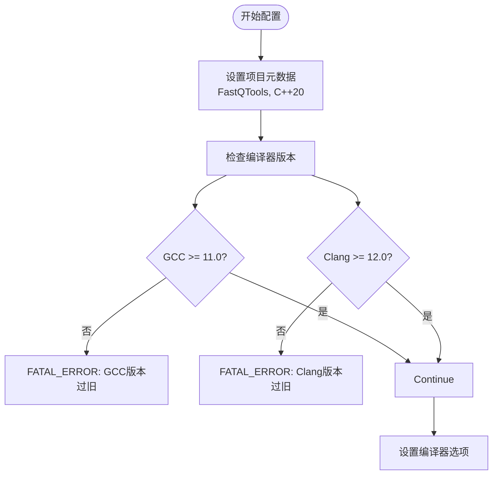
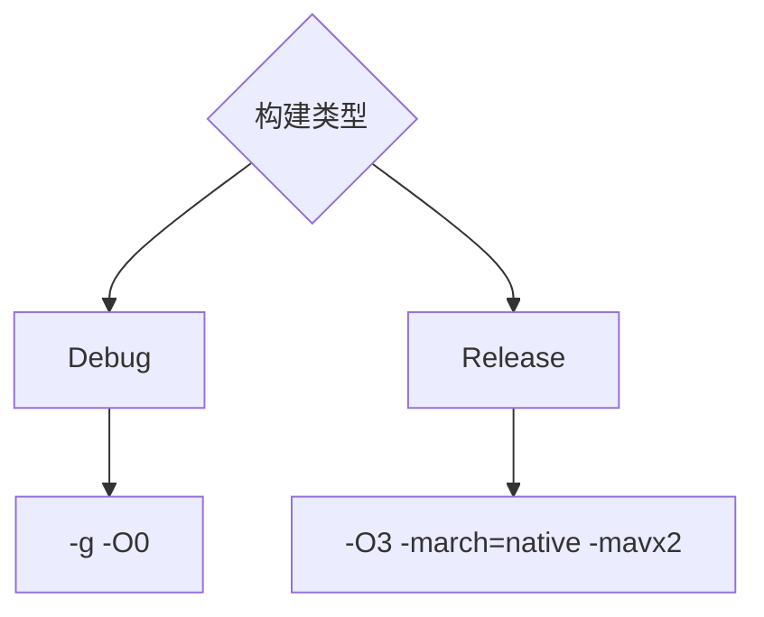
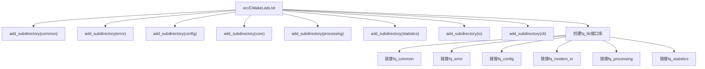
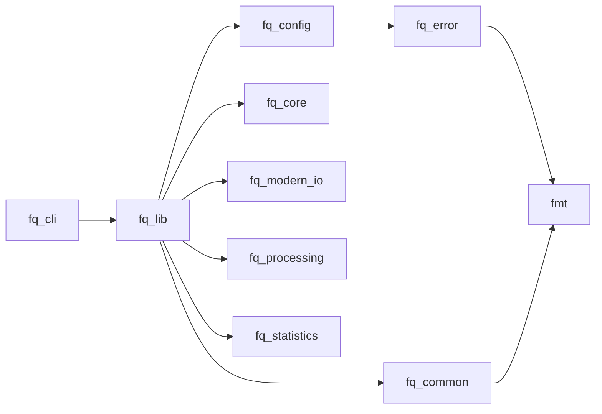
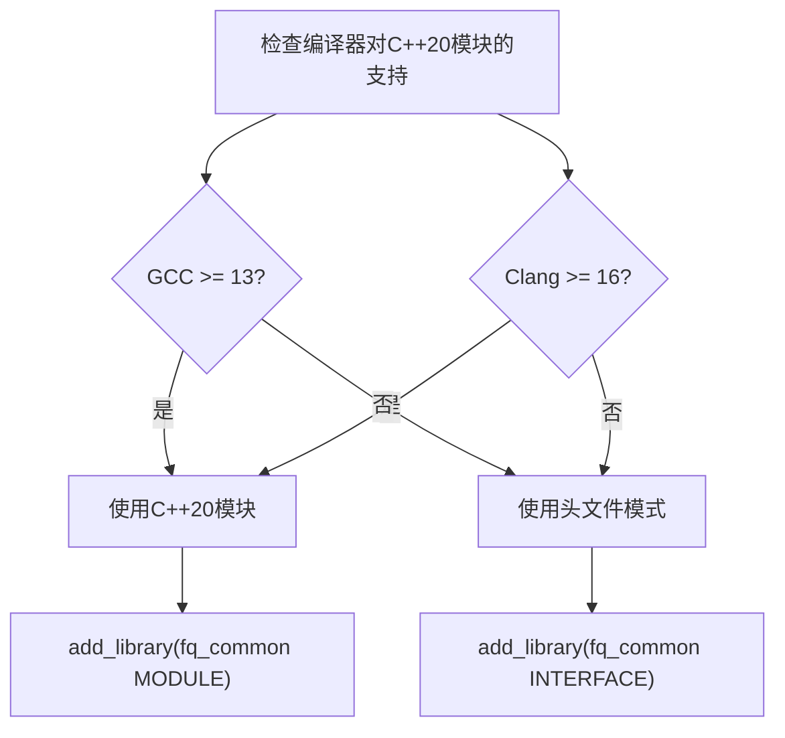
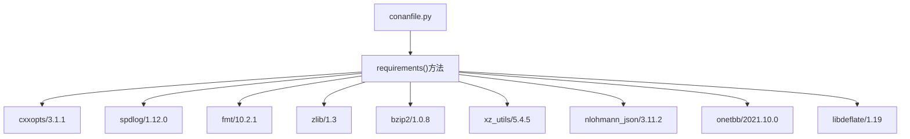
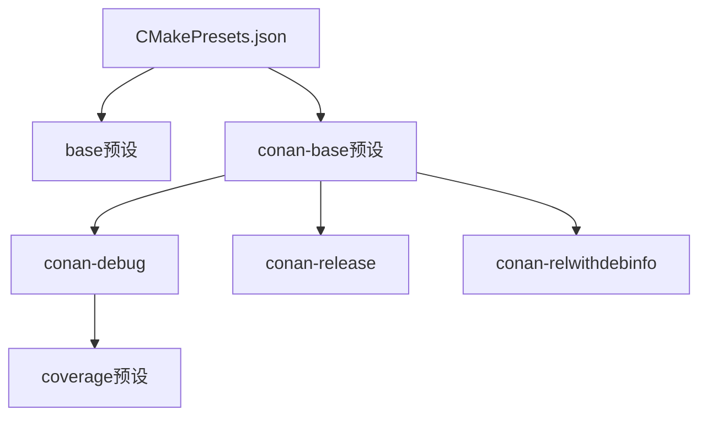
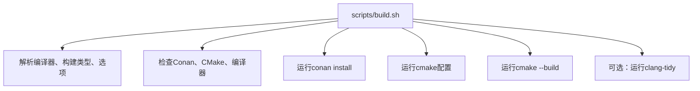

# 构建系统

<cite>
**本文档中引用的文件**  
- [CMakeLists.txt](file://CMakeLists.txt)
- [cmake/modules/fq_common.cmake](file://cmake/modules/fq_common.cmake)
- [cmake/modules/common.cmake](file://cmake/modules/common.cmake)
- [cmake/FastQToolsConfig.cmake.in](file://cmake/FastQToolsConfig.cmake.in)
- [conanfile.py](file://conanfile.py)
- [src/CMakeLists.txt](file://src/CMakeLists.txt)
- [src/cli/CMakeLists.txt](file://src/cli/CMakeLists.txt)
- [src/common/CMakeLists.txt](file://src/common/CMakeLists.txt)
- [tests/CMakeLists.txt](file://tests/CMakeLists.txt)
- [CMakePresets.json](file://CMakePresets.json)
- [scripts/build.sh](file://scripts/build.sh)
- [scripts/test.sh](file://scripts/test.sh)
</cite>

## 目录
1. [简介](#简介)
2. [项目结构](#项目结构)
3. [根级CMakeLists.txt分析](#根级cmakeliststxt分析)
4. [子目录组织与目标定义](#子目录组织与目标定义)
5. [自定义CMake模块](#自定义cmake模块)
6. [Conan依赖管理](#conan依赖管理)
7. [构建变体与编译器标志](#构建变体与编译器标志)
8. [静态分析与代码质量](#静态分析与代码质量)
9. [添加新源文件或模块](#添加新源文件或模块)
10. [常见构建问题与调试](#常见构建问题与调试)
11. [构建脚本与自动化](#构建脚本与自动化)

## 简介
本项目采用现代CMake作为构建系统，结合Conan进行外部依赖管理，支持多编译器、多构建类型和高级构建选项。构建系统设计注重模块化、可维护性和可扩展性，确保在不同平台和环境下的一致性。

## 项目结构
项目构建系统围绕CMake组织，主要构建相关文件分布如下：
- 根目录：`CMakeLists.txt`（主构建配置）、`CMakePresets.json`（构建预设）
- `cmake/`：自定义CMake模块和包配置模板
- `config/dependencies/`：Conan依赖配置
- `src/`：各组件的CMakeLists.txt文件
- `scripts/`：构建和测试脚本

## 根级CMakeLists.txt分析

根级`CMakeLists.txt`文件定义了项目的整体构建配置，包括项目元数据、编译器要求、依赖管理和安装规则。

### 项目配置与编译器要求
文件首先声明项目基本信息，并强制要求C++20标准。通过版本检查确保使用支持C++20的GCC 11+或Clang 12+编译器。



**Section sources**
- [CMakeLists.txt](file://CMakeLists.txt#L1-L43)

### 编译器选项与构建类型
根据构建类型（Debug/Release）设置不同的编译器标志。Debug模式启用调试信息，Release模式启用优化和AVX2指令集。



**Section sources**
- [CMakeLists.txt](file://CMakeLists.txt#L47-L54)

## 子目录组织与目标定义

### src/CMakeLists.txt结构
`src/CMakeLists.txt`通过`add_subdirectory`引入所有子模块，并创建一个名为`fq_lib`的接口库来聚合所有组件。



**Section sources**
- [src/CMakeLists.txt](file://src/CMakeLists.txt#L1-L30)

### 组件间依赖关系
各组件通过`target_link_libraries`建立明确的依赖关系，形成清晰的依赖链。



**Diagram sources**
- [src/CMakeLists.txt](file://src/CMakeLists.txt#L14-L24)
- [src/cli/CMakeLists.txt](file://src/cli/CMakeLists.txt#L9-L13)

## 自定义CMake模块

### fq_common.cmake模块
`cmake/modules/fq_common.cmake`定义了`fq_common`库，包含通用功能。该模块展示了C++20模块的条件编译支持。



**Section sources**
- [cmake/modules/common.cmake](file://cmake/modules/common.cmake#L1-L63)

### 模块功能与调用机制
自定义模块封装了编译选项、平台适配和依赖链接逻辑，通过`include()`在主CMakeLists.txt中调用。

**Section sources**
- [cmake/modules/fq_common.cmake](file://cmake/modules/fq_common.cmake#L1-L40)
- [cmake/modules/fq_config.cmake](file://cmake/modules/fq_config.cmake#L1-L60)
- [cmake/modules/fq_error.cmake](file://cmake/modules/fq_error.cmake#L1-L59)

## Conan依赖管理

### conanfile.py配置
`conanfile.py`定义了项目的所有外部依赖及其版本，使用Conan 2.x的现代Python API。



**Section sources**
- [conanfile.py](file://conanfile.py#L25-L34)

### 依赖声明与版本锁定
所有依赖都指定了精确版本号，确保构建的可重现性。通过`override=True`确保`libdeflate`版本一致性。

**Section sources**
- [conanfile.py](file://conanfile.py#L34)

### 包导出流程
`package_info()`方法配置了导出的库名称和CMake属性，使其他项目能正确链接本项目。

**Section sources**
- [conanfile.py](file://conanfile.py#L49-L52)

## 构建变体与编译器标志

### CMakePresets.json配置
`CMakePresets.json`定义了多种构建预设，包括Debug、Release、RelWithDebInfo和Coverage模式。



**Section sources**
- [CMakePresets.json](file://CMakePresets.json#L8-L74)

### 构建类型配置
不同构建类型设置不同的编译器标志，如Debug模式启用地址和未定义行为检测。

**Section sources**
- [CMakePresets.json](file://CMakePresets.json#L34-L74)

## 静态分析与代码质量

### .clang-tidy配置
项目根目录包含`.clang-tidy`文件，定义了静态分析规则集。

**Section sources**
- [.clang-tidy](file://.clang-tidy)

### 集成静态分析
`scripts/build.sh`脚本支持`--static`选项，运行`clang-tidy`进行静态分析。

**Section sources**
- [scripts/build.sh](file://scripts/build.sh#L291-L300)

## 添加新源文件或模块

### 在src中添加新组件
添加新组件需在`src/CMakeLists.txt`中添加`add_subdirectory()`，并在相应子目录创建CMakeLists.txt。

**Section sources**
- [src/CMakeLists.txt](file://src/CMakeLists.txt#L2-L9)

### 更新CMakeLists.txt
新组件的CMakeLists.txt应定义库目标、包含目录和依赖关系。

```cmake
add_library(fq_new_component
    src/new_component.cpp
)

target_include_directories(fq_new_component PUBLIC
    ${CMAKE_CURRENT_SOURCE_DIR}/include
)

target_link_libraries(fq_new_component PUBLIC
    fq_common
    fmt::fmt
)
```

## 常见构建问题与调试

### 依赖未找到
确保已运行`conan install`并生成`conan_toolchain.cmake`。检查`CMAKE_BINARY_DIR`中是否存在该文件。

**Section sources**
- [CMakeLists.txt](file://CMakeLists.txt#L60-L64)

### 头文件路径错误
确保`target_include_directories`正确设置`PUBLIC`或`INTERFACE`范围，使依赖方能正确找到头文件。

**Section sources**
- [src/common/CMakeLists.txt](file://src/common/CMakeLists.txt#L5-L9)

### 调试建议
使用`VERBOSE=1`或`--verbose`选项查看详细构建日志，检查CMake配置和编译器调用。

## 构建脚本与自动化

### build.sh脚本
`scripts/build.sh`提供统一的构建接口，支持编译器选择、构建类型和高级选项。



**Section sources**
- [scripts/build.sh](file://scripts/build.sh#L1-L319)

### test.sh脚本
`scripts/test.sh`自动化测试执行，支持过滤、重复运行和覆盖率报告生成。

**Section sources**
- [scripts/test.sh](file://scripts/test.sh#L1-L271)