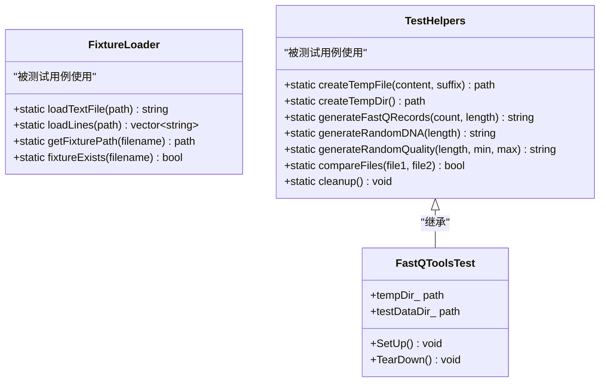
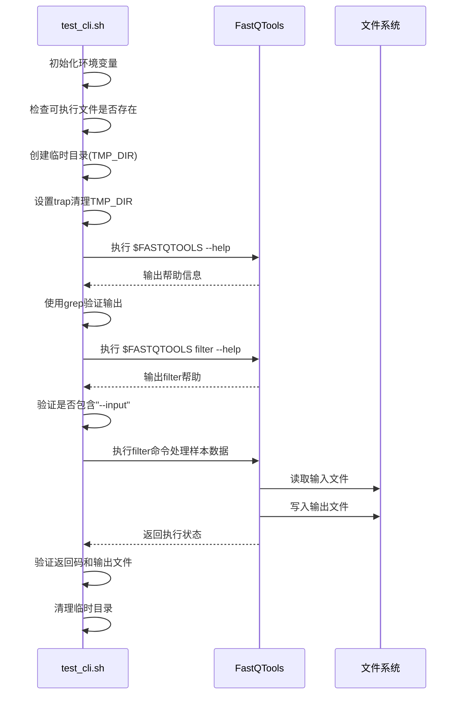

# 测试策略

<cite>
**本文档中引用的文件**  
- [test_fastq_reader.cpp](file://tests/unit/io/test_fastq_reader.cpp)
- [test_helpers.h](file://tests/utils/test_helpers.h)
- [fixture_loader.h](file://tests/utils/fixture_loader.h)
- [test_cli.sh](file://tests/e2e/test_cli.sh)
- [test.sh](file://scripts/test.sh)
- [CMakeLists.txt](file://tests/CMakeLists.txt)
- [CMakeLists.txt](file://tests/unit/CMakeLists.txt)
- [CMakeLists.txt](file://tests/utils/CMakeLists.txt)
</cite>

## 目录

1. [简介](#简介)
2. [单元测试实现方法](#单元测试实现方法)
3. [测试工具类设计与复用](#测试工具类设计与复用)
4. [端到端测试执行流程](#端到端测试执行流程)
5. [测试构建与自动化](#测试构建与自动化)
6. [编写新测试的指导原则](#编写新测试的指导原则)
7. [常见测试失败场景及排查](#常见测试失败场景及排查)
8. [结论](#结论)

## 简介

本项目采用分层测试策略，结合单元测试和端到端测试，确保FASTQ工具核心功能的正确性和稳定性。单元测试使用Google Test框架验证各个模块的内部逻辑，特别是边界条件和异常路径；端到端测试则通过模拟真实CLI调用，验证整个工具链的集成行为。测试代码组织清晰，工具类高度复用，并通过CMake和脚本实现自动化构建与执行。

## 单元测试实现方法

单元测试位于`tests/unit/`目录下，每个模块（如`common`、`io`、`processing`等）都有对应的测试文件。测试用例使用Google Test框架编写，通过`TEST`或`TEST_F`宏定义测试用例，验证函数的正确性、边界条件和异常处理。

以`tests/unit/io/test_fastq_reader.cpp`为例，该测试用例验证了`FastqReader`类的基本读取功能。测试通过创建临时FASTQ文件，在`SetUp()`中初始化测试数据，在`TearDown()`中清理资源。`TEST_F(FastqReaderTest, ReadBasic)`测试用例验证了读取器能否正确解析FASTQ记录的ID、序列和质量分数，并检查文件末尾的空批次处理逻辑。

```mermaid
flowchart TD
Start([测试开始]) --> Setup["SetUp(): 创建临时FASTQ文件"]
Setup --> Execute["执行: reader.nextBatch(batch)"]
Execute --> Validate["验证: EXPECT_EQ(records[0].id, \"read1\")"]
Validate --> CheckEnd["检查文件末尾: 期望空批次"]
CheckEnd --> Teardown["TearDown(): 删除临时文件"]
Teardown --> End([测试结束])
```

**图示来源**
- [test_fastq_reader.cpp](file://tests/unit/io/test_fastq_reader.cpp#L10-L76)

**本节来源**
- [test_fastq_reader.cpp](file://tests/unit/io/test_fastq_reader.cpp#L1-L76)
- [test_common.cpp](file://tests/unit/common/test_common.cpp#L1-L67)

## 测试工具类设计与复用

为了提高测试代码的可维护性和复用性，项目在`tests/utils/`目录下提供了两个核心工具类：`FixtureLoader`和`TestHelpers`。

`FixtureLoader`用于加载预定义的测试数据文件（fixtures），提供`loadTextFile`、`loadLines`等静态方法，简化测试数据的读取。它通过`getFixturePath`方法智能查找测试数据路径，支持从构建目录或源码目录加载。

`TestHelpers`提供更广泛的测试辅助功能，包括：
- `createTempFile`和`createTempDir`：创建临时文件和目录，避免测试间的副作用
- `generateFastQRecords`、`generateRandomDNA`、`generateRandomQuality`：生成合成的FASTQ数据，用于压力测试和边界测试
- `compareFiles`：比较两个文件内容是否一致
- `cleanup`：集中清理所有创建的临时资源

这些工具类被编译为静态库`test_utils`，供所有单元测试链接使用，确保了测试资源管理的一致性。



**图示来源**
- [fixture_loader.h](file://tests/utils/fixture_loader.h#L7-L44)
- [test_helpers.h](file://tests/utils/test_helpers.h#L10-L96)
- [test_helpers.cpp](file://tests/utils/test_helpers.cpp#L1-L114)

**本节来源**
- [fixture_loader.h](file://tests/utils/fixture_loader.h#L1-L44)
- [test_helpers.h](file://tests/utils/test_helpers.h#L1-L96)
- [test_helpers.cpp](file://tests/utils/test_helpers.cpp#L1-L114)
- [CMakeLists.txt](file://tests/utils/CMakeLists.txt#L1-L11)

## 端到端测试执行流程

端到端测试位于`tests/e2e/`目录下，主要通过Shell脚本`test_cli.sh`和Python脚本`test_advanced_cli.py`实现。这些测试直接调用编译后的`FastQTools`可执行文件，模拟真实用户场景，验证CLI命令的正确性。

`test_cli.sh`脚本的执行流程如下：
1. 设置环境变量和路径，确保可执行文件存在
2. 使用`set -e`确保脚本在任何命令失败时立即退出
3. 定义颜色输出函数（`pass`、`fail`、`warn`）以增强可读性
4. 依次执行多个测试用例：
   - 全局帮助：验证`--help`是否显示可用命令
   - 子命令帮助：验证`filter --help`和`stat --help`是否显示输入选项
   - 静默模式：验证`--quiet`是否抑制横幅输出
   - 命令执行：调用`filter`和`stat`命令，检查返回码和输出文件

测试脚本使用`mktemp -d`创建临时目录，并通过`trap`命令确保测试结束后自动清理，保证了测试的独立性和安全性。



**图示来源**
- [test_cli.sh](file://tests/e2e/test_cli.sh#L1-L119)

**本节来源**
- [test_cli.sh](file://tests/e2e/test_cli.sh#L1-L119)
- [test_advanced_cli.py](file://tests/e2e/test_advanced_cli.py#L1-L96)

## 测试构建与自动化

测试的构建和运行通过CMake和Shell脚本实现自动化。CMake配置文件`tests/CMakeLists.txt`和`tests/unit/CMakeLists.txt`负责编译所有测试用例。

`tests/CMakeLists.txt`首先启用测试支持，查找Google Test依赖，然后通过`add_subdirectory(unit)`和`add_subdirectory(utils)`引入子目录。`tests/unit/CMakeLists.txt`定义了一个`add_unit_test`函数，用于简化每个测试可执行文件的创建，自动链接Google Test、主库`fq_lib`和工具库`test_utils`。

自动化测试由`scripts/test.sh`脚本驱动。该脚本接受多种参数，如编译器选择（`-c`）、构建类型（`-t`）、测试过滤（`-f`）、并行执行（`-j`）和覆盖率生成（`-C`）。脚本首先检查构建目录是否存在，若不存在则调用`scripts/build.sh`进行构建。然后使用`ctest --test-dir`在指定的构建目录中运行所有测试。

当启用覆盖率（`-C`）时，脚本会调用`lcov`和`genhtml`生成HTML格式的覆盖率报告，并通过Python脚本输出摘要，包括行、函数和分支的覆盖率。

**本节来源**
- [CMakeLists.txt](file://tests/CMakeLists.txt#L1-L21)
- [CMakeLists.txt](file://tests/unit/CMakeLists.txt#L1-L83)
- [test.sh](file://scripts/test.sh#L1-L271)
- [CMakeLists.txt](file://CMakeLists.txt#L99-L105)

## 编写新测试的指导原则

### 测试覆盖率要求
- 核心模块（如`io`、`processing`）的单元测试覆盖率应达到90%以上
- 使用`scripts/test.sh -C`生成覆盖率报告，重点关注未覆盖的分支和异常路径
- 避免测试`tests/`、`build-*`等目录，这些在覆盖率报告中会被过滤

### 性能测试注意事项
- 对于I/O密集型操作（如`FastqReader`），使用`generateFastQRecords`生成大文件进行压力测试
- 在`Release`模式下运行性能测试，确保编译器优化生效
- 利用`Timer`类测量关键路径的执行时间

### 资源清理机制
- 所有临时文件和目录必须通过`TestHelpers::createTempFile`或`createTempDir`创建
- 在`TearDown()`或`cleanup()`中确保资源被释放
- 使用`trap`命令在Shell脚本中注册清理函数

**本节来源**
- [test_helpers.h](file://tests/utils/test_helpers.h#L70-L74)
- [test_cli.sh](file://tests/e2e/test_cli.sh#L24-L25)
- [test.sh](file://scripts/test.sh#L152-L267)

## 常见测试失败场景及排查

### 文件路径问题
- **现象**：`fixtureExists`返回`false`，或`createTempFile`失败
- **排查**：检查当前工作目录是否正确，确保`tests/fixtures/`目录存在
- **解决**：使用`getFixturePath`的智能查找逻辑，或在CI环境中正确设置工作目录

### 并发竞争条件
- **现象**：测试在本地通过，但在CI上随机失败
- **排查**：检查是否使用了全局静态变量（如`TestHelpers::tempPaths_`）或共享临时目录
- **解决**：确保每个测试用例使用独立的临时目录，避免跨测试的副作用

### 依赖缺失
- **现象**：`find_package(GTest REQUIRED)`失败
- **排查**：确认Google Test已通过Conan或系统包管理器正确安装
- **解决**：运行`conan install config/dependencies/ --build=missing`安装依赖

### 覆盖率工具缺失
- **现象**：`scripts/test.sh -C`报错`lcov not found`
- **排查**：检查系统是否安装了`lcov`和`genhtml`
- **解决**：通过包管理器安装（如`apt-get install lcov`）

**本节来源**
- [fixture_loader.cpp](file://tests/utils/fixture_loader.cpp#L34-L44)
- [test_helpers.cpp](file://tests/utils/test_helpers.cpp#L9-L32)
- [test.sh](file://scripts/test.sh#L156-L164)

## 结论

本项目的测试策略全面覆盖了从单元到端到端的各个层面，通过Google Test框架和自动化脚本实现了高效、可靠的测试流程。测试工具类的设计提高了代码复用性和维护性，而详细的构建和运行脚本确保了测试的一致性和可重复性。遵循本文档的指导原则，可以有效提升代码质量和开发效率。