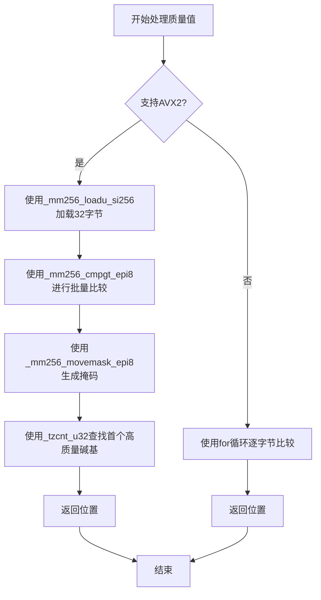

# SIMD优化策略

<cite>
**本文档引用文件**  
- [design.md](file://docs/optimization/design.md)
- [critical-analysis.md](file://docs/optimization/critical-analysis.md)
- [requirements.md](file://docs/optimization/requirements.md)
- [quality_trimmer.cpp](file://src/processing/mutators/quality_trimmer.cpp)
- [quality_trimmer.h](file://include/fqtools/processing/mutators/quality_trimmer.h)
- [CMakeLists.txt](file://CMakeLists.txt)
</cite>

## 目录
1. [引言](#引言)
2. [当前未实装SIMD的原因](#当前未实装simd的原因)
3. [跨平台维护成本与复杂性](#跨平台维护成本与复杂性)
4. [未来SIMD架构方案](#未来simd架构方案)
5. [向量化处理策略](#向量化处理策略)
6. [性能剖析建议](#性能剖析建议)

## 引言
本文档旨在阐明`fastq-tools`项目中SIMD（单指令多数据）优化的当前状态、未实施原因、未来规划及技术考量。根据项目设计文档与性能分析，SIMD优化虽具备理论加速潜力，但受限于当前性能瓶颈分布与工程维护成本，暂未被列为优先实现项。本文将结合项目实际架构与代码实现，系统性地解释相关决策。

## 当前未实装SIMD的原因
项目当前未实现SIMD加速，其核心原因在于性能瓶颈的优先级排序。根据`docs/optimization/design.md`中的设计决策记录，当前系统的性能瓶颈主要集中在I/O操作与GZIP解压环节，而非计算密集型的数据解析过程。

`docs/optimization/critical-analysis.md`的辨证分析报告明确指出，解压环节是“单线程性能的绝对瓶颈（Top 1 Hotspot）”。为此，项目已优先集成了`libdeflate`库，其解压速度比标准`zlib`快2-3倍，带来了显著的吞吐量提升。相比之下，对`QualityTrimmer`等组件进行SIMD优化所带来的收益，在当前的性能格局下显得次要。

因此，遵循“收益明确”和“简单优先”的设计原则，团队决定将SIMD优化的优先级置于`libdeflate`集成和内存池优化之后，避免过早优化（premature optimization），确保工程资源被投入到回报最高的领域。

**Section sources**
- [design.md](file://docs/optimization/design.md#L101-L106)
- [critical-analysis.md](file://docs/optimization/critical-analysis.md#L34-L35)
- [requirements.md](file://docs/optimization/requirements.md#L58-L62)

## 跨平台维护成本与复杂性
实现SIMD优化将带来显著的跨平台维护成本和复杂性增加问题。SIMD指令集（如x86上的SSE4.2、AVX2，ARM上的NEON）具有高度的平台特异性。

1.  **多平台代码维护**：为了支持x86和ARM架构，需要编写和维护两套甚至多套使用不同Intrinsics（内建函数）的代码。这不仅增加了代码量，也使得代码审查、调试和测试的复杂度成倍增长。
2.  **代码可读性与可维护性**：手写Intrinsics代码（如`_mm256_loadu_si256`, `_mm256_cmpgt_epi8`）通常难以阅读和理解，对新开发者不友好，容易引入难以发现的错误，违背了项目“保持代码可维护性”的核心原则。
3.  **构建系统复杂性**：需要在构建系统（CMake）中精确地检测目标平台的CPU特性，并相应地启用编译标志（如`-mavx2`）。虽然`CMakeLists.txt`中已为Release构建配置了`-march=native -mavx2`，但这仅保证了在支持的机器上编译时启用，而无法解决代码本身的多平台兼容问题。

`docs/optimization/critical-analysis.md`将此总结为“维护地狱”，并认为其带来的工程负担超过了潜在的性能收益，尤其是在当前瓶颈不在此处的情况下。

**Section sources**
- [critical-analysis.md](file://docs/optimization/critical-analysis.md#L57-L58)
- [requirements.md](file://docs/optimization/requirements.md#L44)
- [CMakeLists.txt](file://CMakeLists.txt#L53)

## 未来SIMD架构方案
尽管当前未实施，但未来若需引入SIMD，已规划了可能的架构方案。根据`changelog/2025-12-30-Optimization-simd.md`的记录，未来实现将采用基于编译时特征检测的分派机制。

该方案的核心思想是：
1.  **特征检测**：在编译阶段，通过预处理器宏（如`__AVX2__`）检测目标平台是否支持特定的SIMD指令集。
2.  **条件编译**：在关键函数（如`QualityTrimmer::trimFivePrime`）中，使用`#ifdef __AVX2__`等宏来包裹SIMD优化的代码路径。
3.  **回退机制**：当目标平台不支持高级SIMD指令时，自动回退到标量（scalar）循环实现，确保代码的可移植性。

在`src/processing/mutators/quality_trimmer.cpp`的代码中，已经可以看到这种模式的雏形。`trimFivePrime`函数内部使用`#ifdef __AVX2__`包裹了AVX2向量化实现，并在不支持时执行后续的标量循环。这为未来的优化提供了一个清晰的、低风险的集成路径。

**Diagram sources**
- [quality_trimmer.cpp](file://src/processing/mutators/quality_trimmer.cpp#L76-L113)
- [changelog/2025-12-30-Optimization-simd.md](file://changelog/2025-12-30-Optimization-simd.md#L8-L23)

## 向量化处理策略
若未来实施SIMD，最可能的应用场景是对碱基质量值或序列字符进行向量化处理。`changelog/2025-12-30-Optimization-simd.md`和`critical-analysis.md`均指出，`QualityTrimmer`是“极其适合”SIMD优化的场景。

具体策略如下：
1.  **目标操作**：对质量字符串（quality string）进行逐字节比较，判断其是否大于或等于阈值（`q >= threshold`）。
2.  **向量化实现**：利用AVX2指令集，一次处理32个字节的质量值。
    -   使用`_mm256_set1_epi8`创建一个包含32个阈值的向量。
    -   使用`_mm256_loadu_si256`从内存中加载32个连续的质量值字节。
    -   使用`_mm256_cmpgt_epi8`指令，将加载的32个字节与阈值向量进行有符号比较（由于质量值为正数，此操作安全）。
    -   使用`_mm256_movemask_epi8`将比较结果（0或-1）转换为一个32位的整数掩码。
    -   使用`__builtin_ctz`（或`_tzcnt_u32`）快速找到掩码中第一个为1的位，从而确定首个高质量碱基的位置。
3.  **适用性**：此策略适用于`trimFivePrime`和`trimThreePrime`等需要在连续内存块上进行简单、重复比较的场景。

**Section sources**
- [changelog/2025-12-30-Optimization-simd.md](file://changelog/2025-12-30-Optimization-simd.md#L7-L23)
- [critical-analysis.md](file://docs/optimization/critical-analysis.md#L62)
- [quality_trimmer.cpp](file://src/processing/mutators/quality_trimmer.cpp#L91-L102)

## 性能剖析建议
最终是否启动SIMD优化项目，应由数据驱动，而非凭空猜测。建议开发者在考虑此优化前，首先通过性能剖析工具（profiling tools）进行实际测量。

1.  **使用`perf`工具**：在Linux系统上，使用`perf record -g fqtools filter -i large.fq.gz -o out.fq.gz -t 8`命令运行程序，然后用`perf report`分析热点（hotspots）。这将清晰地展示CPU时间主要消耗在哪些函数上。
2.  **验证瓶颈转移**：在`libdeflate`和内存池等主要优化完成后，再次进行性能剖析。如果此时`QualityTrimmer::process`或类似函数成为新的性能瓶颈，那么实施SIMD优化将具有充分的理由。
3.  **基准测试**：使用`tools/benchmark/run_baseline.sh`脚本进行基准测试，对比开启和关闭潜在SIMD优化前后的吞吐量（MB/s）变化，量化优化的实际收益。

`docs/optimization/requirements.md`和`docs/analysis/implementation-proposals.md`都强调了“测量驱动”和“在profiling数据支持下”进行优化的重要性，这确保了所有性能工作都能产生实际价值。

**Section sources**
- [design.md](file://docs/optimization/design.md#L124-L132)
- [requirements.md](file://docs/optimization/requirements.md#L52)
- [implementation-proposals.md](file://docs/analysis/implementation-proposals.md#L97-L99)
- [run_baseline.sh](file://tools/benchmark/run_baseline.sh)