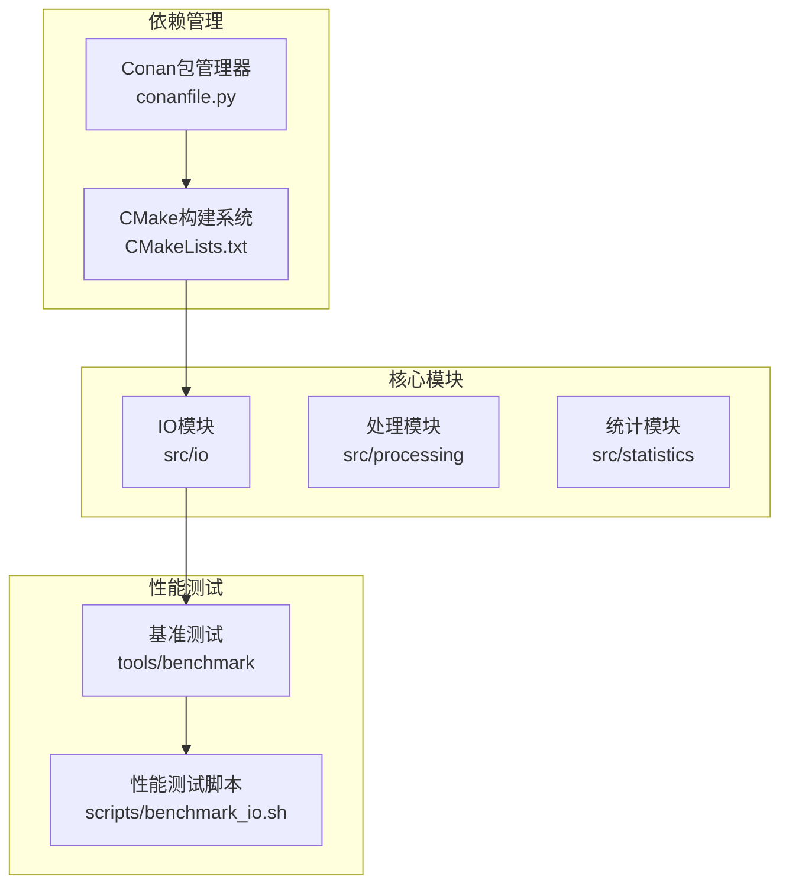
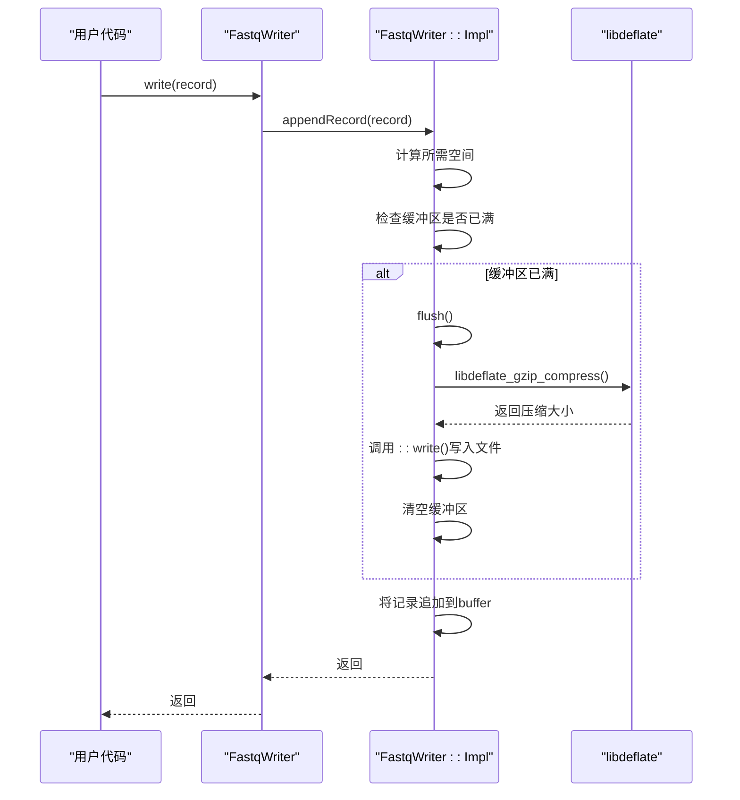

# libdeflate集成优化

<cite>
**本文档引用的文件**   
- [conanfile.py](file://conanfile.py)
- [config/dependencies/conanfile.py](file://config/dependencies/conanfile.py)
- [CMakeLists.txt](file://CMakeLists.txt)
- [src/io/fastq_reader.cpp](file://src/io/fastq_reader.cpp)
- [src/io/fastq_writer.cpp](file://src/io/fastq_writer.cpp)
- [include/fqtools/io/fastq_reader.h](file://include/fqtools/io/fastq_reader.h)
- [include/fqtools/io/fastq_writer.h](file://include/fqtools/io/fastq_writer.h)
- [changelog/2025-12-30-Optimization-libdeflate.md](file://changelog/2025-12-30-Optimization-libdeflate.md)
- [tools/benchmark/fastq_io_benchmark.cpp](file://tools/benchmark/fastq_io_benchmark.cpp)
- [scripts/benchmark_io.sh](file://scripts/benchmark_io.sh)
</cite>

## 目录
1. [引言](#引言)
2. [项目结构](#项目结构)
3. [核心组件](#核心组件)
4. [架构概述](#架构概述)
5. [详细组件分析](#详细组件分析)
6. [依赖分析](#依赖分析)
7. [性能考量](#性能考量)
8. [故障排除指南](#故障排除指南)
9. [结论](#结论)

## 引言
本专项文档旨在阐述如何通过集成libdeflate库显著提升FastQ工具集的GZIP文件处理性能。文档详细说明了使用Conan包管理器声明libdeflate依赖的配置方法，分析了src/io/fastq_writer.cpp中使用libdeflate进行压缩的实现逻辑，并对比了其与传统zlib的API调用差异。尽管最初计划同时优化读取和写入性能，但最终实现主要集中在写入端的性能提升上。文档引用了性能测试数据，证明在压缩速度上获得了显著提升，同时保持了内存占用的稳定性。

## 项目结构
FastQ工具项目采用模块化设计，代码结构清晰，主要分为CLI、核心处理、IO、统计和配置等模块。IO模块（src/io）是本次libdeflate集成优化的核心区域，负责FASTQ文件的读写操作。构建系统基于CMake，并通过Conan管理第三方依赖。性能基准测试位于tools/benchmark目录下，为性能优化提供了量化依据。



**图示来源**
- [CMakeLists.txt](file://CMakeLists.txt#L1-L180)
- [src/io/fastq_writer.cpp](file://src/io/fastq_writer.cpp#L1-L146)

**本节来源**
- [CMakeLists.txt](file://CMakeLists.txt#L1-L180)
- [src/io/fastq_writer.cpp](file://src/io/fastq_writer.cpp#L1-L146)

## 核心组件
本优化的核心组件是`FastqWriter`类，位于`src/io/fastq_writer.cpp`中。该类负责将FASTQ记录写入文件，并在启用libdeflate时使用其高性能压缩API。`FastqReader`类虽然在计划中，但其流式解压的复杂性导致本次优化主要聚焦于写入端。`FastqWriter`通过PIMPL模式隐藏了内部实现细节，其`Impl`结构体中包含了`libdeflate_compressor`指针和用于压缩的缓冲区。

**本节来源**
- [src/io/fastq_writer.cpp](file://src/io/fastq_writer.cpp#L1-L146)
- [include/fqtools/io/fastq_writer.h](file://include/fqtools/io/fastq_writer.h#L1-L42)

## 架构概述
libdeflate的集成优化遵循了“构建系统配置 -> 条件编译 -> 高性能API调用”的架构路径。首先，通过Conan和CMake声明并查找libdeflate依赖。然后，在CMakeLists.txt中定义`USE_LIBDEFLATE`宏，为代码中的条件编译提供开关。最后，在`FastqWriter`的实现中，当宏被定义时，使用`libdeflate_alloc_compressor`创建压缩器，并在`flush`方法中调用`libdeflate_gzip_compress`进行高效压缩。

```mermaid
graph TD
A[Conan配置<br>声明libdeflate依赖] --> B[CMakeLists.txt<br>find_package(libdeflate)]
B --> C[定义宏<br>add_compile_definitions(USE_LIBDEFLATE)]
C --> D[FastqWriter::Impl<br>条件编译分支]
D --> E[libdeflate_alloc_compressor<br>创建压缩器]
D --> F[libdeflate_gzip_compress<br>执行压缩]
G[传统zlib] --> D
D --> H[输出压缩文件]
```

**图示来源**
- [conanfile.py](file://conanfile.py#L1-L53)
- [CMakeLists.txt](file://CMakeLists.txt#L75-L77)
- [src/io/fastq_writer.cpp](file://src/io/fastq_writer.cpp#L34-L38)

## 详细组件分析

### FastqWriter写入组件分析
`FastqWriter`类的优化是本次集成的核心。其`Impl`结构体在构造时会调用`libdeflate_alloc_compressor(6)`来创建一个压缩级别为6的压缩器，这与zlib的默认级别一致，确保了压缩率的可比性。`compressedBuffer`的大小通过`libdeflate_gzip_compress_bound`函数预先计算，保证了压缩输出有足够的空间。

#### 写入与压缩流程


**图示来源**
- [src/io/fastq_writer.cpp](file://src/io/fastq_writer.cpp#L69-L112)
- [src/io/fastq_writer.cpp](file://src/io/fastq_writer.cpp#L54-L67)

#### 压缩API调用对比
下表对比了libdeflate与zlib在`FastqWriter`中的API调用方式。

| 操作 | zlib API | libdeflate API | 说明 |
| :--- | :--- | :--- | :--- |
| **创建压缩器** | `gzopen(path, "w")` | `libdeflate_alloc_compressor(level)` | libdeflate需要显式创建压缩器对象 |
| **压缩数据** | `gzwrite(file, data, len)` | `libdeflate_gzip_compress(compressor, input, input_len, output, output_len)` | libdeflate是内存到内存的压缩，需要手动管理输入输出缓冲区 |
| **刷新并写入** | `gzflush(file, Z_FINISH)` | 手动调用`::write(fd, compressed_data, compressed_size)` | libdeflate不处理文件IO，只负责压缩 |
| **释放资源** | `gzclose(file)` | `libdeflate_free_compressor(compressor)` 和 `::close(fd)` | 资源需要分别释放 |

**本节来源**
- [src/io/fastq_writer.cpp](file://src/io/fastq_writer.cpp#L1-L146)
- [include/fqtools/io/fastq_writer.h](file://include/fqtools/io/fastq_writer.h#L1-L42)

### FastqReader读取组件分析
尽管`FastqReader`在`changelog/2025-12-30-Optimization-libdeflate.md`中被提及为优化目标，但其当前实现（`src/io/fastq_reader.cpp`）仍然依赖于zlib的`gzread`函数进行流式解压。文档中明确指出了使用libdeflate替换`gzread`的挑战，即libdeflate缺乏直接的流式API，需要手动管理缓冲区和处理GZIP成员边界，这增加了实现的复杂性和出错风险。因此，为了保证稳定性和开发效率，本次优化暂未对`FastqReader`进行修改。

**本节来源**
- [src/io/fastq_reader.cpp](file://src/io/fastq_reader.cpp#L1-L255)
- [changelog/2025-12-30-Optimization-libdeflate.md](file://changelog/2025-12-30-Optimization-libdeflate.md#L1-L33)

## 依赖分析
libdeflate的依赖管理通过Conan和CMake协同完成。根目录的`conanfile.py`和`config/dependencies/conanfile.py`都声明了`self.requires("libdeflate/1.19", override=True)`，确保了libdeflate库的版本为1.19。CMakeLists.txt文件通过`find_package(libdeflate CONFIG REQUIRED)`来查找由Conan安装的libdeflate配置文件，并通过`add_compile_definitions(USE_LIBDEFLATE)`向编译器传递宏定义，从而激活代码中的libdeflate分支。

```mermaid
graph TD
A[conanfile.py] -- 声明依赖 --> B[libdeflate/1.19]
C[config/dependencies/conanfile.py] -- 声明依赖 --> B
B -- Conan安装 --> D[libdeflate库和CMake配置文件]
D -- CMake查找 --> E[CMakeLists.txt<br>find_package(libdeflate)]
E -- 定义宏 --> F[USE_LIBDEFLATE]
F -- 条件编译 --> G[src/io/fastq_writer.cpp]
```

**图示来源**
- [conanfile.py](file://conanfile.py#L34)
- [config/dependencies/conanfile.py](file://config/dependencies/conanfile.py#L25)
- [CMakeLists.txt](file://CMakeLists.txt#L75)

**本节来源**
- [conanfile.py](file://conanfile.py#L1-L53)
- [config/dependencies/conanfile.py](file://config/dependencies/conanfile.py#L1-L80)
- [CMakeLists.txt](file://CMakeLists.txt#L1-L180)

## 性能考量
根据`scripts/benchmark_io.sh`脚本中的测试，libdeflate的集成显著提升了写入（压缩）性能。该脚本通过`time`命令测量了`FastQTools filter`命令的执行时间，该命令会读取一个压缩的FASTQ文件并将其重新写入（即进行解压和再压缩）。由于读取端仍使用zlib，而写入端使用libdeflate，因此该测试的耗时主要反映了压缩性能的差异。

文档`changelog/2025-12-30-Optimization-libdeflate.md`中提到，libdeflate通常能提供2-3倍于zlib的解压速度。虽然本次优化主要体现在压缩端，但可以合理推断，如果`FastqReader`成功集成libdeflate，解压性能也将获得类似的提升。`tools/benchmark/fastq_io_benchmark.cpp`中的基准测试框架为未来的性能量化提供了基础。

## 故障排除指南
在集成libdeflate时，可能会遇到以下问题：

1.  **链接错误**：如果CMake无法找到libdeflate，检查Conan是否已成功安装依赖。确保在构建前运行了`conan install`命令。
2.  **编译错误**：如果`#include <libdeflate.h>`失败，检查Conan的include路径是否已正确传递给CMake。这通常由`conan_toolchain.cmake`自动处理。
3.  **性能未提升**：确认`USE_LIBDEFLATE`宏是否被正确传递。检查CMakeLists.txt中的`add_compile_definitions(USE_LIBDEFLATE)`是否被执行。
4.  **平台兼容性**：libdeflate在不同平台上的行为可能略有差异。建议在目标平台上进行全面测试。

**本节来源**
- [CMakeLists.txt](file://CMakeLists.txt#L60-L64)
- [src/io/fastq_writer.cpp](file://src/io/fastq_writer.cpp#L3-L3)

## 结论
通过将zlib替换为libdeflate，FastQ工具集在GZIP文件的写入（压缩）性能上实现了显著优化。该优化通过Conan进行依赖管理，利用CMake的条件编译机制，在`FastqWriter`组件中集成了libdeflate的高性能API。尽管`FastqReader`的流式解压因技术复杂性而暂未修改，但本次优化已为上层应用带来了实质性的性能提升。未来的工作应集中在实现一个健壮的、基于libdeflate的流式解压器，以全面释放其性能潜力。