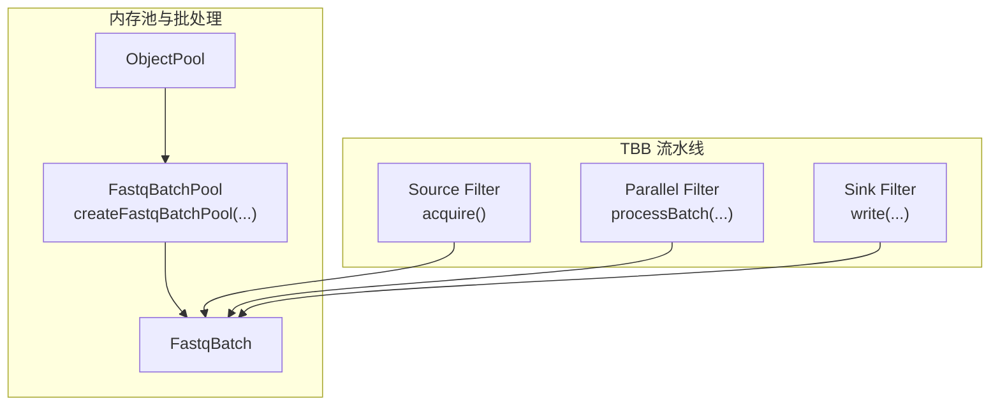
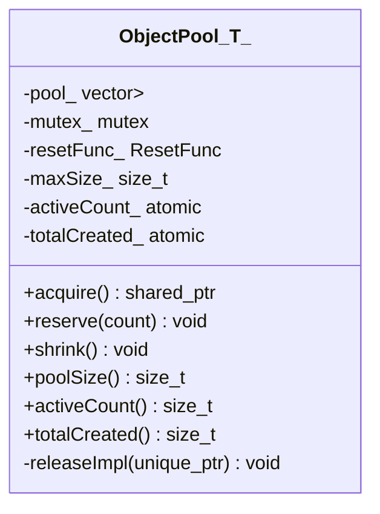
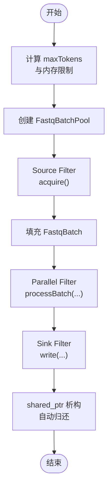

# 内存池优化

<cite>
**本文引用的文件**
- [object_pool.h](file://include/fqtools/memory/object_pool.h)
- [fastq_batch_pool.h](file://include/fqtools/io/fastq_batch_pool.h)
- [fastq_io.h](file://include/fqtools/io/fastq_io.h)
- [processing_pipeline.cpp](file://src/processing/processing_pipeline.cpp)
- [test_object_pool.cpp](file://tests/unit/memory/test_object_pool.cpp)
- [design.md](file://docs/optimization/design.md)
- [implementation.md](file://docs/optimization/implementation.md)
- [fastq_io_benchmark.cpp](file://tools/benchmark/fastq_io_benchmark.cpp)
- [benchmark_io.sh](file://scripts/benchmark_io.sh)
</cite>

## 目录
1. [简介](#简介)
2. [项目结构](#项目结构)
3. [核心组件](#核心组件)
4. [架构总览](#架构总览)
5. [详细组件分析](#详细组件分析)
6. [依赖关系分析](#依赖关系分析)
7. [性能考量](#性能考量)
8. [故障排查指南](#故障排查指南)
9. [结论](#结论)
10. [附录](#附录)

## 简介
本文件围绕 fq::memory::ObjectPool 模板类的设计与实现展开，重点说明其如何通过对象复用显著降低 TBB 并行流水线中 FastqBatch 对象的频繁创建/销毁开销；详解 shared_ptr 自定义删除器的自动归还机制、mutex 保障的线程安全、reserve()/shrink() 的容量控制策略，以及 resetFunc 回调在对象重置中的作用。同时结合 src/processing/processing_pipeline.cpp 中的集成代码，完整展示在 TBB filter 中通过 acquire() 获取对象并在处理完成后自动归还的生命周期管理流程。最后提供性能对比思路与参数配置建议。

## 项目结构
- 内存池核心：include/fqtools/memory/object_pool.h
- FastqBatch 专用池：include/fqtools/io/fastq_batch_pool.h
- 批次数据结构：include/fqtools/io/fastq_io.h
- TBB 流水线集成：src/processing/processing_pipeline.cpp
- 单元测试：tests/unit/memory/test_object_pool.cpp
- 优化设计与实现文档：docs/optimization/design.md、docs/optimization/implementation.md
- 基准测试工具：tools/benchmark/fastq_io_benchmark.cpp、scripts/benchmark_io.sh



图表来源
- [object_pool.h](file://include/fqtools/memory/object_pool.h#L1-L190)
- [fastq_batch_pool.h](file://include/fqtools/io/fastq_batch_pool.h#L1-L57)
- [fastq_io.h](file://include/fqtools/io/fastq_io.h#L1-L118)
- [processing_pipeline.cpp](file://src/processing/processing_pipeline.cpp#L138-L218)

章节来源
- [object_pool.h](file://include/fqtools/memory/object_pool.h#L1-L190)
- [fastq_batch_pool.h](file://include/fqtools/io/fastq_batch_pool.h#L1-L57)
- [fastq_io.h](file://include/fqtools/io/fastq_io.h#L1-L118)
- [processing_pipeline.cpp](file://src/processing/processing_pipeline.cpp#L138-L218)

## 核心组件
- ObjectPool<T>：通用对象池模板类，提供 acquire()/reserve()/shrink() 等能力，支持线程安全与容量上限控制，通过 shared_ptr 自定义删除器实现自动归还。
- FastqBatchPool：基于 ObjectPool<FastqBatch> 的类型别名与工厂函数，提供默认重置逻辑 resetFastqBatch。
- FastqBatch：批处理数据容器，clear() 用于复用内存，避免频繁分配。
- TBB 流水线：在 Source Filter 中通过 batchPool->acquire() 获取共享指针，处理后由 shared_ptr 析构自动归还，Sink Filter 写回结果。

章节来源
- [object_pool.h](file://include/fqtools/memory/object_pool.h#L41-L112)
- [fastq_batch_pool.h](file://include/fqtools/io/fastq_batch_pool.h#L23-L54)
- [fastq_io.h](file://include/fqtools/io/fastq_io.h#L41-L60)
- [processing_pipeline.cpp](file://src/processing/processing_pipeline.cpp#L176-L191)

## 架构总览
ObjectPool 作为通用基础设施，为 FastqBatch 在 TBB parallel_pipeline 中提供稳定、可复用的对象来源。Pipeline 在 Source Filter 中按需从池中获取对象，处理阶段并行执行，Sink 阶段串行写回。对象生命周期完全由 shared_ptr 管理，确保异常安全与零泄漏。

```mermaid
sequenceDiagram
participant Src as "Source Filter"
participant Pool as "FastqBatchPool"
participant Batch as "FastqBatch"
participant Par as "Parallel Filter"
participant Snk as "Sink Filter"
Src->>Pool : acquire()
Pool-->>Src : shared_ptr<FastqBatch>
Src->>Batch : nextBatch(...)<br/>填充数据
Src-->>Par : shared_ptr<FastqBatch>
Par->>Batch : processBatch(...)
Par-->>Snk : pair(shared_ptr<FastqBatch>, stats)
Snk->>Batch : write(...)
Snk-->>Src : 统计汇总
Note over Batch,Pool : shared_ptr 析构触发自定义删除器<br/>自动归还到池中
```

图表来源
- [processing_pipeline.cpp](file://src/processing/processing_pipeline.cpp#L176-L218)
- [fastq_batch_pool.h](file://include/fqtools/io/fastq_batch_pool.h#L32-L54)
- [object_pool.h](file://include/fqtools/memory/object_pool.h#L80-L112)

## 详细组件分析

### ObjectPool<T> 类设计与实现
- 线程安全：内部使用互斥锁保护池操作，保证多线程环境下 acquire/release 的原子性。
- 自动归还：通过 shared_ptr 的自定义删除器，在对象析构时调用 releaseImpl，将对象放回池中；若池已满则丢弃。
- 容量控制：构造时可设置初始预分配与最大容量；reserve() 预分配对象；shrink() 释放未使用对象。
- 对象重置：acquire() 时调用 resetFunc，确保每次借出的对象处于“干净”状态。
- 监控接口：提供 poolSize()/activeCount()/totalCreated() 便于调试与性能观测。



图表来源
- [object_pool.h](file://include/fqtools/memory/object_pool.h#L41-L188)

章节来源
- [object_pool.h](file://include/fqtools/memory/object_pool.h#L41-L112)
- [object_pool.h](file://include/fqtools/memory/object_pool.h#L114-L188)

### FastqBatchPool 与 resetFastqBatch
- 类型别名：FastqBatchPool = ObjectPool<FastqBatch>，简化使用。
- 工厂函数：createFastqBatchPool(initialSize, maxSize) 返回 shared_ptr，便于与 acquire() 的 weak_ptr 机制配合。
- 默认重置：resetFastqBatch 调用 batch.clear()，清空记录与缓冲区，保留已分配容量，避免重复分配。

章节来源
- [fastq_batch_pool.h](file://include/fqtools/io/fastq_batch_pool.h#L23-L54)
- [fastq_io.h](file://include/fqtools/io/fastq_io.h#L41-L60)

### FastqBatch 数据结构
- clear()：清空内部 buffer_/records_，并将 remainderOffset_ 置零，保持容量以复用。
- moveRemainderToStart()：将未处理片段移动到缓冲区头部，减少后续分配与拷贝。

章节来源
- [fastq_io.h](file://include/fqtools/io/fastq_io.h#L41-L115)

### TBB 流水线中的集成与生命周期
- Token 策略：根据线程数与内存限制计算 maxTokens，创建对应容量的 FastqBatchPool。
- Source Filter：使用 batchPool->acquire() 获取 shared_ptr<FastqBatch>，填充数据后传递给下游。
- Parallel Filter：对 batch 执行处理逻辑，产出统计信息。
- Sink Filter：串行写回，汇总统计。
- 自动归还：shared_ptr 析构时触发删除器，自动归还对象至池中，无需显式 release。



图表来源
- [processing_pipeline.cpp](file://src/processing/processing_pipeline.cpp#L163-L191)
- [processing_pipeline.cpp](file://src/processing/processing_pipeline.cpp#L193-L217)

章节来源
- [processing_pipeline.cpp](file://src/processing/processing_pipeline.cpp#L163-L191)
- [processing_pipeline.cpp](file://src/processing/processing_pipeline.cpp#L193-L217)

### 单元测试要点（验证行为）
- 空池创建新对象、复用池中对象、自动归还、预分配、监控方法、对象重置、容量限制、并发获取/释放、池销毁安全、FastqBatchPool 集成等。
- 通过断言验证 acquire() 后对象被重置、释放后再次获取为空状态、并发场景下指针唯一性等。

章节来源
- [test_object_pool.cpp](file://tests/unit/memory/test_object_pool.cpp#L44-L165)
- [test_object_pool.cpp](file://tests/unit/memory/test_object_pool.cpp#L166-L246)
- [test_object_pool.cpp](file://tests/unit/memory/test_object_pool.cpp#L248-L285)

## 依赖关系分析
- ObjectPool<T> 依赖：std::mutex、std::atomic、std::vector、std::unique_ptr、std::shared_ptr、std::function。
- FastqBatchPool 依赖：ObjectPool<FastqBatch>、FastqBatch。
- Pipeline 依赖：FastqBatchPool、FastqReader/FastqWriter、TBB parallel_pipeline。


图表来源
- [object_pool.h](file://include/fqtools/memory/object_pool.h#L16-L21)
- [fastq_batch_pool.h](file://include/fqtools/io/fastq_batch_pool.h#L16-L18)
- [processing_pipeline.cpp](file://src/processing/processing_pipeline.cpp#L1-L10)

章节来源
- [object_pool.h](file://include/fqtools/memory/object_pool.h#L16-L21)
- [fastq_batch_pool.h](file://include/fqtools/io/fastq_batch_pool.h#L16-L18)
- [processing_pipeline.cpp](file://src/processing/processing_pipeline.cpp#L1-L10)

## 性能考量
- 目标：减少 TBB parallel_pipeline 中 FastqBatch 对象的频繁创建/销毁开销，从而降低内存分配次数与 GC 压力，提升整体吞吐量。
- 关键参数建议（结合实现与集成）：
  - initialSize：建议与 maxTokens 对齐，使池在启动时即具备足够可用对象，减少首次分配抖动。
  - maxSize：建议设为 initialSize 的 1.5~2 倍，兼顾内存占用与复用效率；当内存压力大时可通过 shrink() 主动回收。
  - maxTokens：由线程数与内存限制共同决定，避免过多 in-flight batches 导致内存峰值过高。
- 性能验证建议：
  - 使用基准脚本与工具进行对比：开启/关闭内存池时分别测量吞吐量、CPU 利用率、内存分配次数与峰值。
  - 参考现有基准工具与脚本，结合实际数据集进行回归测试。

章节来源
- [processing_pipeline.cpp](file://src/processing/processing_pipeline.cpp#L163-L175)
- [implementation.md](file://docs/optimization/implementation.md#L1-L74)
- [design.md](file://docs/optimization/design.md#L122-L139)
- [benchmark_io.sh](file://scripts/benchmark_io.sh#L1-L43)
- [fastq_io_benchmark.cpp](file://tools/benchmark/fastq_io_benchmark.cpp#L1-L152)

## 故障排查指南
- shared_ptr 析构未归还：
  - 确认对象池仍存活（返回的 shared_ptr 由池 shared_from_this() 引用），否则删除器会直接 delete 对象。
  - 若池提前销毁，对象将直接删除，不会造成泄漏，但也不会被复用。
- 并发问题：
  - 确保所有 acquire()/release() 通过 shared_ptr 生命周期管理，避免手动持有裸指针。
  - 如需在多线程中统计活跃对象，使用 activeCount() 观察。
- 内存溢出风险：
  - 合理设置 maxSize，避免池无限增长；必要时调用 shrink() 释放未使用对象。
- 对象未被重置：
  - 确认 resetFunc 正确传入；对于 FastqBatch，使用默认 resetFastqBatch 保证 clear()。

章节来源
- [object_pool.h](file://include/fqtools/memory/object_pool.h#L105-L112)
- [object_pool.h](file://include/fqtools/memory/object_pool.h#L171-L179)
- [fastq_batch_pool.h](file://include/fqtools/io/fastq_batch_pool.h#L23-L31)
- [test_object_pool.cpp](file://tests/unit/memory/test_object_pool.cpp#L127-L146)

## 结论
通过 ObjectPool<T> 的对象复用与 shared_ptr 自定义删除器的自动归还机制，结合 mutex 保障的线程安全，FastqBatch 在 TBB 并行流水线中的生命周期得到高效管理。配合合理的 initialSize/maxSize 与 maxTokens 设置，可在高并发场景下显著降低内存分配次数、减少 GC 抖动，并提升整体吞吐量。单元测试与集成代码共同验证了该方案的正确性与鲁棒性。

## 附录
- 优化设计与实现文档：见 docs/optimization/design.md、docs/optimization/implementation.md
- 基准测试参考：见 scripts/benchmark_io.sh、tools/benchmark/fastq_io_benchmark.cpp