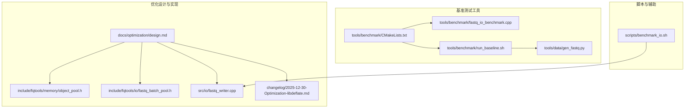
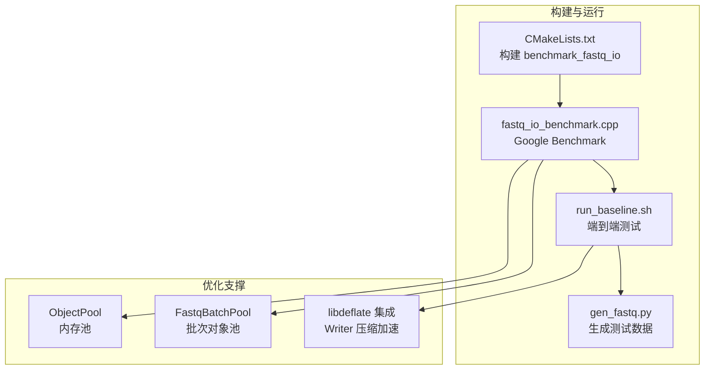
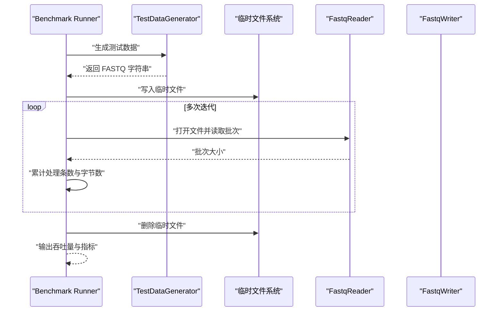
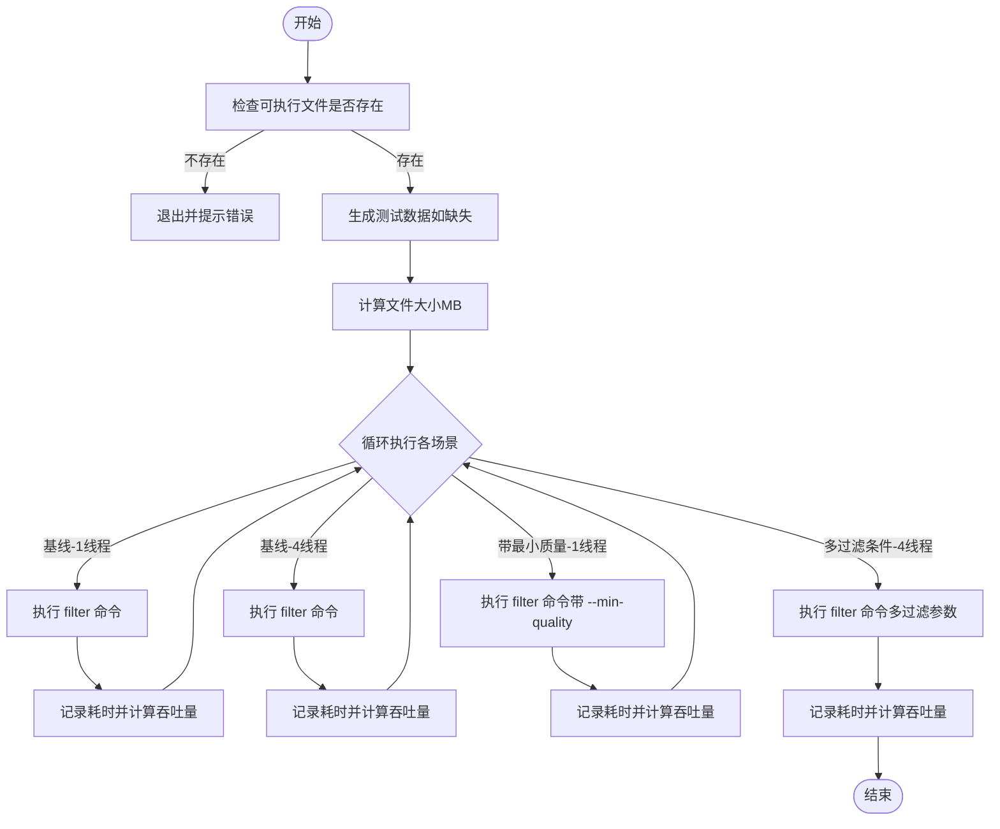
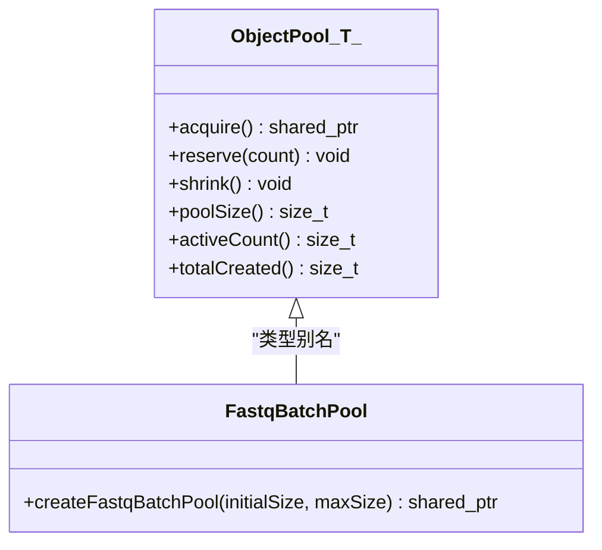
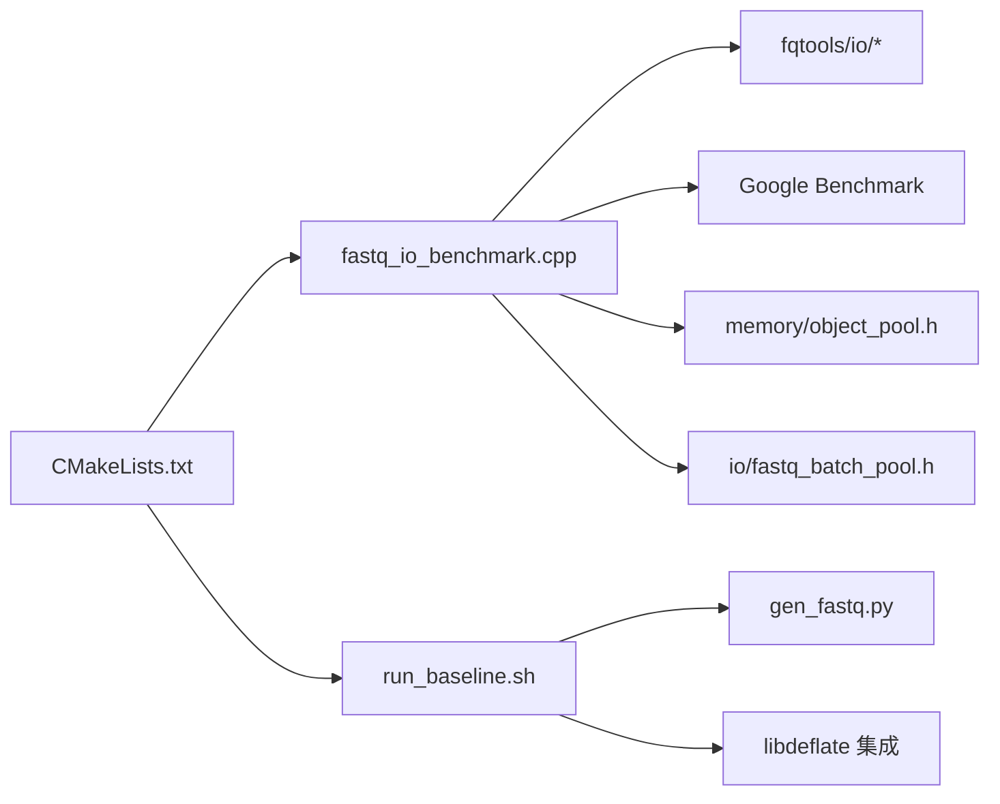

# 基准测试方法

<cite>
**本文引用的文件**
- [tools/benchmark/fastq_io_benchmark.cpp](file://tools/benchmark/fastq_io_benchmark.cpp)
- [tools/benchmark/run_baseline.sh](file://tools/benchmark/run_baseline.sh)
- [tools/benchmark/CMakeLists.txt](file://tools/benchmark/CMakeLists.txt)
- [docs/optimization/design.md](file://docs/optimization/design.md)
- [scripts/benchmark_io.sh](file://scripts/benchmark_io.sh)
- [tools/data/gen_fastq.py](file://tools/data/gen_fastq.py)
- [include/fqtools/memory/object_pool.h](file://include/fqtools/memory/object_pool.h)
- [include/fqtools/io/fastq_batch_pool.h](file://include/fqtools/io/fastq_batch_pool.h)
- [src/io/fastq_writer.cpp](file://src/io/fastq_writer.cpp)
- [changelog/2025-12-30-Optimization-libdeflate.md](file://changelog/2025-12-30-Optimization-libdeflate.md)
</cite>

## 目录
1. [简介](#简介)
2. [项目结构](#项目结构)
3. [核心组件](#核心组件)
4. [架构总览](#架构总览)
5. [详细组件分析](#详细组件分析)
6. [依赖关系分析](#依赖关系分析)
7. [性能考量](#性能考量)
8. [故障排查指南](#故障排查指南)
9. [结论](#结论)
10. [附录](#附录)

## 简介
本指南面向开发者，系统讲解如何使用仓库内的基准测试工具评估系统性能，重点覆盖以下方面：
- 使用 tools/benchmark 目录下的工具进行端到端与IO基准测试；
- 设计 fastq_io_benchmark.cpp 的测试用例，覆盖不同压缩格式、文件大小与线程数的对比方案；
- 演示 run_baseline.sh 的执行流程与结果解读方法；
- 结合 docs/optimization/design.md 的建议，介绍如何使用 time 与 perf 进行生产环境性能测量；
- 定义关键性能指标（吞吐量 MB/s、内存分配次数、CPU 利用率）的采集方式；
- 提供对比不同优化策略（开启/关闭内存池、使用 libdeflate/zlib）的标准测试流程，确保结果可复现。

## 项目结构
本项目的基准测试相关文件集中在 tools/benchmark 与 scripts 目录，配合 docs/optimization/design.md 中的优化建议，形成从工具到指标再到策略的完整闭环。

图表来源
- [tools/benchmark/CMakeLists.txt](file://tools/benchmark/CMakeLists.txt#L1-L53)
- [tools/benchmark/fastq_io_benchmark.cpp](file://tools/benchmark/fastq_io_benchmark.cpp#L1-L152)
- [tools/benchmark/run_baseline.sh](file://tools/benchmark/run_baseline.sh#L1-L72)
- [tools/data/gen_fastq.py](file://tools/data/gen_fastq.py#L1-L51)
- [scripts/benchmark_io.sh](file://scripts/benchmark_io.sh#L1-L43)
- [docs/optimization/design.md](file://docs/optimization/design.md#L1-L139)
- [include/fqtools/memory/object_pool.h](file://include/fqtools/memory/object_pool.h#L1-L190)
- [include/fqtools/io/fastq_batch_pool.h](file://include/fqtools/io/fastq_batch_pool.h#L1-L56)
- [src/io/fastq_writer.cpp](file://src/io/fastq_writer.cpp#L46-L80)
- [changelog/2025-12-30-Optimization-libdeflate.md](file://changelog/2025-12-30-Optimization-libdeflate.md#L1-L33)

章节来源
- [tools/benchmark/CMakeLists.txt](file://tools/benchmark/CMakeLists.txt#L1-L53)
- [tools/benchmark/fastq_io_benchmark.cpp](file://tools/benchmark/fastq_io_benchmark.cpp#L1-L152)
- [tools/benchmark/run_baseline.sh](file://tools/benchmark/run_baseline.sh#L1-L72)
- [tools/data/gen_fastq.py](file://tools/data/gen_fastq.py#L1-L51)
- [scripts/benchmark_io.sh](file://scripts/benchmark_io.sh#L1-L43)
- [docs/optimization/design.md](file://docs/optimization/design.md#L1-L139)

## 核心组件
- IO 基准测试程序：基于 Google Benchmark，提供 FastQ 读取与写入的基准测试入口，自动设置 ItemsProcessed 与 BytesProcessed，便于吞吐量统计。
- 端到端基线脚本：对 FastQTools 的 filter 命令进行端到端性能测试，自动计算吞吐量（MB/s），并支持多线程与过滤参数组合。
- 生成测试数据脚本：用于生成指定规模的 FASTQ 数据，作为基准测试输入。
- 优化设计与实现：包含内存池、libdeflate 集成等优化，为对比不同策略提供基础。

章节来源
- [tools/benchmark/fastq_io_benchmark.cpp](file://tools/benchmark/fastq_io_benchmark.cpp#L67-L150)
- [tools/benchmark/run_baseline.sh](file://tools/benchmark/run_baseline.sh#L41-L71)
- [tools/data/gen_fastq.py](file://tools/data/gen_fastq.py#L1-L51)
- [docs/optimization/design.md](file://docs/optimization/design.md#L1-L139)

## 架构总览
下图展示了基准测试工具链的整体交互：CMake 构建基准程序，Google Benchmark 执行测试，脚本驱动端到端测试并计算吞吐量，优化设计贯穿其中以支持策略对比。

图表来源
- [tools/benchmark/CMakeLists.txt](file://tools/benchmark/CMakeLists.txt#L1-L53)
- [tools/benchmark/fastq_io_benchmark.cpp](file://tools/benchmark/fastq_io_benchmark.cpp#L1-L152)
- [tools/benchmark/run_baseline.sh](file://tools/benchmark/run_baseline.sh#L1-L72)
- [tools/data/gen_fastq.py](file://tools/data/gen_fastq.py#L1-L51)
- [include/fqtools/memory/object_pool.h](file://include/fqtools/memory/object_pool.h#L1-L190)
- [include/fqtools/io/fastq_batch_pool.h](file://include/fqtools/io/fastq_batch_pool.h#L1-L56)
- [src/io/fastq_writer.cpp](file://src/io/fastq_writer.cpp#L46-L80)
- [docs/optimization/design.md](file://docs/optimization/design.md#L1-L139)

## 详细组件分析

### fastq_io_benchmark.cpp：IO 基准测试设计
该文件基于 Google Benchmark 提供两类基准：
- FastQReader 基准：生成指定数量的 FASTQ 记录，写入临时文件，循环读取并统计处理条数与字节数，自动设置 ItemsProcessed 与 BytesProcessed，便于吞吐量统计。
- FastQWriter 基准：准备固定长度的序列与质量数据，循环写入临时文件，统计 ItemsProcessed，便于吞吐量统计。

测试用例设计要点
- 输入生成：使用随机序列与质量分数生成器，控制读长与记录数，避免 IO 开销被 CPU 开销掩盖。
- 临时文件：在临时目录生成输入文件，避免磁盘 IO 与清理干扰。
- 基准范围：通过 Range 指定记录数范围，覆盖小/中/大样本，观察吞吐量随规模变化。
- 指标设置：通过 SetItemsProcessed 与 SetBytesProcessed，自动输出 MB/s 与每秒处理条数。

图表来源
- [tools/benchmark/fastq_io_benchmark.cpp](file://tools/benchmark/fastq_io_benchmark.cpp#L67-L150)

章节来源
- [tools/benchmark/fastq_io_benchmark.cpp](file://tools/benchmark/fastq_io_benchmark.cpp#L1-L152)

### run_baseline.sh：端到端基线脚本执行流程与结果解读
脚本执行流程
- 定位可执行文件与数据目录，创建临时目录用于输出。
- 若缺少测试数据，则调用 Python 脚本生成指定规模与长度的 FASTQ 文件。
- 计算输入文件大小（MB），打印基准信息。
- 循环执行多组场景：
  - 基线（1/4 线程）
  - 带最小质量过滤（1/4 线程）
  - 多过滤条件（1/4 线程）
- 每轮使用时间测量计算耗时与吞吐量（MB/s），并输出结果。

结果解读
- Elapsed：单次运行耗时（秒）
- Throughput：吞吐量（MB/s），越大越好
- 场景对比：通过不同线程数与过滤策略，观察吞吐量变化，定位瓶颈与收益

图表来源
- [tools/benchmark/run_baseline.sh](file://tools/benchmark/run_baseline.sh#L1-L72)

章节来源
- [tools/benchmark/run_baseline.sh](file://tools/benchmark/run_baseline.sh#L1-L72)

### 生成测试数据：gen_fastq.py
- 支持指定输出文件、读取条数、最小/最大读长与随机种子。
- 生成 FASTQ 格式文本，用于端到端与 IO 基准测试。

章节来源
- [tools/data/gen_fastq.py](file://tools/data/gen_fastq.py#L1-L51)

### 优化策略对比：内存池与 libdeflate
- 内存池：通过 ObjectPool 与 FastqBatchPool 减少对象频繁分配与销毁，降低 GC/分配器压力，提高吞吐量。
- libdeflate：在 Writer 侧使用 libdeflate 进行 gzip 压缩，显著提升压缩速度；Reader 侧集成策略见变更记录与设计文档。

图表来源
- [include/fqtools/memory/object_pool.h](file://include/fqtools/memory/object_pool.h#L1-L190)
- [include/fqtools/io/fastq_batch_pool.h](file://include/fqtools/io/fastq_batch_pool.h#L1-L56)

章节来源
- [docs/optimization/design.md](file://docs/optimization/design.md#L1-L139)
- [include/fqtools/memory/object_pool.h](file://include/fqtools/memory/object_pool.h#L1-L190)
- [include/fqtools/io/fastq_batch_pool.h](file://include/fqtools/io/fastq_batch_pool.h#L1-L56)
- [src/io/fastq_writer.cpp](file://src/io/fastq_writer.cpp#L46-L80)
- [changelog/2025-12-30-Optimization-libdeflate.md](file://changelog/2025-12-30-Optimization-libdeflate.md#L1-L33)

## 依赖关系分析
- CMakeLists.txt 负责查找 Google Benchmark 并链接 fq_lib，构建 benchmark_fastq_io 与可选的 performance_benchmark。
- fastq_io_benchmark.cpp 依赖 fqtools/io 的 FastqReader/FastqWriter，以及 Google Benchmark。
- run_baseline.sh 依赖 FastQTools 可执行文件与 Python 生成脚本。
- 优化设计贯穿 IO 层与内存池，libdeflate 集成在 Writer 侧。

图表来源
- [tools/benchmark/CMakeLists.txt](file://tools/benchmark/CMakeLists.txt#L1-L53)
- [tools/benchmark/fastq_io_benchmark.cpp](file://tools/benchmark/fastq_io_benchmark.cpp#L1-L152)
- [tools/benchmark/run_baseline.sh](file://tools/benchmark/run_baseline.sh#L1-L72)
- [tools/data/gen_fastq.py](file://tools/data/gen_fastq.py#L1-L51)
- [include/fqtools/memory/object_pool.h](file://include/fqtools/memory/object_pool.h#L1-L190)
- [include/fqtools/io/fastq_batch_pool.h](file://include/fqtools/io/fastq_batch_pool.h#L1-L56)
- [src/io/fastq_writer.cpp](file://src/io/fastq_writer.cpp#L46-L80)

章节来源
- [tools/benchmark/CMakeLists.txt](file://tools/benchmark/CMakeLists.txt#L1-L53)
- [tools/benchmark/fastq_io_benchmark.cpp](file://tools/benchmark/fastq_io_benchmark.cpp#L1-L152)
- [tools/benchmark/run_baseline.sh](file://tools/benchmark/run_baseline.sh#L1-L72)
- [tools/data/gen_fastq.py](file://tools/data/gen_fastq.py#L1-L51)

## 性能考量
关键性能指标与采集方式
- 吞吐量（MB/s）：由 run_baseline.sh 自动计算，输入文件大小（MB）除以耗时（s）。
- 内存分配次数：可在脚本中加入内存统计命令（如 Linux 的 pmap、valgrind/callgrind）或在 Google Benchmark 中统计对象池活跃计数与创建计数。
- CPU 利用率：使用 time 与 perf 进行生产环境测量，perf record -g 采集热点，perf report 展示热点函数。

生产环境测量建议
- 使用 time：快速估算 CPU 时间与实际时间，识别 CPU 密集与 IO 密集阶段。
- 使用 perf：对 filter 命令进行采样，定位热点函数（如解压、解析、过滤、压缩等）。

章节来源
- [docs/optimization/design.md](file://docs/optimization/design.md#L122-L139)
- [tools/benchmark/run_baseline.sh](file://tools/benchmark/run_baseline.sh#L41-L71)

## 故障排查指南
常见问题与解决思路
- 可执行文件缺失：确认 FastQTools 是否正确构建并位于预期路径。
- 测试数据不足：脚本会在缺失时自动生成，确保 Python 与依赖可用。
- 线程数与过滤参数：根据场景调整 --threads 与过滤参数，观察吞吐量变化。
- 内存池与 libdeflate：若启用内存池或 libdeflate，需确认构建配置与依赖安装。

章节来源
- [tools/benchmark/run_baseline.sh](file://tools/benchmark/run_baseline.sh#L13-L23)
- [tools/benchmark/run_baseline.sh](file://tools/benchmark/run_baseline.sh#L24-L30)
- [scripts/benchmark_io.sh](file://scripts/benchmark_io.sh#L1-L43)

## 结论
通过 tools/benchmark 下的工具与脚本，可以系统地评估 FastQTools 在不同压缩格式、文件规模与线程数下的性能表现。结合 docs/optimization/design.md 的优化建议，开发者可以在开启/关闭内存池、切换 libdeflate/zlib 等策略之间进行可控对比，确保结果可复现、可解释。同时，借助 time 与 perf，可在生产环境中进一步定位瓶颈并验证优化效果。

## 附录

### 标准测试流程（对比不同优化策略）
- 准备数据：使用 gen_fastq.py 生成固定规模与长度的 FASTQ 文件。
- 基线测试：run_baseline.sh 执行多场景（1/4 线程、无过滤、最小质量过滤、多过滤条件）。
- 内存池对比：分别构建启用/禁用内存池版本，重复上述场景，对比吞吐量与内存分配次数。
- libdeflate 对比：分别构建启用/禁用 libdeflate（Writer 侧）版本，重复场景，对比吞吐量与 CPU 利用率。
- 生产环境验证：使用 time 与 perf 进行采样，定位热点并验证优化收益。

章节来源
- [tools/benchmark/run_baseline.sh](file://tools/benchmark/run_baseline.sh#L41-L71)
- [tools/data/gen_fastq.py](file://tools/data/gen_fastq.py#L1-L51)
- [docs/optimization/design.md](file://docs/optimization/design.md#L1-L139)
- [src/io/fastq_writer.cpp](file://src/io/fastq_writer.cpp#L46-L80)
- [changelog/2025-12-30-Optimization-libdeflate.md](file://changelog/2025-12-30-Optimization-libdeflate.md#L1-L33)