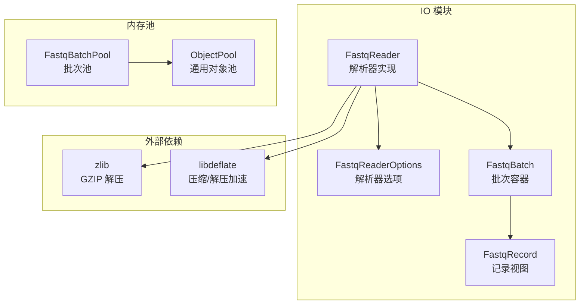
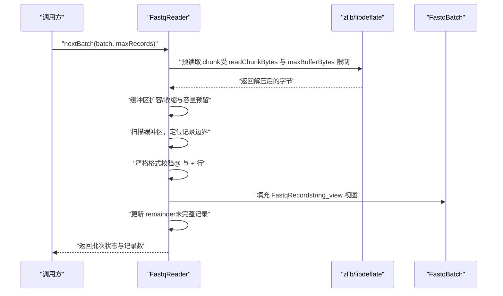
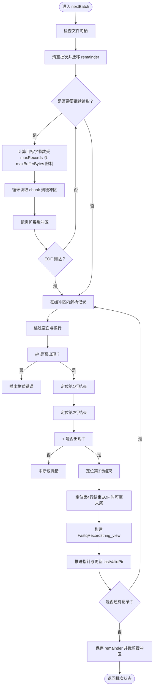
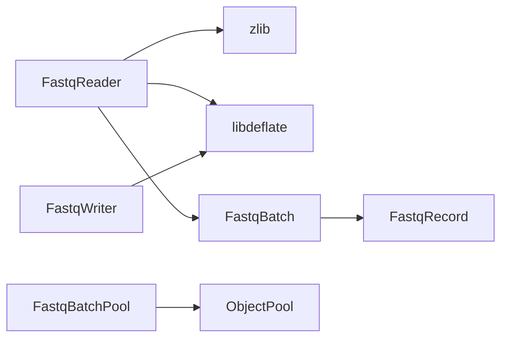

# 解析器优化

<cite>
**本文引用的文件列表**
- [src/io/fastq_reader.cpp](file://src/io/fastq_reader.cpp)
- [include/fqtools/io/fastq_reader.h](file://include/fqtools/io/fastq_reader.h)
- [include/fqtools/io/fastq_io.h](file://include/fqtools/io/fastq_io.h)
- [include/fqtools/io/fastq_batch_pool.h](file://include/fqtools/io/fastq_batch_pool.h)
- [include/fqtools/memory/object_pool.h](file://include/fqtools/memory/object_pool.h)
- [docs/optimization/design.md](file://docs/optimization/design.md)
- [changelog/2025-12-30-Optimization-parser.md](file://changelog/2025-12-30-Optimization-parser.md)
- [tools/benchmark/fastq_io_benchmark.cpp](file://tools/benchmark/fastq_io_benchmark.cpp)
- [src/io/fastq_writer.cpp](file://src/io/fastq_writer.cpp)
</cite>

## 目录
1. [引言](#引言)
2. [项目结构](#项目结构)
3. [核心组件](#核心组件)
4. [架构总览](#架构总览)
5. [详细组件分析](#详细组件分析)
6. [依赖关系分析](#依赖关系分析)
7. [性能考量](#性能考量)
8. [故障排查指南](#故障排查指南)
9. [结论](#结论)
10. [附录](#附录)

## 引言
本技术文档聚焦于 FASTQ 文件解析器的优化实践，围绕 src/io/fastq_reader.cpp 的核心解析逻辑展开，系统阐述以下优化要点：
- 字符扫描与字段分割策略的改进，减少不必要的字符串操作与分支预测开销
- 缓冲区管理机制如何降低 I/O 等待时间，以及预读取策略如何提升数据吞吐效率
- 设计决策中暂未采用 SIMD，但通过减少函数调用开销与优化内存访问模式达到良好性能
- 在不同读段长度与压缩比下的性能表现与参数调优建议（如 batchSize、readChunkBytes、maxBufferBytes 等）

## 项目结构
解析器位于 IO 子模块，核心文件包括：
- 解析器实现：src/io/fastq_reader.cpp
- 解析器接口与选项：include/fqtools/io/fastq_reader.h
- 批次与记录的数据模型：include/fqtools/io/fastq_io.h
- 对象池与批处理池：include/fqtools/io/fastq_batch_pool.h、include/fqtools/memory/object_pool.h
- 优化设计文档：docs/optimization/design.md
- 解析器鲁棒性优化变更记录：changelog/2025-12-30-Optimization-parser.md
- 基准测试：tools/benchmark/fastq_io_benchmark.cpp
- 压缩输出端优化（libdeflate）：src/io/fastq_writer.cpp

图表来源
- [src/io/fastq_reader.cpp](file://src/io/fastq_reader.cpp#L1-L255)
- [include/fqtools/io/fastq_reader.h](file://include/fqtools/io/fastq_reader.h#L1-L46)
- [include/fqtools/io/fastq_io.h](file://include/fqtools/io/fastq_io.h#L1-L118)
- [include/fqtools/io/fastq_batch_pool.h](file://include/fqtools/io/fastq_batch_pool.h#L1-L57)
- [include/fqtools/memory/object_pool.h](file://include/fqtools/memory/object_pool.h#L1-L190)

章节来源
- [src/io/fastq_reader.cpp](file://src/io/fastq_reader.cpp#L1-L255)
- [include/fqtools/io/fastq_reader.h](file://include/fqtools/io/fastq_reader.h#L1-L46)
- [include/fqtools/io/fastq_io.h](file://include/fqtools/io/fastq_io.h#L1-L118)
- [include/fqtools/io/fastq_batch_pool.h](file://include/fqtools/io/fastq_batch_pool.h#L1-L57)
- [include/fqtools/memory/object_pool.h](file://include/fqtools/memory/object_pool.h#L1-L190)

## 核心组件
- FastqReader：负责从压缩或非压缩 FASTQ 文件中按批次读取记录，内部使用 zlib 进行解压，并通过缓冲区预读取与记录边界检测完成解析。
- FastqReaderOptions：控制读取行为的关键参数，包括 readChunkBytes、zlibBufferBytes、maxBufferBytes。
- FastqBatch/FastqRecord：零拷贝视图结构，记录在批次缓冲区内以 string_view 形式存在，避免额外复制。
- FastqBatchPool/ObjectPool：对象池机制，减少批次对象的频繁创建/销毁，降低分配开销。

章节来源
- [include/fqtools/io/fastq_reader.h](file://include/fqtools/io/fastq_reader.h#L1-L46)
- [include/fqtools/io/fastq_io.h](file://include/fqtools/io/fastq_io.h#L1-L118)
- [include/fqtools/io/fastq_batch_pool.h](file://include/fqtools/io/fastq_batch_pool.h#L1-L57)
- [include/fqtools/memory/object_pool.h](file://include/fqtools/memory/object_pool.h#L1-L190)

## 架构总览
解析器采用“预读取 + 边界检测”的流水线式设计：
- 读取阶段：根据 readChunkBytes 与 maxBufferBytes 动态预读取，维持批次缓冲区容量与上限
- 解析阶段：在缓冲区内线性扫描，定位每条记录的四行边界，提取 ID、序列、质量等字段
- 容错阶段：严格的格式校验，遇到非法起始或缺失行时抛出错误
- 复用阶段：将未完整解析的尾部片段保存为 remainder，供下次解析继续使用

图表来源
- [src/io/fastq_reader.cpp](file://src/io/fastq_reader.cpp#L57-L251)
- [include/fqtools/io/fastq_io.h](file://include/fqtools/io/fastq_io.h#L1-L118)

## 详细组件分析

### FastqReader 解析流程与优化点
- 字符扫描与字段分割
  - 使用线性扫描与 EOL 查找函数定位四行边界，避免正则与多次字符串复制
  - 严格校验记录起始与第三行标识，异常时立即抛错，防止静默错误
  - 使用 string_view 直接指向缓冲区内的子串，零拷贝提取 ID、序列、质量
- 缓冲区管理与预读取
  - 依据 readChunkBytes 与 maxRecords 估算目标字节数，结合 maxBufferBytes 上限控制内存占用
  - 动态扩容策略：当容量不足时按指数增长，避免频繁 re-allocate
  - EOF 到达后，将剩余数据作为 remainder，下次解析从上次最后有效位置继续
- 错误处理与健壮性
  - 当缓冲区达到上限仍无法解析完整记录时，抛出明确错误提示
  - 对换行符与回车符进行兼容处理，避免因行尾差异导致解析失败

图表来源
- [src/io/fastq_reader.cpp](file://src/io/fastq_reader.cpp#L57-L251)

章节来源
- [src/io/fastq_reader.cpp](file://src/io/fastq_reader.cpp#L57-L251)
- [changelog/2025-12-30-Optimization-parser.md](file://changelog/2025-12-30-Optimization-parser.md#L1-L26)

### FastqBatch 与零拷贝视图
- FastqRecord 以 string_view 指向 FastqBatch 的连续缓冲区，避免复制，降低内存与 CPU 开销
- FastqBatch 提供 buffer() 与 records() 访问器，支持 moveRemainderToStart 等高效内存移动操作
- 默认容量与预估记录数，便于在不同读段长度下平衡内存与吞吐

章节来源
- [include/fqtools/io/fastq_io.h](file://include/fqtools/io/fastq_io.h#L1-L118)

### 对象池与批处理复用
- FastqBatchPool 基于 ObjectPool<T> 实现，通过 acquire/release 自动归还，显著降低批次对象分配/销毁开销
- 在处理管道中，对象池与 shared_ptr 自定义删除器配合，确保生命周期可控且无泄漏

章节来源
- [include/fqtools/io/fastq_batch_pool.h](file://include/fqtools/io/fastq_batch_pool.h#L1-L57)
- [include/fqtools/memory/object_pool.h](file://include/fqtools/memory/object_pool.h#L1-L190)
- [docs/optimization/design.md](file://docs/optimization/design.md#L1-L139)

### libdeflate 压缩端优化（与解析器协同）
- Writer 端采用 libdeflate 进行 gzip 压缩，使用固定阈值触发 flush，结合压缩缓冲区上限，提升写入吞吐
- Reader 端当前仍使用 zlib 流式解压，libdeflate 集成处于评估与简化策略阶段，避免引入复杂流式上下文

章节来源
- [src/io/fastq_writer.cpp](file://src/io/fastq_writer.cpp#L1-L146)
- [docs/optimization/design.md](file://docs/optimization/design.md#L81-L114)

## 依赖关系分析
- FastqReader 依赖 zlib（或 libdeflate）进行解压，依赖 FastqBatch/FastqRecord 进行数据承载
- FastqBatchPool 依赖 ObjectPool<T> 提供对象复用
- Writer 端引入 libdeflate 以提升压缩性能，与 Reader 端形成 I/O 两端优化闭环

图表来源
- [src/io/fastq_reader.cpp](file://src/io/fastq_reader.cpp#L1-L255)
- [include/fqtools/io/fastq_io.h](file://include/fqtools/io/fastq_io.h#L1-L118)
- [include/fqtools/io/fastq_batch_pool.h](file://include/fqtools/io/fastq_batch_pool.h#L1-L57)
- [include/fqtools/memory/object_pool.h](file://include/fqtools/memory/object_pool.h#L1-L190)
- [src/io/fastq_writer.cpp](file://src/io/fastq_writer.cpp#L1-L146)

章节来源
- [src/io/fastq_reader.cpp](file://src/io/fastq_reader.cpp#L1-L255)
- [src/io/fastq_writer.cpp](file://src/io/fastq_writer.cpp#L1-L146)
- [include/fqtools/io/fastq_io.h](file://include/fqtools/io/fastq_io.h#L1-L118)
- [include/fqtools/io/fastq_batch_pool.h](file://include/fqtools/io/fastq_batch_pool.h#L1-L57)
- [include/fqtools/memory/object_pool.h](file://include/fqtools/memory/object_pool.h#L1-L190)

## 性能考量
- 字符扫描与字段分割
  - 线性扫描 + EOL 快速查找，避免正则与多次复制，减少分支预测失败与缓存抖动
  - 严格格式校验在热路径上通过条件分支快速失败，降低无效解析成本
- 缓冲区与预读取
  - readChunkBytes 控制每次读取粒度，maxBufferBytes 限制峰值内存，二者共同决定吞吐与内存占用的平衡
  - 动态扩容策略按需增长，避免频繁 re-allocate；EOF 到达后及时裁剪，减少冗余内存
- 对象池与内存复用
  - 批次对象池显著降低分配/销毁开销，配合 moveRemainderToStart 等原地操作，进一步减少拷贝
- 压缩端优化
  - Writer 端采用 libdeflate，固定阈值触发 flush，提升写入吞吐；Reader 端保持 zlib 流式解压，兼顾稳定性
- 参数调优建议
  - batchSize：在 pipeline 场景中，适当增大批次大小可提升吞吐，但需结合下游处理能力与内存上限
  - readChunkBytes：增大可减少系统调用次数，但会提高峰值内存；建议从默认值开始，结合 maxBufferBytes 调整
  - maxBufferBytes：设置合理上限，避免 OOM；当解析失败提示“达到最大缓冲区”时，应增大该值或减小批次大小
  - zlibBufferBytes：增大解压缓冲区可减少底层 I/O 往返，但会增加内存占用
- 基准测试参考
  - 基准工具提供了读取与写入的基准样例，可用于对比不同参数组合下的吞吐与内存分配次数

章节来源
- [src/io/fastq_reader.cpp](file://src/io/fastq_reader.cpp#L75-L129)
- [include/fqtools/io/fastq_reader.h](file://include/fqtools/io/fastq_reader.h#L11-L15)
- [include/fqtools/io/fastq_io.h](file://include/fqtools/io/fastq_io.h#L41-L118)
- [tools/benchmark/fastq_io_benchmark.cpp](file://tools/benchmark/fastq_io_benchmark.cpp#L67-L150)
- [docs/optimization/design.md](file://docs/optimization/design.md#L81-L139)

## 故障排查指南
- “格式错误：期望在记录起始处看到 '@'”
  - 可能原因：输入文件损坏或指针偏移；检查文件完整性与编码
  - 处理建议：确认文件未被截断，必要时重新生成
- “期望在第3行看到 '+'”
  - 可能原因：FASTQ 格式不规范或存在多余行
  - 处理建议：修复输入文件格式或使用格式校验工具
- “达到最大缓冲区而无法解析完整记录”
  - 可能原因：maxBufferBytes 设置过小或批次过大
  - 处理建议：增大 maxBufferBytes 或减小 batchSize/readChunkBytes
- “EOF 到达但仍无记录”
  - 可能原因：文件为空或最后一行不完整
  - 处理建议：检查文件末尾换行符与记录完整性

章节来源
- [src/io/fastq_reader.cpp](file://src/io/fastq_reader.cpp#L141-L188)
- [src/io/fastq_reader.cpp](file://src/io/fastq_reader.cpp#L240-L251)
- [changelog/2025-12-30-Optimization-parser.md](file://changelog/2025-12-30-Optimization-parser.md#L1-L26)

## 结论
本解析器通过“预读取 + 边界检测 + 零拷贝视图 + 对象池复用”的组合策略，在不引入 SIMD 的前提下实现了良好的性能与稳定性。严格格式校验提升了鲁棒性，libdeflate 在压缩端的应用进一步优化了整体 I/O 吞吐。参数调优应围绕 readChunkBytes、maxBufferBytes 与 batchSize 展开，结合具体硬件与数据特征进行迭代优化。

## 附录
- 关键实现路径参考
  - 解析主循环与缓冲区管理：[src/io/fastq_reader.cpp](file://src/io/fastq_reader.cpp#L57-L251)
  - 选项与接口定义：[include/fqtools/io/fastq_reader.h](file://include/fqtools/io/fastq_reader.h#L11-L15)
  - 数据模型与零拷贝视图：[include/fqtools/io/fastq_io.h](file://include/fqtools/io/fastq_io.h#L12-L35)
  - 批次池与对象池：[include/fqtools/io/fastq_batch_pool.h](file://include/fqtools/io/fastq_batch_pool.h#L23-L54)、[include/fqtools/memory/object_pool.h](file://include/fqtools/memory/object_pool.h#L70-L112)
  - 压缩端优化（libdeflate）：[src/io/fastq_writer.cpp](file://src/io/fastq_writer.cpp#L1-L146)
  - 解析器鲁棒性优化记录：[changelog/2025-12-30-Optimization-parser.md](file://changelog/2025-12-30-Optimization-parser.md#L1-L26)
  - 基准测试样例：[tools/benchmark/fastq_io_benchmark.cpp](file://tools/benchmark/fastq_io_benchmark.cpp#L67-L150)