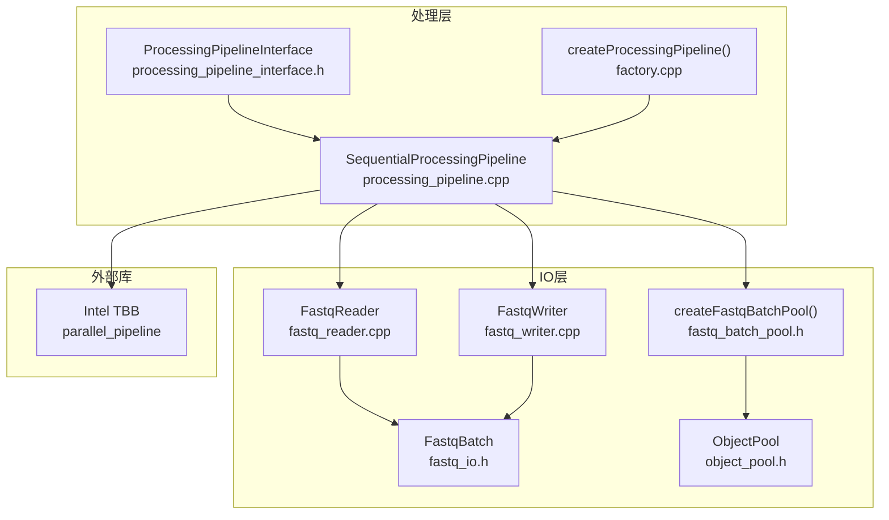
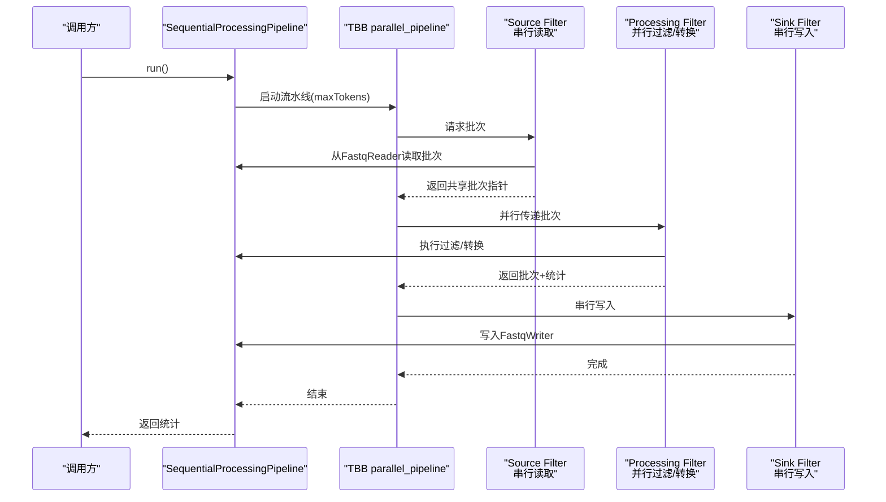
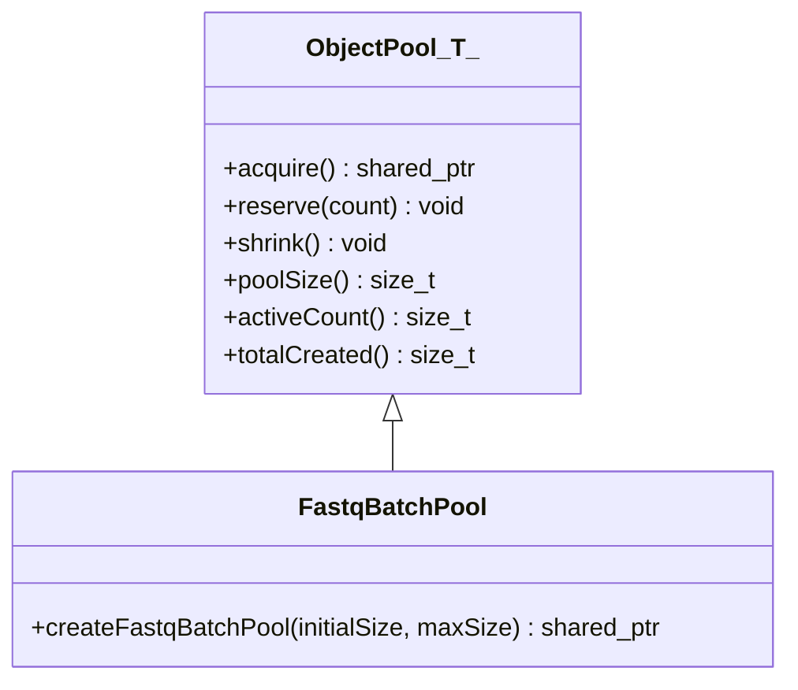
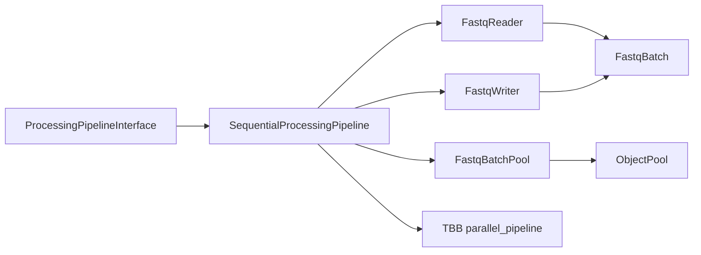

# 并发模型

<cite>
**本文引用的文件**
- [processing_pipeline.cpp](file://src/processing/processing_pipeline.cpp)
- [processing_pipeline.h](file://include/fqtools/processing/processing_pipeline.h)
- [processing_pipeline_interface.h](file://include/fqtools/processing/processing_pipeline_interface.h)
- [factory.cpp](file://src/processing/factory.cpp)
- [fastq_batch_pool.h](file://include/fqtools/io/fastq_batch_pool.h)
- [object_pool.h](file://include/fqtools/memory/object_pool.h)
- [fastq_io.h](file://include/fqtools/io/fastq_io.h)
- [fastq_reader.cpp](file://src/io/fastq_reader.cpp)
- [test_pipeline_smoke.cpp](file://tests/unit/processing/test_pipeline_smoke.cpp)
- [implementation-proposals.md](file://docs/analysis/implementation-proposals.md)
- [fastq_io_benchmark.cpp](file://tools/benchmark/fastq_io_benchmark.cpp)
</cite>

## 目录
1. [引言](#引言)
2. [项目结构](#项目结构)
3. [核心组件](#核心组件)
4. [架构总览](#架构总览)
5. [详细组件分析](#详细组件分析)
6. [依赖关系分析](#依赖关系分析)
7. [性能考量](#性能考量)
8. [故障排查指南](#故障排查指南)
9. [结论](#结论)
10. [附录](#附录)

## 引言
本文件围绕基于Intel TBB的并行流水线实现，系统性解析FASTQ数据处理的三阶段流水线：source（串行读取FASTQ记录）、processing（并行执行过滤与转换）、sink（串行写入结果）。重点说明TBB如何通过parallel_pipeline自动管理线程池与任务调度，并通过内置背压机制平衡I/O与计算速度，避免内存溢出。同时结合processing_pipeline.cpp中的实现细节，阐述如何定义与连接各阶段，以及在高吞吐量场景下的性能优势与资源利用率，并给出可操作的调优建议。

## 项目结构
与并发流水线直接相关的关键模块如下：
- 处理流水线接口与实现：processing_pipeline_interface.h、processing_pipeline.cpp、factory.cpp
- IO与批处理：fastq_io.h、fastq_reader.cpp、fastq_batch_pool.h
- 对象池：object_pool.h
- 文档与基准：implementation-proposals.md、fastq_io_benchmark.cpp
- 单元测试：test_pipeline_smoke.cpp

图表来源
- [processing_pipeline_interface.h](file://include/fqtools/processing/processing_pipeline_interface.h#L1-L169)
- [processing_pipeline.cpp](file://src/processing/processing_pipeline.cpp#L1-L238)
- [factory.cpp](file://src/processing/factory.cpp#L1-L31)
- [fastq_io.h](file://include/fqtools/io/fastq_io.h#L1-L118)
- [fastq_batch_pool.h](file://include/fqtools/io/fastq_batch_pool.h#L1-L57)
- [object_pool.h](file://include/fqtools/memory/object_pool.h#L1-L190)
- [fastq_reader.cpp](file://src/io/fastq_reader.cpp#L90-L113)

章节来源
- [processing_pipeline.cpp](file://src/processing/processing_pipeline.cpp#L1-L238)
- [processing_pipeline_interface.h](file://include/fqtools/processing/processing_pipeline_interface.h#L1-L169)
- [factory.cpp](file://src/processing/factory.cpp#L1-L31)

## 核心组件
- ProcessingPipelineInterface：定义统一的处理接口，包括输入输出路径设置、配置注入、处理器注册与执行。
- SequentialProcessingPipeline：具体实现，支持串行与并行两种执行路径；并行路径基于TBB parallel_pipeline。
- ProcessingConfig：流水线配置项，包含批大小、线程数、读取块大小、压缩缓冲、写缓冲、批次容量、内存上限、最大在途批次等。
- FastqBatch/FastqReader/FastqWriter：批处理容器与读写器，支撑source与sink阶段。
- ObjectPool/FastqBatchPool：对象池，复用FastqBatch，降低频繁分配带来的开销。
- TBB parallel_pipeline：并行执行引擎，通过filters串联source/processing/sink三阶段。

章节来源
- [processing_pipeline_interface.h](file://include/fqtools/processing/processing_pipeline_interface.h#L1-L169)
- [processing_pipeline.cpp](file://src/processing/processing_pipeline.cpp#L1-L238)
- [fastq_io.h](file://include/fqtools/io/fastq_io.h#L1-L118)
- [fastq_batch_pool.h](file://include/fqtools/io/fastq_batch_pool.h#L1-L57)
- [object_pool.h](file://include/fqtools/memory/object_pool.h#L1-L190)

## 架构总览
下图展示了基于TBB parallel_pipeline的数据处理流水线，明确三阶段职责与数据流方向。

图表来源
- [processing_pipeline.cpp](file://src/processing/processing_pipeline.cpp#L138-L217)
- [fastq_io.h](file://include/fqtools/io/fastq_io.h#L1-L118)

## 详细组件分析

### 1) 三阶段流水线与背压机制
- Source阶段（串行）：使用串行有序filter从FastqReader读取批次，每次从对象池acquire一个FastqBatch，填充后返回给下游。当读取结束时，通过flow_control触发停止信号，终止上游。
- Processing阶段（并行）：使用并行filter对批次进行过滤与转换，产出批次与统计信息对，保持与source相同的顺序性（通过sink阶段串行写入）。
- Sink阶段（串行）：串行写入FastqWriter，累加最终统计，确保写入顺序与原始批次顺序一致。

背压机制：
- 最大令牌数maxTokens决定在途批次上限，限制内存占用与并发度。
- 当内存上限memoryLimitBytes与批次容量batchCapacityBytes设定时，maxTokens会进一步下调，确保整体内存占用不超过阈值。
- TBB parallel_pipeline的filters之间天然具备背压：当下游处理慢于上游，上游将被阻塞，避免无界增长。

章节来源
- [processing_pipeline.cpp](file://src/processing/processing_pipeline.cpp#L138-L217)
- [fastq_batch_pool.h](file://include/fqtools/io/fastq_batch_pool.h#L1-L57)
- [object_pool.h](file://include/fqtools/memory/object_pool.h#L1-L190)

### 2) 线程池与任务调度
- 通过TBB全局控制限制最大并行度，避免过度竞争。
- processing阶段为并行filter，TBB根据硬件核心数与maxTokens自动调度任务，提高CPU利用率。
- sink阶段为串行有序filter，保证写入顺序与统计聚合的正确性。

章节来源
- [processing_pipeline.cpp](file://src/processing/processing_pipeline.cpp#L142-L143)
- [processing_pipeline.cpp](file://src/processing/processing_pipeline.cpp#L193-L201)

### 3) 对象池与内存复用
- FastqBatchPool基于ObjectPool<T>，通过shared_ptr自定义删除器实现“借用—自动归还”，避免频繁分配与释放。
- 在source阶段acquire批次，processing阶段使用，sink阶段无需手动释放，shared_ptr析构时自动归还池中，降低内存碎片与GC压力。

图表来源
- [object_pool.h](file://include/fqtools/memory/object_pool.h#L1-L190)
- [fastq_batch_pool.h](file://include/fqtools/io/fastq_batch_pool.h#L1-L57)

章节来源
- [fastq_batch_pool.h](file://include/fqtools/io/fastq_batch_pool.h#L1-L57)
- [object_pool.h](file://include/fqtools/memory/object_pool.h#L1-L190)

### 4) 批处理与读取策略
- FastqBatch持有连续内存，支持批量读取与零拷贝视图（FastqRecord），减少复制与分配。
- FastqReader在读取时根据maxBufferBytes与chunk大小动态扩容，避免单次读取过大导致内存峰值过高。

章节来源
- [fastq_io.h](file://include/fqtools/io/fastq_io.h#L1-L118)
- [fastq_reader.cpp](file://src/io/fastq_reader.cpp#L90-L113)

### 5) 统计与吞吐量
- 统计信息包含总读取数、通过数、过滤数、输入/输出字节数、耗时与吞吐量（MB/s），便于性能评估与调优。
- 通过串行sink阶段累加统计，避免并行写入带来的竞态。

章节来源
- [processing_pipeline_interface.h](file://include/fqtools/processing/processing_pipeline_interface.h#L1-L169)
- [processing_pipeline.cpp](file://src/processing/processing_pipeline.cpp#L219-L237)

### 6) 工厂与接口解耦
- 工厂函数createProcessingPipeline返回接口实例，隐藏具体实现，便于扩展其他实现（如异步/分片）。

章节来源
- [factory.cpp](file://src/processing/factory.cpp#L1-L31)
- [processing_pipeline_interface.h](file://include/fqtools/processing/processing_pipeline_interface.h#L1-L169)

## 依赖关系分析
- 处理层依赖IO层与对象池，通过接口解耦，便于替换实现。
- TBB parallel_pipeline作为执行引擎，连接三阶段，天然具备背压与并行调度能力。
- 配置项ProcessingConfig贯穿source/processing/sink，统一影响吞吐与内存占用。

图表来源
- [processing_pipeline_interface.h](file://include/fqtools/processing/processing_pipeline_interface.h#L1-L169)
- [processing_pipeline.cpp](file://src/processing/processing_pipeline.cpp#L138-L217)
- [fastq_batch_pool.h](file://include/fqtools/io/fastq_batch_pool.h#L1-L57)
- [object_pool.h](file://include/fqtools/memory/object_pool.h#L1-L190)

章节来源
- [processing_pipeline.cpp](file://src/processing/processing_pipeline.cpp#L138-L217)
- [processing_pipeline_interface.h](file://include/fqtools/processing/processing_pipeline_interface.h#L1-L169)

## 性能考量
- 并行度与背压：通过maxTokens与memoryLimitBytes共同约束在途批次数量，避免内存溢出；并行度受threadCount与max_allowed_parallelism限制。
- 批大小与缓冲：batchSize、readChunkBytes、zlibBufferBytes、writerBufferBytes影响I/O与CPU负载的平衡；增大批可提升吞吐但增加内存占用。
- 对象池：复用FastqBatch显著降低分配/释放成本，尤其在高并发场景。
- I/O与计算平衡：TBB的背压使source不会超前生产，processing并行处理，sink串行写入，整体稳定。
- 基准参考：工具链提供读写基准，可用于验证优化效果。

章节来源
- [processing_pipeline.cpp](file://src/processing/processing_pipeline.cpp#L162-L175)
- [processing_pipeline.cpp](file://src/processing/processing_pipeline.cpp#L142-L143)
- [fastq_io_benchmark.cpp](file://tools/benchmark/fastq_io_benchmark.cpp#L1-L152)

## 故障排查指南
- 输入/输出打开失败：检查输入路径与输出路径有效性，查看异常抛出位置。
- TBB执行异常：捕获异常并记录日志，定位具体阶段（source/processing/sink）。
- 内存不足：适当降低threadCount、maxTokens、batchCapacityBytes或启用memoryLimitBytes，避免内存峰值过高。
- 性能不达预期：检查批大小与缓冲配置，确认对象池预分配是否合理；观察吞吐与CPU使用率是否匹配。

章节来源
- [processing_pipeline.cpp](file://src/processing/processing_pipeline.cpp#L54-L66)
- [processing_pipeline.cpp](file://src/processing/processing_pipeline.cpp#L150-L161)
- [processing_pipeline.cpp](file://src/processing/processing_pipeline.cpp#L229-L231)

## 结论
该并发模型以TBB parallel_pipeline为核心，将I/O密集型的source与CPU密集型的processing解耦，借助对象池与背压机制在高吞吐场景下保持稳定的内存占用与良好的资源利用率。通过合理配置ProcessingConfig与对象池规模，可在不同硬件环境下获得更优的吞吐表现。

## 附录
- 关键实现路径参考
  - 三阶段流水线与背压：[processing_pipeline.cpp](file://src/processing/processing_pipeline.cpp#L138-L217)
  - 对象池与自动归还：[fastq_batch_pool.h](file://include/fqtools/io/fastq_batch_pool.h#L1-L57)、[object_pool.h](file://include/fqtools/memory/object_pool.h#L1-L190)
  - 批处理与读取策略：[fastq_io.h](file://include/fqtools/io/fastq_io.h#L1-L118)、[fastq_reader.cpp](file://src/io/fastq_reader.cpp#L90-L113)
  - 接口与工厂：[processing_pipeline_interface.h](file://include/fqtools/processing/processing_pipeline_interface.h#L1-L169)、[factory.cpp](file://src/processing/factory.cpp#L1-L31)
  - 文档与实现提案：[implementation-proposals.md](file://docs/analysis/implementation-proposals.md#L1-L68)
  - 基准测试：[fastq_io_benchmark.cpp](file://tools/benchmark/fastq_io_benchmark.cpp#L1-L152)
  - 单元测试：[test_pipeline_smoke.cpp](file://tests/unit/processing/test_pipeline_smoke.cpp#L1-L9)