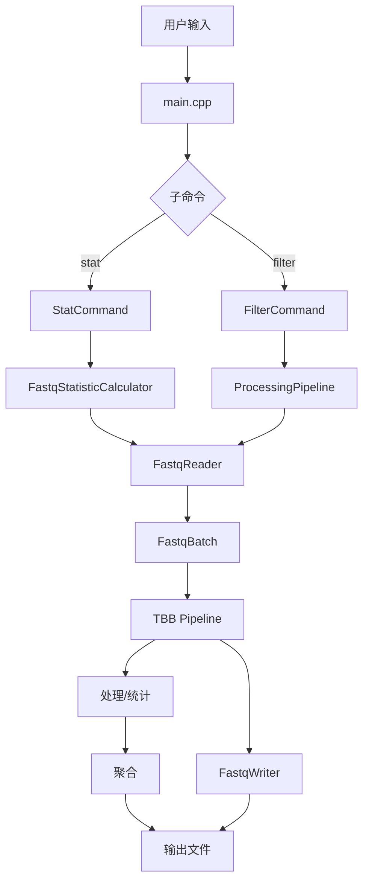

# 数据流

<cite>
**本文档引用的文件**   
- [main.cpp](file://src/cli/main.cpp)
- [stat_command.cpp](file://src/cli/commands/stat_command.cpp)
- [filter_command.cpp](file://src/cli/commands/filter_command.cpp)
- [fastq_reader.cpp](file://src/io/fastq_reader.cpp)
- [fastq_reader.h](file://include/fqtools/io/fastq_reader.h)
- [fastq_io.h](file://include/fqtools/io/fastq_io.h)
- [processing_pipeline.cpp](file://src/processing/processing_pipeline.cpp)
- [processing_pipeline_interface.h](file://include/fqtools/processing/processing_pipeline_interface.h)
- [fq_statistic.cpp](file://src/statistics/fq_statistic.cpp)
- [statistic_calculator_interface.h](file://include/fqtools/statistics/statistic_calculator_interface.h)
- [fastq_batch_pool.h](file://include/fqtools/io/fastq_batch_pool.h)
- [object_pool.h](file://include/fqtools/memory/object_pool.h)
- [fastq_writer.cpp](file://src/io/fastq_writer.cpp)
</cite>

## 目录
1. [简介](#简介)
2. [数据流概览](#数据流概览)
3. [命令行参数解析与分发](#命令行参数解析与分发)
4. [IO模块与数据读取](#io模块与数据读取)
5. [处理管道与并行分发](#处理管道与并行分发)
6. [统计模块与结果聚合](#统计模块与结果聚合)
7. [输出与日志](#输出与日志)
8. [数据传递与内存管理](#数据传递与内存管理)

## 简介
本文档详细追踪了`fastq-tools`项目中数据从用户输入到最终输出的完整生命周期。文档从`main.cpp`的入口开始，逐步描述了命令行参数如何被解析，配置如何传递给具体的命令（如`StatCommand`或`FilterCommand`），IO模块如何根据文件扩展名自动处理压缩流并读取数据，处理管道如何利用TBB（Intel Threading Building Blocks）将数据分发给并行的处理阶段，统计模块如何收集和聚合数据，以及最终结果如何通过spdlog输出或写入文件。文档特别强调了数据在各层间的传递方式（如共享指针、移动语义）和状态变更，旨在帮助开发者深入理解系统行为，便于进行性能优化和问题排查。

## 数据流概览
`fastq-tools`的数据流遵循一个清晰的管道模型。用户通过命令行提供输入文件路径和配置参数。`main.cpp`负责解析这些全局和子命令参数，并根据子命令类型（如`stat`或`filter`）将控制权分发给相应的命令处理器。命令处理器（如`StatCommand`）使用`cxxopts`库解析其特定的参数，并将这些参数封装成配置对象（如`StatisticOptions`或`ProcessingConfig`）。随后，该配置被传递给核心处理模块（如`FastqStatisticCalculator`或`ProcessingPipeline`）。核心模块利用`FastqReader`从输入文件中读取数据，`FastqReader`内部使用`gz`库（或`libdeflate`）来处理`.gz`压缩文件。数据以`FastqBatch`对象的形式被读取，这些对象被放入一个由`FastqBatchPool`管理的对象池中以实现内存复用。处理管道使用TBB的`parallel_pipeline`机制，将`FastqBatch`对象在多个阶段（读取、处理、写入）之间并行传递。在`stat`命令中，每个批次的统计结果被独立计算，然后在串行阶段聚合。最终，聚合后的结果被格式化并写入指定的输出文件。



**图示来源**
- [main.cpp](file://src/cli/main.cpp#L35-L116)
- [stat_command.cpp](file://src/cli/commands/stat_command.cpp#L11-L67)
- [filter_command.cpp](file://src/cli/commands/filter_command.cpp#L32-L154)
- [fastq_reader.cpp](file://src/io/fastq_reader.cpp#L53-L254)
- [processing_pipeline.cpp](file://src/processing/processing_pipeline.cpp#L37-L237)
- [fq_statistic.cpp](file://src/statistics/fq_statistic.cpp#L87-L158)

## 命令行参数解析与分发
数据流的起点是用户的命令行输入。`main.cpp`作为程序的入口点，首先处理全局选项（如`--verbose`、`--quiet`、`--log-level`），并根据这些选项初始化日志系统。随后，它会识别出用户请求的子命令（如`stat`或`filter`）。`main.cpp`通过创建一个命令名称到命令对象的映射表来注册所有支持的子命令。一旦识别出具体的子命令，`main.cpp`会将剩余的命令行参数（包括子命令本身）传递给该命令的`execute`方法。

具体的命令（如`StatCommand`或`FilterCommand`）在其`execute`方法中使用`cxxopts`库来解析其特有的参数。`cxxopts`提供了一个声明式的API来定义参数选项（如`-i`表示输入文件，`-o`表示输出文件），并自动处理参数的解析、类型转换和帮助信息的生成。解析成功后，这些参数的值会被提取并填充到一个配置结构体中（如`StatisticOptions`或`ProcessingConfig`），然后传递给相应的处理模块。

**本节来源**
- [main.cpp](file://src/cli/main.cpp#L35-L116)
- [stat_command.cpp](file://src/cli/commands/stat_command.cpp#L11-L67)
- [filter_command.cpp](file://src/cli/commands/filter_command.cpp#L32-L154)

## IO模块与数据读取
IO模块的核心是`FastqReader`类，它负责从文件中读取FASTQ数据。`FastqReader`使用Pimpl（Pointer to implementation）模式，其内部实现`Impl`使用`gzFile`句柄来打开和读取文件。当文件路径以`.gz`结尾时，`gzopen`会自动处理GZIP解压缩，开发者无需手动干预。`FastqReader`的配置（`FastqReaderOptions`）允许用户调整读取块大小（`readChunkBytes`）、zlib内部缓冲区大小（`zlibBufferBytes`）和批次缓冲区的最大容量（`maxBufferBytes`）。

`FastqReader`的核心方法是`nextBatch`，它将读取的数据填充到一个`FastqBatch`对象中。`FastqBatch`是一个数据容器，包含一个`std::vector<char>`用于存储原始的FASTQ文本数据，以及一个`std::vector<FastqRecord>`用于存储解析后的记录视图。`FastqRecord`本身不拥有数据，而是通过`std::string_view`指向`FastqBatch`中的`buffer`，实现了零拷贝。`nextBatch`方法会循环读取数据，直到满足批次大小或达到文件末尾。它会处理跨缓冲区边界的记录，并将未解析完的碎片数据保留在`remainder`中，以便在下一次调用时继续解析。

```mermaid
sequenceDiagram
participant User as 用户
participant Main as main.cpp
participant StatCmd as StatCommand
participant Reader as FastqReader
participant Batch as FastqBatch
participant File as 输入文件(.gz)
User->>Main : fastq-tools stat -i data.fq.gz -o stats.txt
Main->>StatCmd : execute(argc, argv)
Note over StatCmd : 使用cxxopts解析参数
StatCmd->>StatCmd : 创建StatisticOptions
StatCmd->>StatCmd : 调用createStatisticCalculator
StatCmd->>Reader : FastqReader(inputPath, options)
Reader->>File : gzopen("data.fq.gz", "r")
loop 读取批次
Reader->>File : gzread(缓冲区)
Reader->>Batch : 解析文本为FastqRecord
Reader->>Batch : 将记录添加到records_
alt 达到批次大小或EOF
Reader-->>StatCmd : 返回true
break
else
Reader->>File : 继续读取
end
end
```

**图示来源**
- [fastq_reader.cpp](file://src/io/fastq_reader.cpp#L53-L254)
- [fastq_reader.h](file://include/fqtools/io/fastq_reader.h#L17-L43)
- [fastq_io.h](file://include/fqtools/io/fastq_io.h#L41-L115)

## 处理管道与并行分发
处理管道是`fastq-tools`实现高性能的核心。`ProcessingPipelineInterface`定义了管道的抽象接口，而`SequentialProcessingPipeline`是其具体实现。管道使用TBB的`parallel_pipeline`来实现多阶段并行处理。管道通常包含三个阶段：一个串行的输入阶段（读取数据）、一个并行的处理阶段（应用过滤器和修改器）和一个串行的输出阶段（写入数据或聚合结果）。

在`filter`命令中，`ProcessingPipeline`会创建一个`FastqBatchPool`对象池，用于预分配和复用`FastqBatch`对象，从而避免频繁的内存分配和释放。输入阶段从`FastqReader`获取`FastqBatch`，并将其传递给处理阶段。处理阶段会并行地对每个批次应用所有注册的`ReadPredicate`（过滤器）和`ReadMutator`（修改器）。例如，`MinQualityPredicate`会检查每条读取的平均质量是否达标，而`QualityTrimmer`会修剪低质量的碱基。处理后的批次被传递到输出阶段，由`FastqWriter`写入输出文件。

在`stat`命令中，处理管道的结构类似，但处理阶段会调用`FqStatisticWorker`来计算每个批次的统计信息，输出阶段则负责将这些部分结果聚合到一个全局的`FqStatisticResult`中。

**本节来源**
- [processing_pipeline.cpp](file://src/processing/processing_pipeline.cpp#L37-L237)
- [processing_pipeline_interface.h](file://include/fqtools/processing/processing_pipeline_interface.h#L82-L155)
- [fastq_batch_pool.h](file://include/fqtools/io/fastq_batch_pool.h#L32-L53)
- [object_pool.h](file://include/fqtools/memory/object_pool.h#L42-L190)

## 统计模块与结果聚合
统计模块负责生成关于FASTQ文件的详细报告。`FastqStatisticCalculator`是统计功能的入口点。它接收一个`StatisticOptions`对象，该对象包含了输入/输出路径、线程数等配置。`FastqStatisticCalculator`同样使用TBB的`parallel_pipeline`来并行处理数据。

在并行处理阶段，每个`FqStatisticWorker`实例会独立计算一个`FastqBatch`的统计信息，包括读取总数、总碱基数、每个位置的碱基分布和质量值分布等。这些部分结果被封装在`FqStatisticResult`对象中。在串行的聚合阶段，所有部分结果通过`operator+=`被累加到一个最终的`FqStatisticResult`中。这个累加操作需要特别处理，例如当一个批次的最大读取长度超过当前结果时，需要动态调整`posQualityDist`和`posBaseDist`的大小。

聚合完成后，`FastqStatisticCalculator`会调用`writeResult`方法，将最终的统计结果格式化为一个文本报告并写入指定的输出文件。

**本节来源**
- [fq_statistic.cpp](file://src/statistics/fq_statistic.cpp#L87-L158)
- [statistic_calculator_interface.h](file://include/fqtools/statistics/statistic_calculator_interface.h#L46-L53)

## 输出与日志
`fastq-tools`使用`spdlog`库进行日志记录。日志级别（如`debug`、`info`、`error`）可以在命令行中通过`--verbose`、`--quiet`或`--log-level`选项进行配置。`spdlog`提供了高性能的日志记录功能，并支持多种日志格式和输出目标。

对于`filter`命令，处理结果（如通过的读取数、过滤的读取数、吞吐量等）会通过`ProcessingStatistics::toString()`方法格式化为字符串，并直接输出到标准输出（`std::cout`）。对于`stat`命令，最终的统计报告会被写入一个指定的文本文件。`FastqWriter`类负责将处理后的`FastqBatch`对象写入输出文件。与`FastqReader`类似，如果输出文件路径以`.gz`结尾，`FastqWriter`会自动进行GZIP压缩。`FastqWriter`内部使用`libdeflate`库进行压缩，以获得比传统`zlib`更高的压缩速度。

**本节来源**
- [main.cpp](file://src/cli/main.cpp#L74-L81)
- [filter_command.cpp](file://src/cli/commands/filter_command.cpp#L151)
- [fq_statistic.cpp](file://src/statistics/fq_statistic.cpp#L156-L158)
- [fastq_writer.cpp](file://src/io/fastq_writer.cpp#L1-L80)

## 数据传递与内存管理
在整个数据流中，高效的数据传递和内存管理至关重要。`fastq-tools`广泛使用了现代C++的特性来优化性能。

*   **共享指针 (`std::shared_ptr`)**: 在TBB管道中，`FastqBatch`对象通过`std::shared_ptr<FastqBatch>`在各个阶段之间传递。这确保了对象的生命周期由最后一个使用它的阶段来管理。当管道中的一个阶段完成对批次的处理后，其`shared_ptr`会被销毁，如果这是最后一个引用，对象将被自动归还到`FastqBatchPool`中。
*   **移动语义 (Move Semantics)**: `FastqBatch`类明确禁用了拷贝构造和拷贝赋值，但启用了移动构造和移动赋值。这鼓励了数据的移动而非拷贝，避免了不必要的内存复制。当一个`FastqBatch`从一个函数返回或在容器中移动时，其内部的`buffer`和`records`向量会被高效地转移。
*   **对象池 (Object Pool)**: `FastqBatchPool`基于`ObjectPool`模板实现，它预分配了一定数量的`FastqBatch`对象。当一个批次处理完毕后，它不会被立即销毁，而是被重置（`clear()`）并放回池中。当下一个批次需要时，可以从池中快速获取一个已分配好内存的`FastqBatch`，从而极大地减少了`new`和`delete`的调用次数，降低了内存碎片和分配开销。
*   **零拷贝解析 (Zero-Copy Parsing)**: `FastqRecord`结构体不拥有数据，而是使用`std::string_view`来引用`FastqBatch`中`buffer`的特定区域。这意味着在解析FASTQ记录时，不会为ID、序列、质量值等字段创建新的字符串副本，从而节省了内存和CPU时间。

**本节来源**
- [fastq_io.h](file://include/fqtools/io/fastq_io.h#L41-L115)
- [fastq_batch_pool.h](file://include/fqtools/io/fastq_batch_pool.h#L32-L53)
- [object_pool.h](file://include/fqtools/memory/object_pool.h#L42-L190)
- [processing_pipeline.cpp](file://src/processing/processing_pipeline.cpp#L184-L208)
- [fq_statistic.cpp](file://src/statistics/fq_statistic.cpp#L127-L134)