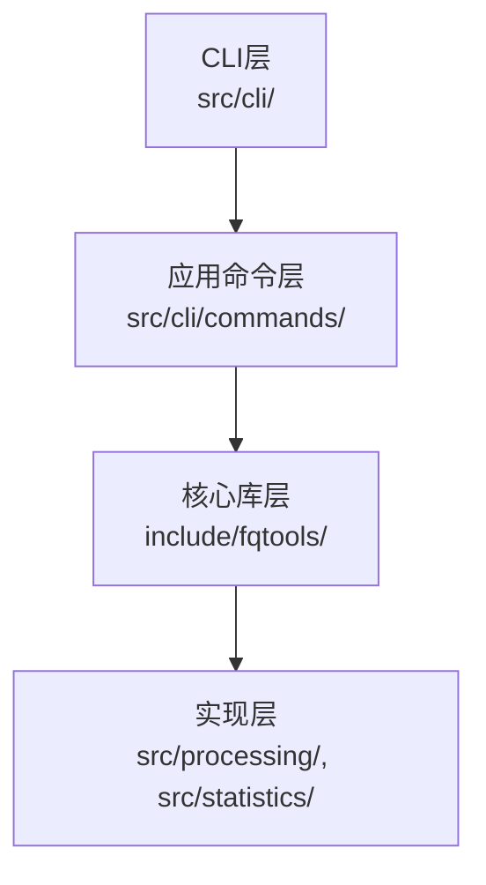
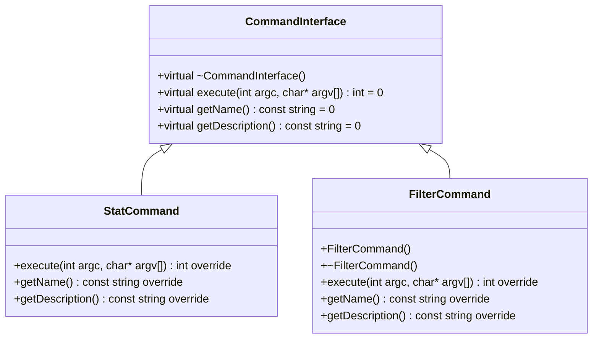
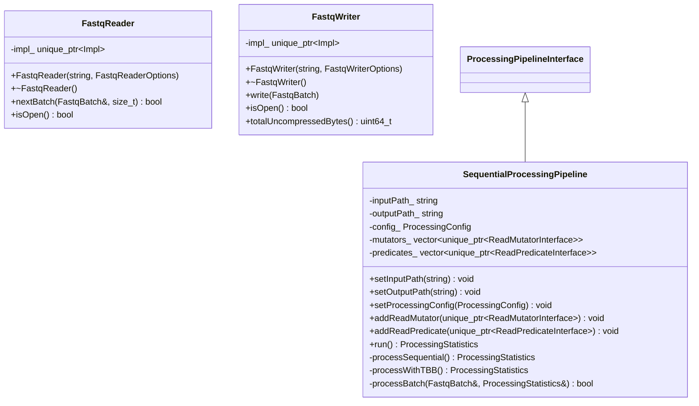
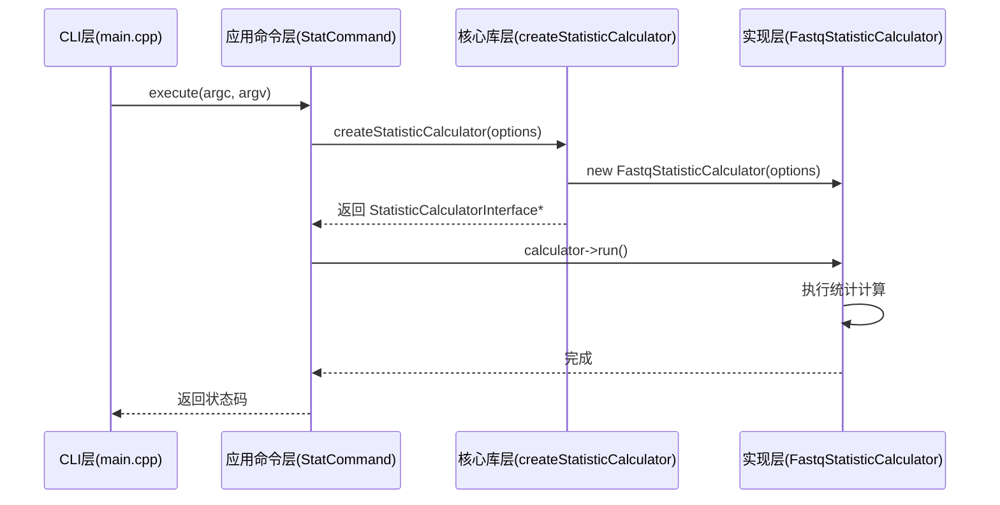

# 架构层次

<cite>
**本文档中引用的文件**  
- [main.cpp](file://src/cli/main.cpp)
- [command_interface.h](file://src/cli/commands/command_interface.h)
- [stat_command.cpp](file://src/cli/commands/stat_command.cpp)
- [filter_command.cpp](file://src/cli/commands/filter_command.cpp)
- [fq.h](file://include/fqtools/fq.h)
- [processing_pipeline_interface.h](file://include/fqtools/processing/processing_pipeline_interface.h)
- [statistic_calculator_interface.h](file://include/fqtools/statistics/statistic_calculator_interface.h)
- [processing_pipeline.cpp](file://src/processing/processing_pipeline.cpp)
- [fq_statistic.cpp](file://src/statistics/fq_statistic.cpp)
- [fastq_reader.h](file://include/fqtools/io/fastq_reader.h)
- [fastq_writer.h](file://include/fqtools/io/fastq_writer.h)
</cite>

## 目录
1. [简介](#简介)
2. [四层架构概述](#四层架构概述)
3. [CLI层（命令行接口层）](#cli层命令行接口层)
4. [应用命令层](#应用命令层)
5. [核心库层（公共API层）](#核心库层公共api层)
6. [实现层](#实现层)
7. [层间通信机制](#层间通信机制)
8. [分层架构的优势](#分层架构的优势)
9. [总结](#总结)

## 简介

本项目采用清晰的四层架构设计，分别为：CLI层、应用命令层、核心库层和实现层。这种分层设计实现了关注点分离，提升了代码的可维护性、可测试性和可复用性。每一层都有明确的职责边界，依赖方向严格自上而下，而接口定义则自下而上，确保了高层模块不依赖于低层模块的具体实现。

**Section sources**
- [main.cpp](file://src/cli/main.cpp#L1-L138)

## 四层架构概述

项目的四层架构如下图所示：



**Diagram sources**
- [main.cpp](file://src/cli/main.cpp#L1-L138)
- [command_interface.h](file://src/cli/commands/command_interface.h#L1-L58)

## CLI层（命令行接口层）

CLI层位于`src/cli/`目录下，是程序的入口点。其主要职责是解析命令行参数、处理全局选项（如日志级别）、分发子命令（如`stat`、`filter`）并输出帮助信息。该层不包含任何业务逻辑，仅负责与用户的交互和命令的路由。

`main.cpp`文件通过`cxxopts`库解析参数，并根据子命令名称创建相应的命令对象实例，然后调用其`execute`方法。

**Section sources**
- [main.cpp](file://src/cli/main.cpp#L1-L138)

## 应用命令层

应用命令层位于`src/cli/commands/`目录下，实现了具体的命令逻辑。每个命令（如`StatCommand`、`FilterCommand`）都继承自`CommandInterface`抽象基类，实现了`execute`、`getName`和`getDescription`等纯虚函数。

该层负责解析各自命令的特定参数，并调用核心库层提供的接口来执行实际功能。例如，`StatCommand`解析输入输出文件路径和线程数等参数，然后使用`createStatisticCalculator`工厂函数创建统计计算器并执行。



**Diagram sources**
- [command_interface.h](file://src/cli/commands/command_interface.h#L1-L58)
- [stat_command.h](file://src/cli/commands/stat_command.h#L1-L44)
- [filter_command.h](file://src/cli/commands/filter_command.h#L1-L72)

**Section sources**
- [stat_command.cpp](file://src/cli/commands/stat_command.cpp#L1-L78)
- [filter_command.cpp](file://src/cli/commands/filter_command.cpp#L1-L165)

## 核心库层（公共API层）

核心库层位于`include/fqtools/`目录下，是项目对外提供的稳定、模块化的公共API接口。该层通过头文件暴露接口，隐藏了底层实现细节，支持库级别的复用。

`fq.h`作为公共API的门面（Façade），聚合了所有对外暴露的接口，包括`ProcessingPipelineInterface`和`StatisticCalculatorInterface`。这些接口定义了抽象方法和数据结构（如`ProcessingConfig`、`StatisticOptions`），使得上层应用命令层可以依赖于抽象而非具体实现。

```mermaid
classDiagram
class ProcessingPipelineInterface {
+virtual ~ProcessingPipelineInterface()
+virtual setInputPath(string) void
+virtual setOutputPath(string) void
+virtual setProcessingConfig(ProcessingConfig) void
+virtual addReadMutator(unique_ptr~ReadMutatorInterface~) void
+virtual addReadPredicate(unique_ptr~ReadPredicateInterface~) void
+virtual run() ProcessingStatistics
}
class StatisticCalculatorInterface {
+virtual ~StatisticCalculatorInterface()
+virtual run() void
}
class ProcessingConfig {
+batchSize size_t
+threadCount size_t
}
class StatisticOptions {
+inputFastqPath string
+outputStatPath string
+batchSize uint32_t
+threadCount uint32_t
}
class createProcessingPipeline() {
+-> unique_ptr~ProcessingPipelineInterface~
}
class createStatisticCalculator(StatisticOptions) {
+-> unique_ptr~StatisticCalculatorInterface~
}
```

**Diagram sources**
- [fq.h](file://include/fqtools/fq.h#L1-L16)
- [processing_pipeline_interface.h](file://include/fqtools/processing/processing_pipeline_interface.h#L1-L169)
- [statistic_calculator_interface.h](file://include/fqtools/statistics/statistic_calculator_interface.h#L1-L65)

**Section sources**
- [fq.h](file://include/fqtools/fq.h#L1-L16)
- [processing_pipeline_interface.h](file://include/fqtools/processing/processing_pipeline_interface.h#L1-L169)
- [statistic_calculator_interface.h](file://include/fqtools/statistics/statistic_calculator_interface.h#L1-L65)

## 实现层

实现层位于`src/processing/`和`src/statistics/`等目录下，包含了具体功能的实现。该层实现了核心库层定义的接口，完成了实际的数据处理、统计计算、文件读写等任务。

例如，`SequentialProcessingPipeline`类实现了`ProcessingPipelineInterface`接口，使用TBB（Intel Threading Building Blocks）库实现了并行处理管道。`FastqReader`和`FastqWriter`类则使用Pimpl（Pointer to Implementation）模式隐藏了内部实现细节，其具体实现位于`Impl`结构体中。



**Diagram sources**
- [processing_pipeline.cpp](file://src/processing/processing_pipeline.cpp#L1-L238)
- [fastq_reader.h](file://include/fqtools/io/fastq_reader.h#L1-L46)
- [fastq_writer.h](file://include/fqtools/io/fastq_writer.h#L1-L42)

**Section sources**
- [processing_pipeline.cpp](file://src/processing/processing_pipeline.cpp#L1-L238)
- [fq_statistic.cpp](file://src/statistics/fq_statistic.cpp#L1-L259)

## 层间通信机制

层间的通信通过抽象接口和工厂模式实现。上层模块通过包含核心库层的头文件来使用接口，而具体的实现类对上层是不可见的。

- **CLI层 → 应用命令层**：通过`main.cpp`中创建`CommandPtr`（`unique_ptr<CommandInterface>`）实例来调用具体命令。
- **应用命令层 → 核心库层**：通过调用`createStatisticCalculator`或`createProcessingPipeline`工厂函数获取接口实例，然后调用其方法。
- **核心库层 → 实现层**：工厂函数返回具体实现类（如`SequentialProcessingPipeline`）的实例，但以上层可见的接口类型（`ProcessingPipelineInterface`）返回。

这种机制确保了依赖倒置原则（Dependency Inversion Principle），即高层模块不依赖于低层模块的实现细节。



**Diagram sources**
- [main.cpp](file://src/cli/main.cpp#L1-L138)
- [stat_command.cpp](file://src/cli/commands/stat_command.cpp#L1-L78)
- [statistic_calculator_interface.h](file://include/fqtools/statistics/statistic_calculator_interface.h#L1-L65)
- [fq_statistic.cpp](file://src/statistics/fq_statistic.cpp#L1-L259)

## 分层架构的优势

1. **提升可维护性**：各层职责单一，修改某一层的实现不会影响其他层。例如，可以替换`FastqReader`的内部实现而不影响上层调用。
2. **支持库级别复用**：核心库层提供了稳定的C++ API，可以被其他项目作为静态库或动态库直接链接使用。
3. **降低学习门槛**：新开发者可以先理解高层的命令分发逻辑，再逐步深入底层实现，无需一开始就掌握全部细节。
4. **便于测试**：可以针对每一层编写独立的单元测试。例如，可以为`ProcessingPipelineInterface`创建模拟对象（Mock）来测试`FilterCommand`。
5. **实现解耦**：通过Pimpl模式和接口抽象，有效隐藏了实现细节，减少了编译依赖，加快了编译速度。

## 总结

本项目的四层架构设计清晰地划分了职责，通过接口和工厂模式实现了层间的松耦合。这种设计不仅提升了代码质量，也为未来的功能扩展和维护提供了坚实的基础。核心库层作为公共API的稳定接口，使得项目可以轻松地被集成到其他系统中。