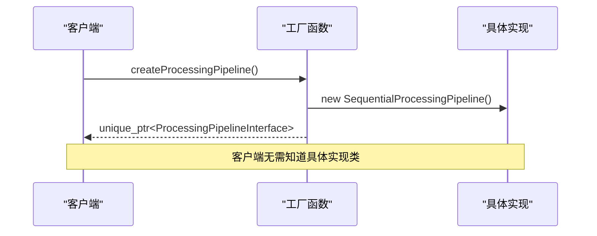
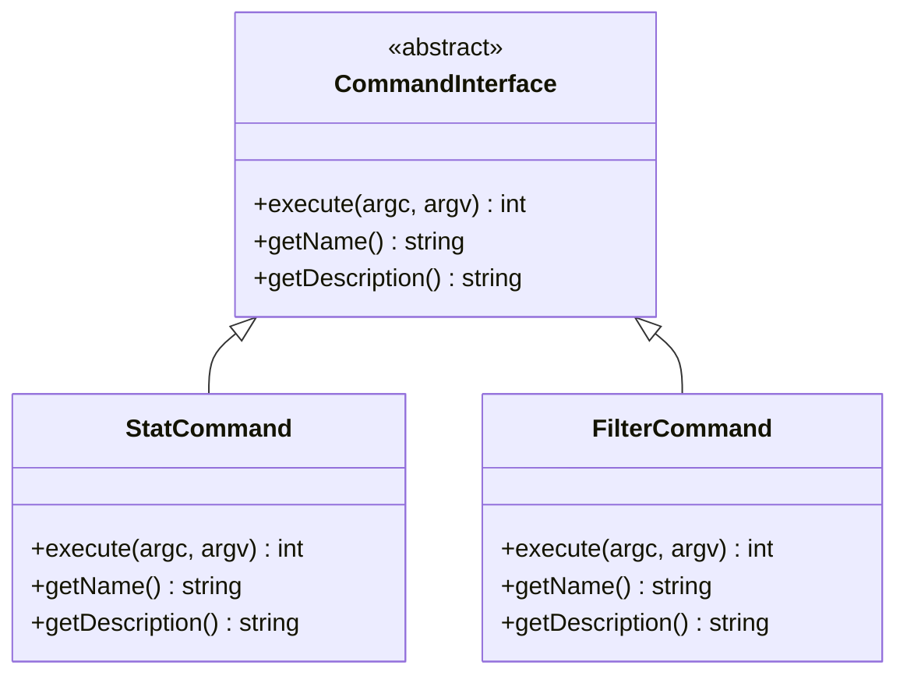
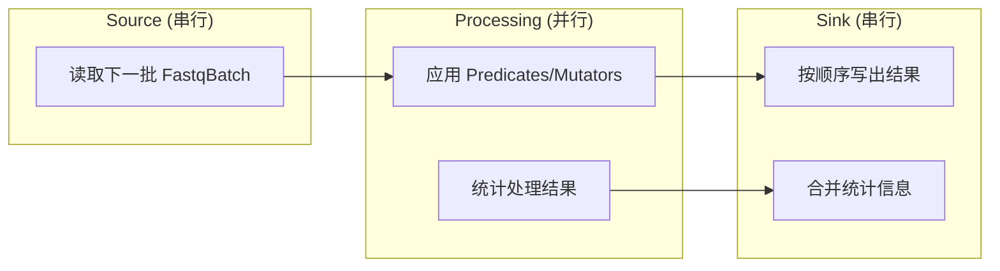
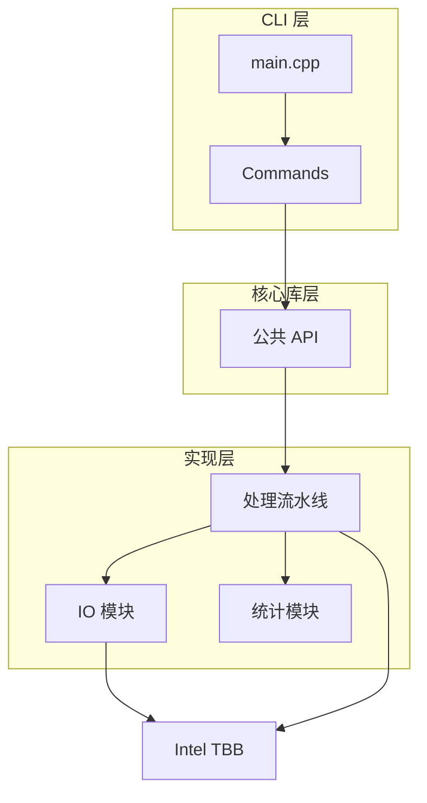

# 架构设计

<cite>
**本文档引用的文件**   
- [main.cpp](file://src/cli/main.cpp)
- [fq.h](file://include/fqtools/fq.h)
- [processing_pipeline_interface.h](file://include/fqtools/processing/processing_pipeline_interface.h)
- [processing_pipeline.cpp](file://src/processing/processing_pipeline.cpp)
- [factory.cpp](file://src/processing/factory.cpp)
- [fastq_reader.h](file://include/fqtools/io/fastq_reader.h)
- [fastq_writer.h](file://include/fqtools/io/fastq_writer.h)
- [filter_command.h](file://src/cli/commands/filter_command.h)
- [stat_command.h](file://src/cli/commands/stat_command.h)
- [architecture.md](file://docs/dev/architecture.md)
- [design.md](file://docs/dev/design.md)
</cite>

## 目录
1. [引言](#引言)
2. [分层架构](#分层架构)
3. [核心架构模式](#核心架构模式)
4. [数据流分析](#数据流分析)
5. [并行处理流水线](#并行处理流水线)
6. [组件依赖与交互](#组件依赖与交互)
7. [关键技术决策](#关键技术决策)
8. [结论](#结论)

## 引言

FastQTools 是一个面向 FASTQ 文件的现代 C++ 高性能处理工具集，专注于生物信息学场景中的质控、过滤和统计分析。本架构设计文档旨在深入揭示系统的内部工作原理，详细描述其分层架构、关键设计模式、数据流路径以及核心技术决策。通过分析从用户输入到结果输出的完整处理流程，本文档为开发者和用户提供了对系统性能和可扩展性的全面理解。

## 分层架构

FastQTools 采用清晰的分层架构设计，将系统划分为四个主要层次：CLI 层、命令层、核心库层和实现层。这种分层设计实现了高内聚低耦合，确保了系统的可维护性和可扩展性。

```
用户/调用者
    ↓
CLI 层 (src/cli/)
    ↓
应用命令层 (src/cli/commands/)
    ↓
核心库层 (include/fqtools/)
    ↓
实现层 (src/pipeline/, src/modules/)
```

### CLI 层

CLI 层是系统的入口点，负责解析命令行参数、分发子命令并初始化日志系统。该层的主程序入口位于 `src/cli/main.cpp`，它使用 cxxopts 库进行参数解析，并通过 spdlog 进行日志记录。CLI 层不包含任何业务逻辑，其主要职责是将用户请求路由到相应的命令处理器。

**Section sources**
- [main.cpp](file://src/cli/main.cpp#L1-L138)

### 命令层

命令层位于 CLI 层之下，实现了具体的业务逻辑。该层通过 `CommandInterface` 抽象接口定义了所有子命令的公共行为，目前实现了 `StatCommand` 和 `FilterCommand` 两个具体命令。每个命令负责验证参数、配置处理管道并执行相应的操作。这种设计模式使得添加新的命令变得简单而直观。

**Section sources**
- [filter_command.h](file://src/cli/commands/filter_command.h#L1-L72)
- [stat_command.h](file://src/cli/commands/stat_command.h#L1-L44)

### 核心库层

核心库层提供了系统的公共 API，是命令层与实现层之间的桥梁。该层的接口定义在 `include/fqtools/` 目录下，通过聚合头文件 `fq.h` 提供一站式入口。核心接口包括 `ProcessingPipelineInterface`、`ReadMutatorInterface` 和 `ReadPredicateInterface`，这些接口实现了抽象与实现的完全解耦。

**Section sources**
- [fq.h](file://include/fqtools/fq.h#L1-L16)
- [processing_pipeline_interface.h](file://include/fqtools/processing/processing_pipeline_interface.h#L1-L169)

### 实现层

实现层包含了系统的所有具体实现细节。该层位于 `src/` 目录下，实现了核心库层定义的接口。关键实现包括 `SequentialProcessingPipeline` 类，它提供了串行和并行两种处理模式；`FastqReader` 和 `FastqWriter` 类，它们负责高效地读写 FASTQ 文件；以及各种 `ReadMutator` 和 `ReadPredicate` 的具体实现。

**Section sources**
- [processing_pipeline.cpp](file://src/processing/processing_pipeline.cpp#L1-L238)
- [fastq_reader.h](file://include/fqtools/io/fastq_reader.h#L1-L46)
- [fastq_writer.h](file://include/fqtools/io/fastq_writer.h#L1-L42)

## 核心架构模式

FastQTools 在设计中应用了多种经典的设计模式，以提高代码的灵活性、可维护性和性能。

### Pimpl 模式

系统广泛使用 Pimpl（Pointer to Implementation）模式来隐藏实现细节，减少编译依赖。例如，`FastqReader` 和 `FastqWriter` 类都定义了私有的 `Impl` 结构体，并通过 `std::unique_ptr<Impl>` 持有其实例。这种设计使得接口头文件不依赖于具体的实现细节，从而降低了模块间的耦合度。

```mermaid
classDiagram
class FastqReader {
+FastqReader(const string& path)
+~FastqReader()
+nextBatch(FastqBatch& batch) bool
+isOpen() bool
-Impl* pImpl
}
class FastqReader : : Impl {
-gzFile file_
-char* buffer_
-size_t bufferSize_
}
FastqReader --> FastqReader : : Impl : "pImpl"
```

**Diagram sources**
- [fastq_reader.h](file://include/fqtools/io/fastq_reader.h#L40-L42)
- [fastq_writer.h](file://include/fqtools/io/fastq_writer.h#L37-L38)

### 工厂模式

系统使用工厂模式来创建处理组件，实现了对象创建与使用的解耦。`createProcessingPipeline()` 函数是一个典型的工厂函数，它返回一个 `std::unique_ptr<ProcessingPipelineInterface>`，隐藏了具体实现类 `SequentialProcessingPipeline` 的细节。这种设计使得客户端代码无需了解具体的实现类，提高了系统的可扩展性。



**Diagram sources**
- [factory.cpp](file://src/processing/factory.cpp#L26-L28)
- [processing_pipeline_interface.h](file://include/fqtools/processing/processing_pipeline_interface.h#L166-L168)

### 命令模式

CLI 指令的分发采用了命令模式。`CommandInterface` 定义了所有命令的公共接口，而 `StatCommand` 和 `FilterCommand` 则是具体的命令实现。主程序通过多态调用 `execute()` 方法来执行具体的命令逻辑，这种设计使得命令的添加和管理变得非常灵活。



**Diagram sources**
- [command_interface.h](file://src/cli/commands/command_interface.h)
- [stat_command.h](file://src/cli/commands/stat_command.h#L18-L44)
- [filter_command.h](file://src/cli/commands/filter_command.h#L24-L72)

## 数据流分析

FastQTools 的数据流从用户输入开始，经过一系列处理阶段，最终生成结果。整个流程体现了高效的数据处理和资源管理策略。

### 用户输入与配置解析

数据流始于用户通过命令行输入的参数。CLI 层解析这些参数，包括输入输出文件路径、处理选项和全局配置。解析后的配置被封装在 `ProcessingConfig` 结构体中，该结构体包含了批处理大小、线程数等关键性能参数。

**Section sources**
- [main.cpp](file://src/cli/main.cpp#L36-L82)
- [processing_pipeline_interface.h](file://include/fqtools/processing/processing_pipeline_interface.h#L61-L71)

### IO 模块读取

配置完成后，系统通过 `FastqReader` 模块读取输入文件。该模块采用批量读取策略，将数据以 `FastqBatch` 的形式加载到内存中。`FastqBatch` 使用连续内存缓冲区来存储原始数据，并通过 `std::string_view` 指向各个字段，最大限度地减少了字符串拷贝和内存分配。

**Section sources**
- [fastq_reader.h](file://include/fqtools/io/fastq_reader.h#L31-L33)
- [design.md](file://docs/dev/design.md#L11-L17)

### 处理流水线

数据进入处理流水线后，首先经过一系列 `ReadPredicate` 过滤器的筛选，然后由 `ReadMutator` 修改器进行变换。处理过程以批为单位进行，每个批次独立处理，实现了高度的并行化。处理结果被统计在 `ProcessingStatistics` 结构体中，用于性能监控和结果分析。

**Section sources**
- [processing_pipeline.cpp](file://src/processing/processing_pipeline.cpp#L94-L136)
- [processing_pipeline_interface.h](file://include/fqtools/processing/processing_pipeline_interface.h#L31-L52)

### 结果生成

处理完成后，数据通过 `FastqWriter` 模块写入输出文件。写入过程同样以批为单位进行，确保了高效的 I/O 性能。最终，系统汇总所有批次的统计信息，生成完整的处理报告。

**Section sources**
- [processing_pipeline.cpp](file://src/processing/processing_pipeline.cpp#L73-L74)
- [fastq_writer.h](file://include/fqtools/io/fastq_writer.h#L30-L31)

## 并行处理流水线

FastQTools 的高性能核心在于其基于 Intel TBB 的并行处理流水线。该流水线采用经典的三阶段设计：source、processing 和 sink。

### TBB 流水线结构



**Diagram sources**
- [processing_pipeline.cpp](file://src/processing/processing_pipeline.cpp#L179-L217)
- [design.md](file://docs/dev/design.md#L32-L34)

### 并行处理实现

系统通过 `tbb::parallel_pipeline` 实现并行处理。流水线的 `source` 阶段串行读取数据批次，`processing` 阶段并行处理各个批次，`sink` 阶段串行写出结果。这种设计充分利用了多核处理器的计算能力，同时保证了输出的有序性。

**Section sources**
- [processing_pipeline.cpp](file://src/processing/processing_pipeline.cpp#L179-L217)

### 背压机制

系统内置了背压机制，通过 `maxTokens` 参数控制流水线中同时处理的批次数量。这有效地平衡了 I/O 和计算速度，防止内存过度消耗。当内存限制或飞行中批次数量达到阈值时，系统会自动调整处理节奏。

**Section sources**
- [processing_pipeline.cpp](file://src/processing/processing_pipeline.cpp#L163-L175)

## 组件依赖与交互

FastQTools 的组件间依赖关系清晰，遵循自下而上的依赖方向，确保了模块化设计的完整性。



**Diagram sources**
- [architecture.md](file://docs/dev/architecture.md#L23-L33)
- [CMakeLists.txt](file://CMakeLists.txt)

## 关键技术决策

### libdeflate 压缩优化

系统选择 libdeflate 进行压缩优化，主要基于以下考虑：libdeflate 提供了比标准 zlib 更高的压缩和解压缩速度，特别适合处理大规模的 FASTQ 文件。其优化的算法和 SIMD 指令支持使得在保持兼容性的同时显著提升了 I/O 性能。

**Section sources**
- [changelog/2025-12-30-Optimization-libdeflate.md](file://changelog/2025-12-30-Optimization-libdeflate.md)

### 模块化设计

系统的模块化设计支持未来的功能扩展。通过清晰的接口定义和 Pimpl 模式，新的处理功能可以作为独立的模块添加，而不会影响现有代码。例如，添加新的过滤器或统计功能只需实现相应的接口，然后在工厂函数中注册即可。

**Section sources**
- [architecture.md](file://docs/dev/architecture.md#L7-L8)
- [design.md](file://docs/dev/design.md#L3-L5)

## 结论

FastQTools 通过精心设计的分层架构、先进的设计模式和高效的并行处理机制，实现了高性能的 FASTQ 文件处理能力。系统采用 Pimpl 模式隐藏实现细节，使用工厂模式创建处理组件，通过命令模式分发 CLI 指令，确保了代码的灵活性和可维护性。基于 Intel TBB 的并行处理流水线充分利用了现代多核处理器的计算能力，而模块化设计则为未来的功能扩展提供了坚实的基础。这些技术决策共同构成了一个高性能、可扩展且易于维护的生物信息学工具集。