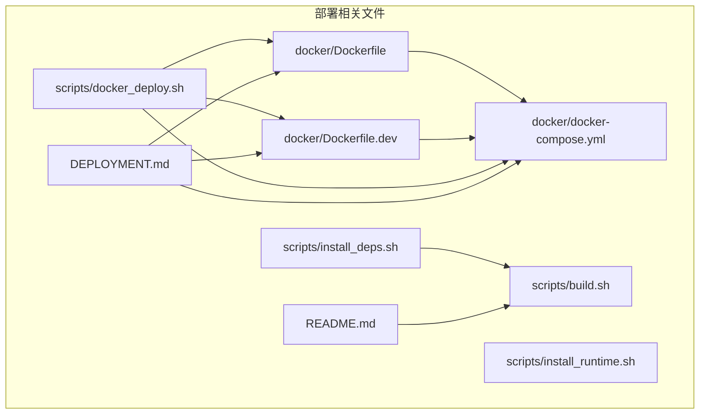
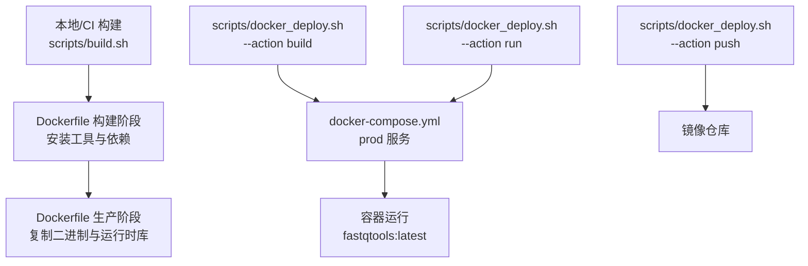
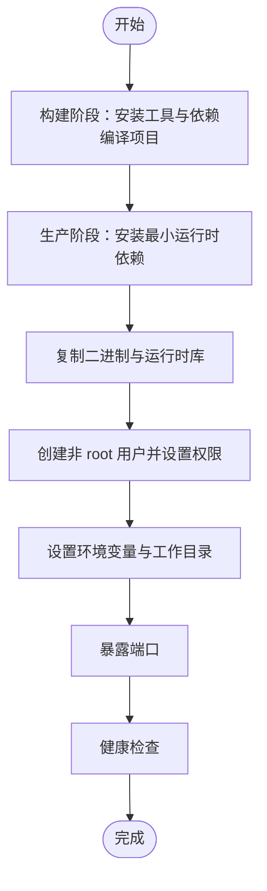
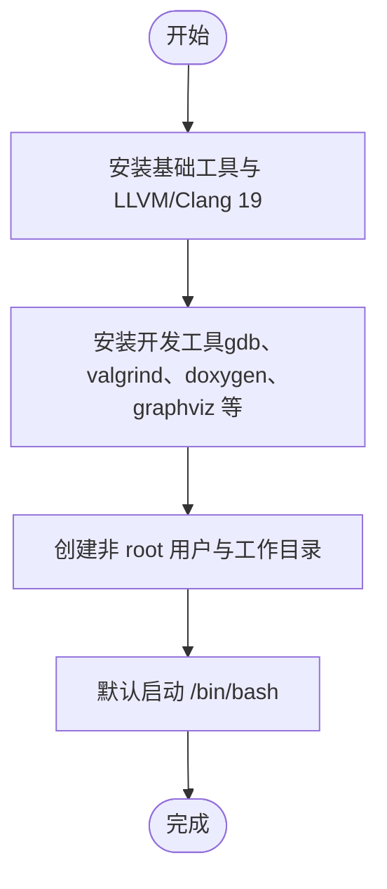
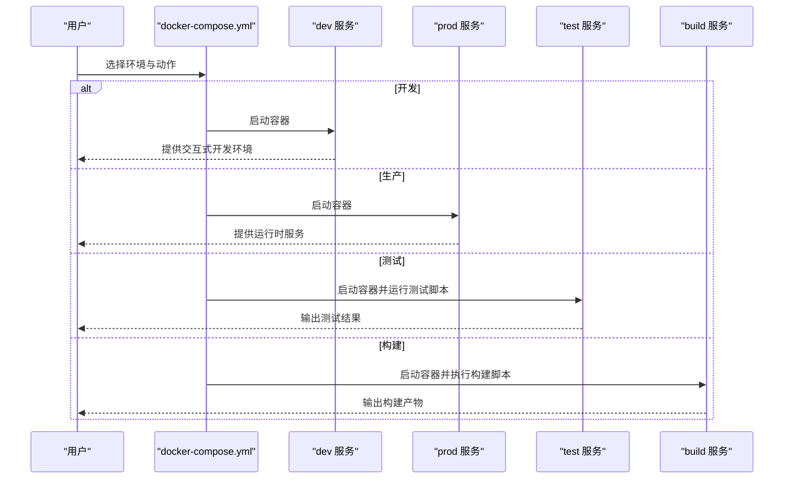
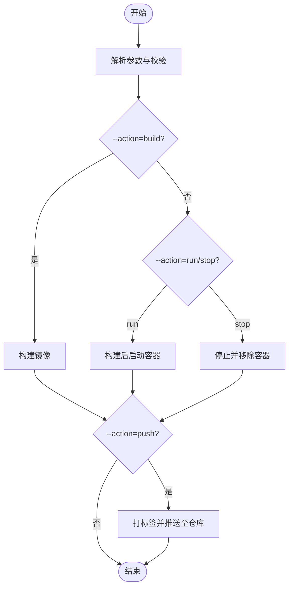
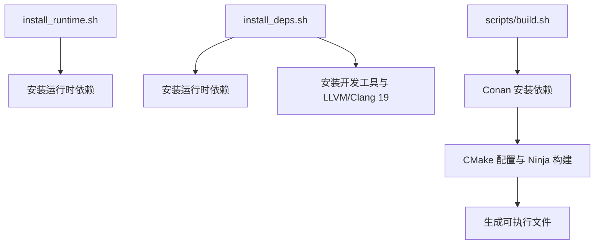
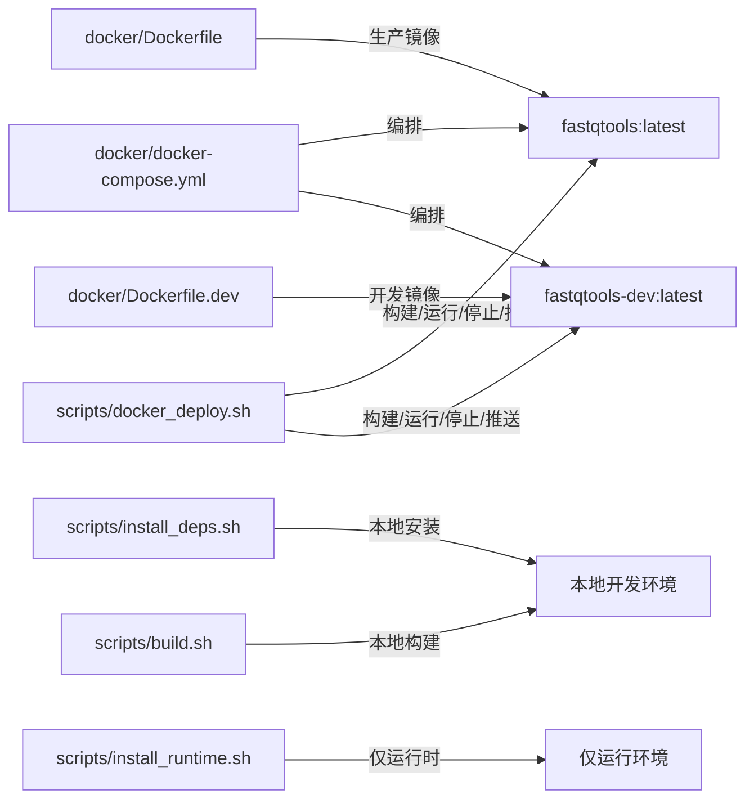

# 部署

<cite>
**本文引用的文件**
- [docker/Dockerfile](file://docker/Dockerfile)
- [docker/Dockerfile.dev](file://docker/Dockerfile.dev)
- [docker/docker-compose.yml](file://docker/docker-compose.yml)
- [scripts/docker_deploy.sh](file://scripts/docker_deploy.sh)
- [DEPLOYMENT.md](file://DEPLOYMENT.md)
- [scripts/install_runtime.sh](file://scripts/install_runtime.sh)
- [scripts/install_deps.sh](file://scripts/install_deps.sh)
- [scripts/build.sh](file://scripts/build.sh)
- [README.md](file://README.md)
</cite>

## 目录
1. [简介](#简介)
2. [项目结构](#项目结构)
3. [核心组件](#核心组件)
4. [架构总览](#架构总览)
5. [详细组件分析](#详细组件分析)
6. [依赖关系分析](#依赖关系分析)
7. [性能考量](#性能考量)
8. [故障排查指南](#故障排查指南)
9. [结论](#结论)
10. [附录](#附录)

## 简介
本指南面向希望将 FastQTools 部署到生产环境的用户，覆盖以下内容：
- 使用提供的 Dockerfile 构建轻量级生产镜像，并通过 docker_deploy.sh 脚本进行自动化构建、运行、停止与推送。
- 解释 docker-compose.yml 的配置，如何编排包含 FastQTools 以及可能的外部服务（如数据库、消息队列）的复杂应用。
- 在不同环境（本地、云服务器、Kubernetes）下的部署最佳实践。
- 镜像优化策略（多阶段构建、非 root 用户、最小化运行时依赖）。
- 裸机部署步骤与注意事项。

## 项目结构
与部署直接相关的文件集中在以下位置：
- docker/Dockerfile：生产镜像（多阶段构建），包含运行时依赖与非 root 用户。
- docker/Dockerfile.dev：开发镜像（完整工具链），便于交互式开发。
- docker/docker-compose.yml：多环境编排（dev/prod/test/build），挂载卷与环境变量配置。
- scripts/docker_deploy.sh：统一的部署脚本，支持 build/run/stop/push 四种动作与多环境选择。
- DEPLOYMENT.md：官方部署文档，涵盖安装选项、容器镜像、环境变量、卷挂载、安全与性能优化、监控与健康检查、故障排查与最佳实践。
- scripts/install_runtime.sh 与 scripts/install_deps.sh：裸机安装脚本，分别用于仅运行时依赖与开发/运行时依赖安装。
- scripts/build.sh：本地构建脚本，支持多种编译器、构建类型与 sanitizer/覆盖率等选项。
- README.md：项目概览与快速开始，包含构建与运行示例。

图表来源
- [docker/Dockerfile](file://docker/Dockerfile#L1-L114)
- [docker/Dockerfile.dev](file://docker/Dockerfile.dev#L1-L83)
- [docker/docker-compose.yml](file://docker/docker-compose.yml#L1-L79)
- [scripts/docker_deploy.sh](file://scripts/docker_deploy.sh#L1-L229)
- [DEPLOYMENT.md](file://DEPLOYMENT.md#L1-L247)
- [scripts/install_runtime.sh](file://scripts/install_runtime.sh#L1-L75)
- [scripts/install_deps.sh](file://scripts/install_deps.sh#L1-L282)
- [scripts/build.sh](file://scripts/build.sh#L1-L319)
- [README.md](file://README.md#L1-L128)

章节来源
- [docker/Dockerfile](file://docker/Dockerfile#L1-L114)
- [docker/Dockerfile.dev](file://docker/Dockerfile.dev#L1-L83)
- [docker/docker-compose.yml](file://docker/docker-compose.yml#L1-L79)
- [scripts/docker_deploy.sh](file://scripts/docker_deploy.sh#L1-L229)
- [DEPLOYMENT.md](file://DEPLOYMENT.md#L1-L247)
- [scripts/install_runtime.sh](file://scripts/install_runtime.sh#L1-L75)
- [scripts/install_deps.sh](file://scripts/install_deps.sh#L1-L282)
- [scripts/build.sh](file://scripts/build.sh#L1-L319)
- [README.md](file://README.md#L1-L128)

## 核心组件
- 生产镜像（Dockerfile）：采用多阶段构建，第一阶段安装构建工具与依赖并编译，第二阶段仅保留运行时依赖与二进制，非 root 用户运行，设置健康检查与环境变量，暴露端口，适合生产。
- 开发镜像（Dockerfile.dev）：包含完整开发工具链（Clang/LLVM、Ninja、Conan、调试与静态分析工具），非 root 用户，便于交互式开发与调试。
- 编排文件（docker-compose.yml）：定义 dev/prod/test/build 四个服务，分别映射不同的 Dockerfile 目标与工作目录、卷挂载、环境变量与命令；prod 服务支持持久化数据卷与重启策略。
- 部署脚本（scripts/docker_deploy.sh）：统一入口，支持 --env/--action/--tag/--registry 参数，封装构建、运行、停止与推送流程。
- 裸机安装脚本：install_runtime.sh 仅安装运行时依赖；install_deps.sh 支持开发/运行时/全量安装模式，并自动检测与安装 LLVM/Clang、Conan、Ninja 等工具。
- 本地构建脚本（scripts/build.sh）：支持指定编译器、构建类型与 sanitizer/覆盖率/LTO 等高级选项，自动调用 Conan 与 CMake/Ninja。

章节来源
- [docker/Dockerfile](file://docker/Dockerfile#L1-L114)
- [docker/Dockerfile.dev](file://docker/Dockerfile.dev#L1-L83)
- [docker/docker-compose.yml](file://docker/docker-compose.yml#L1-L79)
- [scripts/docker_deploy.sh](file://scripts/docker_deploy.sh#L1-L229)
- [scripts/install_runtime.sh](file://scripts/install_runtime.sh#L1-L75)
- [scripts/install_deps.sh](file://scripts/install_deps.sh#L1-L282)
- [scripts/build.sh](file://scripts/build.sh#L1-L319)

## 架构总览
下图展示了从本地构建到容器运行的整体流程，以及部署脚本与编排文件之间的关系。

图表来源
- [scripts/build.sh](file://scripts/build.sh#L1-L319)
- [docker/Dockerfile](file://docker/Dockerfile#L1-L114)
- [docker/docker-compose.yml](file://docker/docker-compose.yml#L1-L79)
- [scripts/docker_deploy.sh](file://scripts/docker_deploy.sh#L1-L229)

## 详细组件分析

### Dockerfile（生产镜像）
- 多阶段构建：构建阶段安装编译工具、CMake、Ninja、Conan、LLVM/Clang 与依赖库，执行 CMake+Ninja 构建；生产阶段仅拷贝二进制与运行时库，安装最小运行时依赖，创建非 root 用户，设置工作目录与环境变量，暴露端口，配置健康检查。
- 运行时依赖：包含 Intel TBB、zlib、bzip2、xz、libdeflate 等，确保二进制可在最小化环境中运行。
- 安全与隔离：非 root 用户运行，健康检查基于 CLI 帮助命令，便于容器编排平台监控。
- 环境变量：设置 PATH、LD_LIBRARY_PATH、FASTQTOOLS_DATA_DIR、FASTQTOOLS_OUTPUT_DIR，便于容器内使用。

图表来源
- [docker/Dockerfile](file://docker/Dockerfile#L1-L114)

章节来源
- [docker/Dockerfile](file://docker/Dockerfile#L1-L114)

### Dockerfile.dev（开发镜像）
- 基于 gcc:14.2-bookworm，安装完整开发工具链（Clang/LLVM 19、Ninja、Conan、调试与静态分析工具），设置非 root 用户与工作目录，提供交互式 Bash。
- 与生产镜像共享工具链一致性，便于开发与生产的对齐。

图表来源
- [docker/Dockerfile.dev](file://docker/Dockerfile.dev#L1-L83)

章节来源
- [docker/Dockerfile.dev](file://docker/Dockerfile.dev#L1-L83)

### docker-compose.yml（编排配置）
- dev 服务：使用开发镜像，映射源码与缓存卷，暴露端口，交互式 Bash，便于本地开发。
- prod 服务：使用生产镜像，映射只读输入数据卷与可写输出卷，设置环境变量，启用重启策略，适合生产运行。
- test 服务：使用开发镜像，映射缓存卷，设置构建类型与覆盖率标志，运行测试脚本。
- build 服务：使用生产镜像，映射缓存卷，执行构建脚本，适合 CI 场景。
- 卷：conan_cache、ccache_cache 作为命名卷，提升依赖与编译缓存复用效率。

图表来源
- [docker/docker-compose.yml](file://docker/docker-compose.yml#L1-L79)

章节来源
- [docker/docker-compose.yml](file://docker/docker-compose.yml#L1-L79)

### scripts/docker_deploy.sh（部署脚本）
- 功能：统一入口，支持 --env（production/development/test）、--action（build/run/stop/push）、--tag、--registry。
- 流程：
  - build：根据环境选择对应 Dockerfile 与目标阶段，构建镜像。
  - run：先构建镜像，再通过 docker-compose 启动对应服务。
  - stop：停止并移除对应服务容器。
  - push：为镜像打标签并推送到指定仓库。
- 输出：带颜色提示，失败时退出并给出错误信息。

图表来源
- [scripts/docker_deploy.sh](file://scripts/docker_deploy.sh#L1-L229)

章节来源
- [scripts/docker_deploy.sh](file://scripts/docker_deploy.sh#L1-L229)

### 裸机部署（install_runtime.sh 与 install_deps.sh）
- install_runtime.sh：仅安装运行时依赖（TBB、zlib、bzip2、xz、libdeflate），适合最终用户或仅需运行 FastQTools 的场景。
- install_deps.sh：支持三种模式（开发/运行时/全量），自动安装 LLVM/Clang 19、Ninja、Conan、调试与静态分析工具，适用于开发者或需要本地构建的场景。
- build.sh：本地构建脚本，支持多种编译器、构建类型与 sanitizer/覆盖率/LTO 等选项，自动调用 Conan 与 CMake/Ninja。

图表来源
- [scripts/install_runtime.sh](file://scripts/install_runtime.sh#L1-L75)
- [scripts/install_deps.sh](file://scripts/install_deps.sh#L1-L282)
- [scripts/build.sh](file://scripts/build.sh#L1-L319)

章节来源
- [scripts/install_runtime.sh](file://scripts/install_runtime.sh#L1-L75)
- [scripts/install_deps.sh](file://scripts/install_deps.sh#L1-L282)
- [scripts/build.sh](file://scripts/build.sh#L1-L319)

## 依赖关系分析
- 镜像与脚本耦合：docker_deploy.sh 依赖 docker-compose.yml 中的服务定义与 Dockerfile 的目标阶段；生产镜像由 Dockerfile 的生产阶段产出。
- 本地与容器一致性：Dockerfile.dev 与 install_deps.sh/README 的环境要求保持一致，确保本地与容器开发体验一致。
- 依赖管理：Conan 在 Dockerfile 与本地构建脚本中均被使用，保证依赖版本与二进制缓存的一致性。

图表来源
- [docker/Dockerfile](file://docker/Dockerfile#L1-L114)
- [docker/Dockerfile.dev](file://docker/Dockerfile.dev#L1-L83)
- [docker/docker-compose.yml](file://docker/docker-compose.yml#L1-L79)
- [scripts/docker_deploy.sh](file://scripts/docker_deploy.sh#L1-L229)
- [scripts/install_deps.sh](file://scripts/install_deps.sh#L1-L282)
- [scripts/install_runtime.sh](file://scripts/install_runtime.sh#L1-L75)
- [scripts/build.sh](file://scripts/build.sh#L1-L319)

章节来源
- [docker/Dockerfile](file://docker/Dockerfile#L1-L114)
- [docker/Dockerfile.dev](file://docker/Dockerfile.dev#L1-L83)
- [docker/docker-compose.yml](file://docker/docker-compose.yml#L1-L79)
- [scripts/docker_deploy.sh](file://scripts/docker_deploy.sh#L1-L229)
- [scripts/install_deps.sh](file://scripts/install_deps.sh#L1-L282)
- [scripts/install_runtime.sh](file://scripts/install_runtime.sh#L1-L75)
- [scripts/build.sh](file://scripts/build.sh#L1-L319)

## 性能考量
- 构建性能：使用 Ninja 并结合 ccache，减少重复编译时间；Docker 多阶段构建避免将开发工具带入生产镜像。
- 运行性能：生产镜像仅包含运行时库，体积更小；容器内使用 Intel TBB 并行处理，配合 libdeflate 与压缩库加速 IO。
- 镜像体积：生产镜像基于 debian:12-slim，仅复制必要的二进制与库，体积较小，降低拉取与运行成本。
- 缓存与卷：docker-compose 中使用命名卷（conan_cache、ccache_cache）提升依赖与编译缓存复用效率。

章节来源
- [docker/Dockerfile](file://docker/Dockerfile#L1-L114)
- [docker/docker-compose.yml](file://docker/docker-compose.yml#L1-L79)
- [DEPLOYMENT.md](file://DEPLOYMENT.md#L145-L158)

## 故障排查指南
- 权限问题：生产镜像以非 root 用户运行，若宿主机挂载卷权限不足，需调整宿主机目录属主与权限。
- 缺失依赖：可通过容器内检查动态链接库，确认运行时库是否满足。
- 构建失败：检查开发环境（编译器、Conan、CMake、Ninja 是否可用），或在开发容器中复现问题。
- 调试模式：支持进入容器交互式调试，或附加到正在运行的容器进行诊断。

章节来源
- [DEPLOYMENT.md](file://DEPLOYMENT.md#L176-L208)
- [docker/Dockerfile](file://docker/Dockerfile#L1-L114)

## 结论
通过多阶段 Dockerfile、统一的 docker_deploy.sh 脚本与 docker-compose.yml 编排，FastQTools 可在本地、云服务器与 Kubernetes 等环境中实现一致、可重复且高效的部署。生产镜像强调最小化与安全性，开发镜像提供完整的工具链，裸机安装脚本满足不同用户需求。结合健康检查与日志监控，可进一步提升生产稳定性与可观测性。

## 附录

### 不同环境下的部署最佳实践
- 本地开发
  - 使用 docker-compose dev 服务或 scripts/docker_deploy.sh --env development --action run，映射源码与缓存卷，便于热更新与调试。
- 云服务器
  - 使用 docker-compose prod 服务或 scripts/docker_deploy.sh --env production --action run，挂载只读输入数据卷与可写输出卷，设置资源限制与重启策略，定期更新基础镜像。
- Kubernetes
  - 将生产镜像部署为 Deployment，使用 ConfigMap/Secret 管理环境变量与密钥，使用 PersistentVolumeClaim 挂载数据与输出目录，配置 readiness/liveness 探针（可参考容器健康检查）。

章节来源
- [docker/docker-compose.yml](file://docker/docker-compose.yml#L1-L79)
- [scripts/docker_deploy.sh](file://scripts/docker_deploy.sh#L1-L229)
- [DEPLOYMENT.md](file://DEPLOYMENT.md#L210-L223)

### 镜像优化策略
- 多阶段构建：分离构建与运行阶段，仅在最终镜像中包含运行时库与二进制。
- 最小化基础镜像：使用 debian:12-slim，减少层与依赖。
- 非 root 用户：降低攻击面，提升安全性。
- 缓存与卷：利用 Conan 与 ccache 缓存，减少重复下载与编译时间。
- 健康检查：通过容器健康检查保障服务可用性。

章节来源
- [docker/Dockerfile](file://docker/Dockerfile#L1-L114)
- [docker/docker-compose.yml](file://docker/docker-compose.yml#L1-L79)
- [DEPLOYMENT.md](file://DEPLOYMENT.md#L130-L166)

### 裸机部署步骤与注意事项
- 仅运行时依赖：使用 install_runtime.sh 安装运行时库，适合最终用户或仅需运行 FastQTools 的场景。
- 开发/运行时依赖：使用 install_deps.sh，自动安装 LLVM/Clang 19、Ninja、Conan、调试与静态分析工具，适合开发者或需要本地构建的场景。
- 本地构建：使用 scripts/build.sh，支持多种编译器、构建类型与 sanitizer/覆盖率/LTO 等选项，自动调用 Conan 与 CMake/Ninja。

章节来源
- [scripts/install_runtime.sh](file://scripts/install_runtime.sh#L1-L75)
- [scripts/install_deps.sh](file://scripts/install_deps.sh#L1-L282)
- [scripts/build.sh](file://scripts/build.sh#L1-L319)
- [README.md](file://README.md#L87-L108)