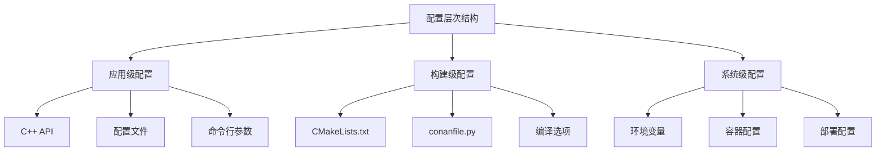
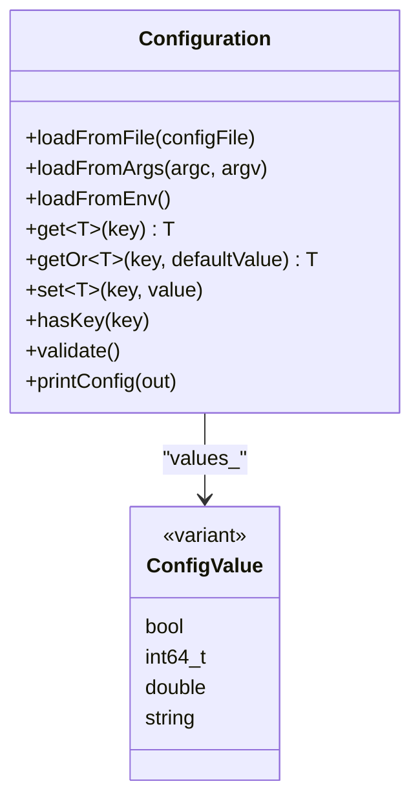
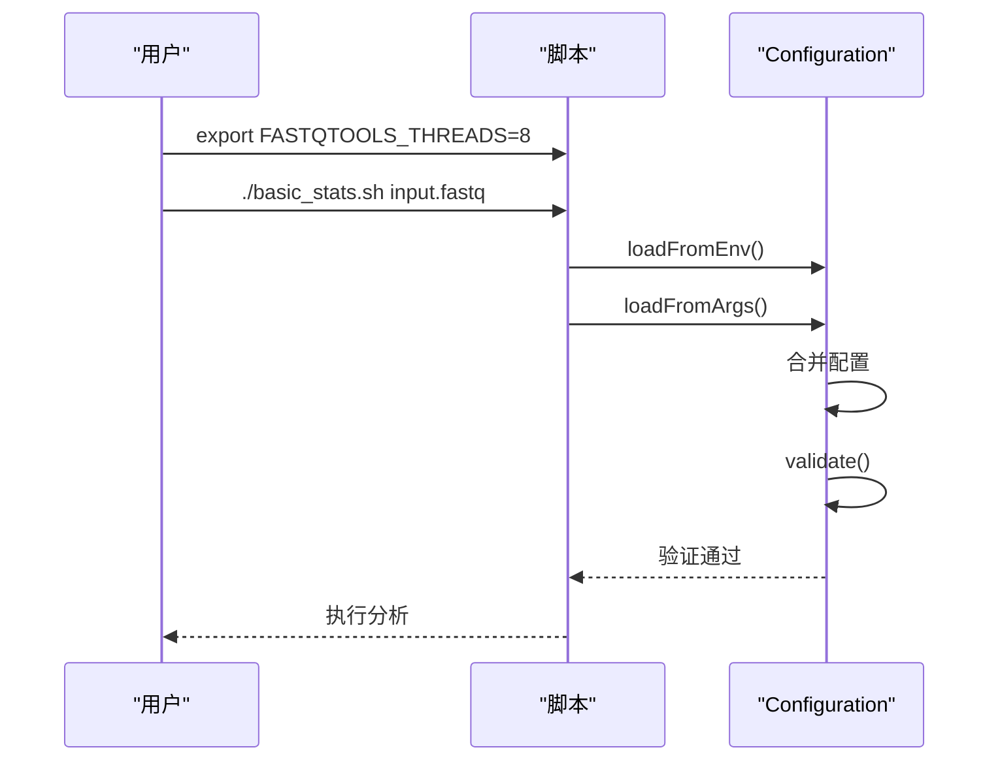
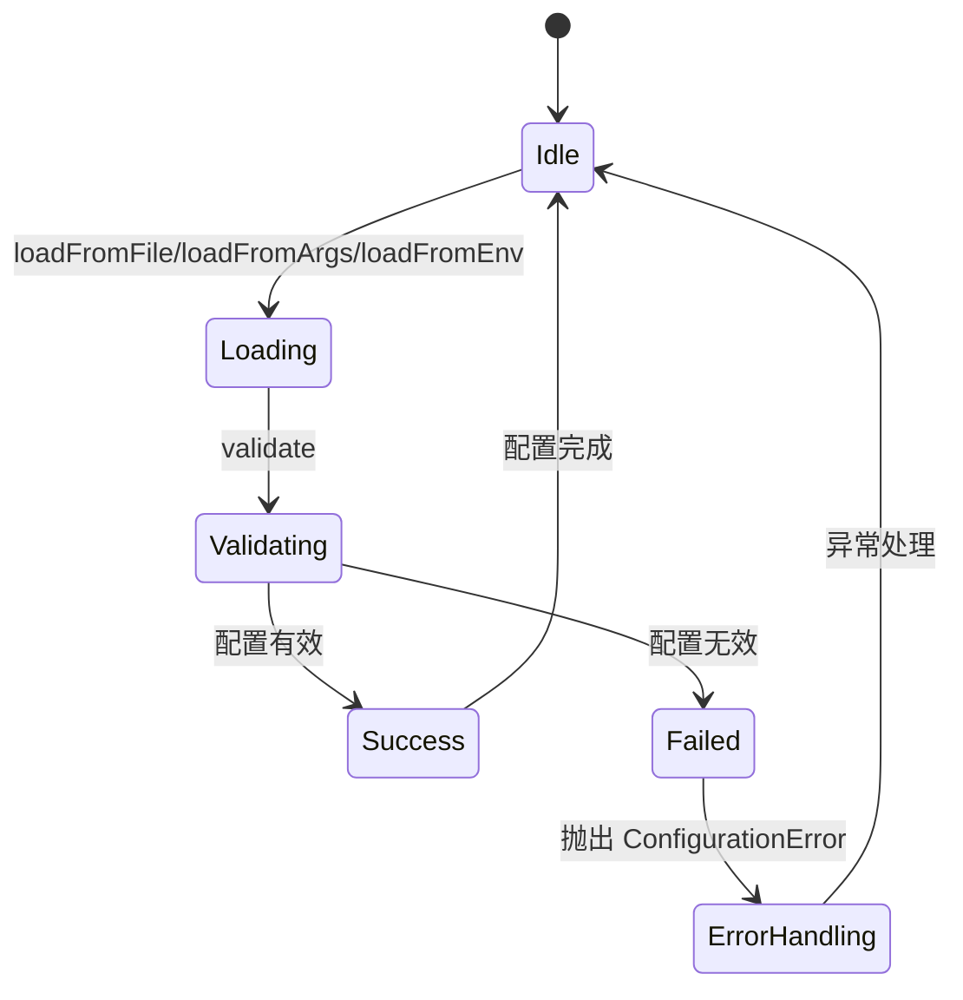

# 配置管理

<cite>
**本文档引用的文件**
- [config.h](file://include/fqtools/config/config.h)
- [config.cpp](file://src/config/config.cpp)
- [conanfile.py](file://conanfile.py)
- [CMakeLists.txt](file://CMakeLists.txt)
- [FastQToolsConfig.cmake.in](file://cmake/FastQToolsConfig.cmake.in)
- [test_configuration.cpp](file://tests/unit/config/test_configuration.cpp)
- [test_config_parsing.cpp](file://tests/unit/config/test_config_parsing.cpp)
- [main.cpp](file://src/cli/main.cpp)
- [build.sh](file://scripts/build.sh)
- [Dockerfile](file://docker/Dockerfile)
- [basic_stats.sh](file://examples/basic_usage/basic_stats.sh)
- [config/dependencies/conanfile.py](file://config/dependencies/conanfile.py)
</cite>

## 目录
1. [引言](#引言)
2. [配置层次结构](#配置层次结构)
3. [运行时配置](#运行时配置)
4. [构建时配置](#构建时配置)
5. [环境变量与命令行覆盖](#环境变量与命令行覆盖)
6. [配置优先级与合并规则](#配置优先级与合并规则)
7. [配置验证与错误处理](#配置验证与错误处理)
8. [实际应用示例](#实际应用示例)
9. [最佳实践](#最佳实践)

## 引言

FastQTools 项目提供了一个全面的配置管理系统，支持多层级的配置管理，包括应用级运行时配置、构建时配置和系统级环境配置。本文档详细说明了如何使用 `config.h` 中的 C++ API 设置处理选项（如最大线程数、缓冲区大小），如何通过 CMake 和 Conan 管理依赖项版本和编译选项，以及如何通过环境变量或命令行参数覆盖默认配置。

该系统设计为灵活且可扩展，允许用户在不同层级上进行配置，同时确保配置的类型安全和有效性验证。配置系统支持从配置文件、命令行参数和环境变量中加载配置，并按照预定义的优先级进行合并。

**Section sources**
- [config.h](file://include/fqtools/config/config.h#L1-L151)
- [config.cpp](file://src/config/config.cpp#L1-L266)

## 配置层次结构

FastQTools 的配置系统分为三个主要层次，每个层次服务于不同的配置需求和生命周期：

1. **应用级配置 (Application-level Configuration)**：在程序运行时通过 C++ API 动态设置的配置，如线程数、批处理大小等处理选项。
2. **构建级配置 (Build-level Configuration)**：在编译时通过 CMake 和 Conan 设置的配置，如依赖项版本、编译器选项等。
3. **系统级配置 (System-level Configuration)**：通过环境变量设置的全局配置，可以在不修改代码或构建脚本的情况下调整程序行为。

这种分层设计允许开发人员和用户在适当的层级上进行配置，确保了配置的灵活性和可维护性。



**Diagram sources**
- [config.h](file://include/fqtools/config/config.h#L24-L137)
- [CMakeLists.txt](file://CMakeLists.txt#L1-L180)
- [conanfile.py](file://conanfile.py#L1-L53)

## 运行时配置

运行时配置是 FastQTools 的核心配置机制，通过 `fq::config::Configuration` 类提供。该类实现了类型安全的配置管理，支持多种数据类型（bool、int64_t、double、string）的存储和检索。

### 配置类设计

`Configuration` 类提供了以下主要功能：
- 从配置文件加载配置
- 从命令行参数解析配置
- 从环境变量读取配置
- 类型安全的配置值获取和设置
- 配置验证和错误处理

配置值通过 `std::variant<bool, std::int64_t, double, std::string>` 类型存储，确保了类型安全。类提供了模板方法 `get<T>()` 和 `getOr<T>()` 用于类型安全的值检索。

### API 使用示例



**Diagram sources**
- [config.h](file://include/fqtools/config/config.h#L33-L137)
- [config.cpp](file://src/config/config.cpp#L36-L265)

### 配置加载流程

运行时配置可以通过多种方式加载，系统会按照以下流程处理：


**Diagram sources**
- [config.cpp](file://src/config/config.cpp#L36-L88)
- [config.cpp](file://src/config/config.cpp#L91-L108)

**Section sources**
- [config.h](file://include/fqtools/config/config.h#L45-L66)
- [config.cpp](file://src/config/config.cpp#L36-L108)

## 构建时配置

构建时配置通过 CMake 和 Conan 系统管理，负责项目的依赖项管理和编译选项设置。

### Conan 依赖管理

Conan 用于管理项目的外部依赖项，`conanfile.py` 文件定义了所有依赖项及其版本：

```python
def requirements(self):
    self.requires("cxxopts/3.1.1")
    self.requires("spdlog/1.12.0")
    self.requires("fmt/10.2.1")
    self.requires("zlib/1.3")
    self.requires("bzip2/1.0.8")
    self.requires("xz_utils/5.4.5")
    self.requires("nlohmann_json/3.11.2")
    self.requires("onetbb/2021.10.0")
    self.requires("libdeflate/1.19", override=True)
```

这些依赖项包括：
- **cxxopts**: 命令行参数解析库
- **spdlog**: 高性能日志库
- **fmt**: 格式化库
- **zlib/bzip2/xz_utils**: 压缩库
- **nlohmann_json**: JSON 处理库
- **onetbb**: 并行计算库
- **libdeflate**: 高性能压缩库

### CMake 构建配置

CMakeLists.txt 文件定义了项目的构建配置，包括编译器要求、编译选项和构建目标：


**Diagram sources**
- [CMakeLists.txt](file://CMakeLists.txt#L23-L54)
- [conanfile.py](file://conanfile.py#L26-L34)

### 构建选项

项目支持多种构建选项，可以通过 CMake 变量或构建脚本进行设置：

| 选项 | 描述 | 默认值 |
|------|------|--------|
| ENABLE_COVERAGE | 启用代码覆盖率分析 | OFF |
| BUILD_BENCHMARKS | 构建性能基准测试 | OFF |
| BUILD_TESTING | 构建单元测试 | ON |
| CMAKE_BUILD_TYPE | 构建类型 | Release |
| CMAKE_CXX_STANDARD | C++ 标准 | 20 |

这些选项可以通过 `cmake` 命令行或构建脚本进行设置，例如：
```bash
cmake -B build -DENABLE_COVERAGE=ON -DBUILD_TESTING=ON
```

**Section sources**
- [CMakeLists.txt](file://CMakeLists.txt#L82-L105)
- [conanfile.py](file://conanfile.py#L5-L53)

## 环境变量与命令行覆盖

FastQTools 支持通过环境变量和命令行参数覆盖默认配置，提供了灵活的配置覆盖机制。

### 环境变量配置

环境变量以 `FASTQTOOLS_` 为前缀，系统会自动将其转换为小写配置键。例如：

- `FASTQTOOLS_THREADS=8` → `threads=8`
- `FASTQTOOLS_BATCH_SIZE=100000` → `batch_size=100000`
- `FASTQTOOLS_DEBUG_MODE=true` → `debug_mode=true`

环境变量的加载在 `Configuration::loadFromEnv()` 方法中实现，系统会遍历所有环境变量，筛选出以 `FASTQTOOLS_` 开头的变量，并将其余部分转换为小写作为配置键。

### 命令行参数

命令行参数支持多种格式：
- `--key=value`: 键值对格式
- `--key value`: 分离的键值格式
- `-k value`: 短名称格式

系统支持的短名称映射包括：
- `-i` → `input`
- `-o` → `output`
- `-t` → `threads`
- `-m` → `memoryLimitMb`
- `-v` → `verbose`
- `-h` → `help`

### 覆盖示例



**Diagram sources**
- [config.cpp](file://src/config/config.cpp#L91-L108)
- [config.cpp](file://src/config/config.cpp#L55-L88)
- [basic_stats.sh](file://examples/basic_usage/basic_stats.sh#L16-L17)

**Section sources**
- [config.h](file://include/fqtools/config/config.h#L57-L66)
- [config.cpp](file://src/config/config.cpp#L91-L108)
- [basic_stats.sh](file://examples/basic_usage/basic_stats.sh#L15-L16)

## 配置优先级与合并规则

FastQTools 的配置系统遵循特定的优先级规则，确保配置的确定性和可预测性。

### 优先级层次

配置的优先级从高到低如下：
1. **命令行参数**: 最高优先级，直接覆盖其他所有配置
2. **环境变量**: 中等优先级，可以被命令行参数覆盖
3. **配置文件**: 较低优先级，可以被环境变量和命令行参数覆盖
4. **默认值**: 最低优先级，仅在没有其他配置时使用

### 合并流程

配置合并遵循"后覆盖前"的原则，即后加载的配置会覆盖先加载的同名配置：


**Diagram sources**
- [main.cpp](file://src/cli/main.cpp#L35-L116)
- [config.cpp](file://src/config/config.cpp#L36-L108)

### 实际应用

在实际使用中，用户可以通过多种方式组合配置：

```bash
# 使用配置文件，但通过环境变量覆盖线程数
export FASTQTOOLS_THREADS=8
FastQTools stat -i input.fastq -o output.txt

# 使用命令行参数完全覆盖
FastQTools stat -i input.fastq -o output.txt --threads 16 --batch-size 100000
```

**Section sources**
- [main.cpp](file://src/cli/main.cpp#L35-L116)
- [config.cpp](file://src/config/config.cpp#L36-L108)

## 配置验证与错误处理

配置系统包含完整的验证机制，确保配置的有效性和完整性。

### 验证规则

`Configuration::validate()` 方法执行以下验证：
- 检查必需的配置键是否存在
- 验证数值范围的有效性
- 确保配置的一致性

```cpp
void Configuration::validate() const {
    static const std::vector<std::string> requiredKeys = {"input", "output"};
    for (const auto& key : requiredKeys) {
        if (!hasKey(key)) {
            FQ_THROW_CONFIG_ERROR(std::format("Required configuration key '{}' is missing", key));
        }
    }
    if (hasKey("threads")) {
        auto threads = getOr<std::int64_t>("threads", 1);
        if (threads <= 0 || threads > 256) {
            FQ_THROW_CONFIG_ERROR("threads must be between 1 and 256");
        }
    }
}
```

### 错误处理

系统使用 `fq::error::ConfigurationError` 异常类处理配置错误，所有配置操作都可能抛出此异常：



**Diagram sources**
- [config.cpp](file://src/config/config.cpp#L110-L128)
- [config.h](file://include/fqtools/config/config.h#L43-L44)

**Section sources**
- [config.cpp](file://src/config/config.cpp#L110-L128)
- [test_configuration.cpp](file://tests/unit/config/test_configuration.cpp#L205-L234)

## 实际应用示例

以下是一些实际的配置使用示例，展示了如何在不同场景下使用配置系统。

### 基本统计分析

在 `basic_stats.sh` 脚本中，通过环境变量设置配置：

```bash
# 设置环境变量
export FASTQTOOLS_THREADS=8
export FASTQTOOLS_BATCH_SIZE=100000

# 运行统计分析
./basic_stats.sh input.fastq.gz
```

脚本内部使用这些环境变量：
```bash
THREADS=${FASTQTOOLS_THREADS:-4}
BATCH_SIZE=${FASTQTOOLS_BATCH_SIZE:-50000}
```

### 构建脚本配置

`build.sh` 脚本支持多种构建配置选项：

```bash
# 基本构建
./scripts/build.sh

# 使用 GCC 调试构建
./scripts/build.sh gcc Debug

# 启用地址 sanitizer
./scripts/build.sh --asan

# 启用代码覆盖率
./scripts/build.sh --coverage
```

### Docker 部署配置

在 Docker 环境中，通过环境变量设置系统级配置：

```dockerfile
ENV FASTQTOOLS_DATA_DIR=/app/data
ENV FASTQTOOLS_OUTPUT_DIR=/app/output
```

**Section sources**
- [basic_stats.sh](file://examples/basic_usage/basic_stats.sh#L15-L17)
- [build.sh](file://scripts/build.sh#L1-L319)
- [Dockerfile](file://docker/Dockerfile#L103-L105)

## 最佳实践

为了有效使用 FastQTools 的配置系统，建议遵循以下最佳实践：

### 配置管理建议

1. **使用配置文件作为基础**: 将常用配置保存在配置文件中，便于复用和版本控制。
2. **环境变量用于部署**: 在生产环境中使用环境变量进行配置，避免硬编码。
3. **命令行参数用于临时覆盖**: 使用命令行参数进行临时的、一次性的配置覆盖。
4. **合理设置默认值**: 确保所有关键配置都有合理的默认值，提高易用性。

### 安全考虑

1. **验证所有输入配置**: 始终调用 `validate()` 方法确保配置的有效性。
2. **限制资源使用**: 设置合理的线程数和内存限制，防止资源耗尽。
3. **使用类型安全的 API**: 优先使用 `get<T>()` 而不是直接访问配置值。

### 性能优化

1. **合理设置批处理大小**: 根据系统内存和处理需求调整 `batchSize`。
2. **优化线程数**: 根据 CPU 核心数设置合适的 `threads` 值。
3. **调整缓冲区大小**: 根据 I/O 性能需求调整 `readChunkBytes` 和 `writerBufferBytes`。

通过遵循这些最佳实践，可以确保 FastQTools 的配置系统既灵活又可靠，满足不同场景下的需求。

**Section sources**
- [config.h](file://include/fqtools/config/config.h#L110-L114)
- [config.cpp](file://src/config/config.cpp#L110-L128)
- [basic_stats.sh](file://examples/basic_usage/basic_stats.sh#L15-L17)