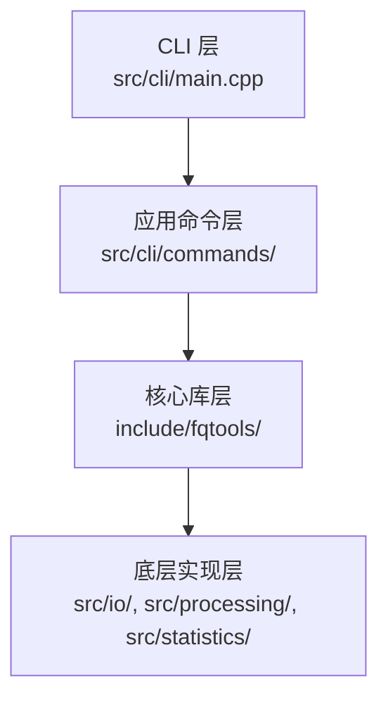

# 项目概述

<cite>
**本文档引用的文件**  
- [README.md](file://README.md)
- [docs/user/usage.md](file://docs/user/usage.md)
- [docs/dev/architecture.md](file://docs/dev/architecture.md)
- [docs/installation.md](file://docs/installation.md)
- [include/fqtools/fq.h](file://include/fqtools/fq.h)
- [include/fqtools/core/core.h](file://include/fqtools/core/core.h)
- [include/fqtools/io/fastq_reader.h](file://include/fqtools/io/fastq_reader.h)
- [include/fqtools/processing/processing_pipeline.h](file://include/fqtools/processing/processing_pipeline.h)
- [include/fqtools/statistics/statistic_calculator.h](file://include/fqtools/statistics/statistic_calculator.h)
- [src/cli/main.cpp](file://src/cli/main.cpp)
- [src/cli/commands/stat_command.h](file://src/cli/commands/stat_command.h)
- [src/cli/commands/filter_command.h](file://src/cli/commands/filter_command.h)
- [CMakeLists.txt](file://CMakeLists.txt)
- [conanfile.py](file://conanfile.py)
- [docker/Dockerfile](file://docker/Dockerfile)
</cite>

## 目录
1. [简介](#简介)
2. [核心功能与用途](#核心功能与用途)
3. [整体架构设计](#整体架构设计)
4. [技术选型与实现细节](#技术选型与实现细节)
5. [典型使用场景](#典型使用场景)
6. [集成与部署方式](#集成与部署方式)
7. [初学者关键概念](#初学者关键概念)

## 简介

fastq-tools 是一个专为生物信息学领域设计的高性能 C++ 工具集，旨在高效处理 FASTQ 格式的高通量测序数据文件。该项目以性能为核心目标，提供了一套现代化、模块化的工具，用于执行质量控制、数据过滤和统计分析等关键任务。其设计遵循现代 C++ 最佳实践，采用 C++20 标准，并通过 Intel TBB 实现并行化处理，确保在处理大规模测序数据时具备卓越的吞吐量和资源利用率。项目不仅提供命令行工具，还设计了清晰的公共 API，支持作为库集成到其他 C++ 项目中。

**Section sources**
- [README.md](file://README.md#L1-L128)
- [docs/user/usage.md](file://docs/user/usage.md#L1-L87)

## 核心功能与用途

fastq-tools 的核心功能聚焦于 FASTQ 数据的预处理和分析，主要包含两大命令：`stat` 和 `filter`。

`stat` 命令用于对 FASTQ 文件进行全面的统计分析。它能够计算并输出多种关键指标，包括读段总数、有效读段数、序列长度分布（最小值、最大值、平均值）、碱基组成（A/T/C/G/N 的比例）、GC 含量以及质量分数分布（如 Q20/Q30 碱基百分比）。这些统计信息对于评估测序数据的质量、识别潜在问题（如接头污染或低质量区域）至关重要。

`filter` 命令则用于对原始测序数据进行清洗和过滤。它支持基于多种条件的读段筛选，例如设置最小/最大读长、最小平均质量阈值、最大 N 碱基比例等。此外，它还提供质量修剪（trimming）功能，可以根据指定的质量阈值（如 `--trim-quality 20`）从读段的 5' 端、3' 端或两端移除低质量碱基，从而提高下游分析的准确性。

**Section sources**
- [README.md](file://README.md#L21-L25)
- [docs/user/usage.md](file://docs/user/usage.md#L16-L56)

## 整体架构设计

fastq-tools 采用模块化分层架构，各层职责清晰，耦合度低。整个架构从上到下可分为四个主要层次：

1.  **CLI 层**：位于 `src/cli/` 目录，是程序的入口。`main.cpp` 文件负责解析全局命令行参数（如日志级别 `--verbose`）、初始化日志系统，并根据用户输入的子命令（如 `stat` 或 `filter`）进行分发。
2.  **应用命令层**：位于 `src/cli/commands/` 目录。该层定义了 `CommandInterface` 接口，并由 `StatCommand` 和 `FilterCommand` 等具体类实现。这些类负责解析各自命令的特定参数、进行参数验证，并调用核心库层的功能。
3.  **核心库层**：位于 `include/fqtools/` 目录，是项目对外暴露的公共 API。它通过头文件（如 `fq.h`）聚合了所有核心功能的接口，包括 `ProcessingPipelineInterface` 和 `StatisticCalculatorInterface`。这一层的设计保证了库的易用性和稳定性。
4.  **底层实现层**：位于 `src/` 目录下的各个模块（如 `io/`, `processing/`, `statistics/`）。该层包含了所有具体功能的实现，例如 `FastqReader` 负责文件 I/O，`ProcessingPipeline` 利用 TBB 实现并行处理流水线，`StatisticCalculator` 负责统计计算。

这种分层设计使得上层应用逻辑与底层实现细节分离，提高了代码的可维护性和可测试性。



**Diagram sources**
- [src/cli/main.cpp](file://src/cli/main.cpp#L1-L138)
- [src/cli/commands/command_interface.h](file://src/cli/commands/command_interface.h)
- [include/fqtools/fq.h](file://include/fqtools/fq.h#L1-L16)
- [docs/dev/architecture.md](file://docs/dev/architecture.md#L21-L33)

**Section sources**
- [docs/dev/architecture.md](file://docs/dev/architecture.md#L21-L33)
- [src/cli/main.cpp](file://src/cli/main.cpp#L1-L138)

## 技术选型与实现细节

fastq-tools 的技术选型旨在最大化性能和现代化开发体验。

项目采用 **C++20** 作为开发语言，充分利用了其现代特性，如范围（`std::ranges`）、概念（Concepts）等，使代码更加简洁、安全和高效。例如，在 `core.h` 中，`SequenceUtils` 类使用 `std::ranges::range` 概念来约束模板参数，确保了函数只能接受有效的范围类型。

并发处理是性能的关键。项目选用 **Intel TBB (Threading Building Blocks)** 作为并行计算框架，通过 `tbb::parallel_pipeline` 构建了高性能的处理流水线。该流水线分为三个阶段：`source` 阶段串行读取 FASTQ 记录，`processing` 阶段并行执行过滤或统计等计算密集型任务，`sink` 阶段串行写入结果。TBB 的内置背压机制能自动平衡 I/O 和计算速度，防止内存溢出。

构建系统采用 **现代 CMake**，通过 `CMakeLists.txt` 文件定义了清晰的目标依赖关系。项目使用 `find_package` 来集成 Conan 管理的第三方库，并通过 `add_subdirectory` 组织内部模块。`conanfile.py` 文件定义了所有外部依赖（如 cxxopts, spdlog, TBB, libdeflate），确保了依赖管理的自动化和可重现性。

```mermaid
classDiagram
class FastqReader {
+FastqReader(path)
+nextBatch(batch) bool
+isOpen() bool
}
class ProcessingPipelineInterface {
<<interface>>
+setInputPath(path)
+setOutputPath(path)
+run() ProcessingStats
}
class StatisticCalculatorInterface {
<<interface>>
+run()
}
class StatCommand {
+execute(argc, argv) int
+getName() string
+getDescription() string
}
class FilterCommand {
+execute(argc, argv) int
+getName() string
+getDescription() string
}
FastqReader --> ProcessingPipelineInterface : "作为数据源"
StatCommand --> StatisticCalculatorInterface : "依赖"
FilterCommand --> ProcessingPipelineInterface : "依赖"
StatisticCalculatorInterface <|.. fq : : statistics : : StatisticCalculator : "实现"
ProcessingPipelineInterface <|.. fq : : processing : : ProcessingPipeline : "实现"
```

**Diagram sources**
- [include/fqtools/io/fastq_reader.h](file://include/fqtools/io/fastq_reader.h#L1-L46)
- [include/fqtools/processing/processing_pipeline.h](file://include/fqtools/processing/processing_pipeline.h#L1-L3)
- [include/fqtools/statistics/statistic_calculator.h](file://include/fqtools/statistics/statistic_calculator.h#L1-L3)
- [src/cli/commands/stat_command.h](file://src/cli/commands/stat_command.h#L1-L44)
- [src/cli/commands/filter_command.h](file://src/cli/commands/filter_command.h#L1-L72)

**Section sources**
- [docs/dev/architecture.md](file://docs/dev/architecture.md#L57-L65)
- [CMakeLists.txt](file://CMakeLists.txt#L1-L180)
- [conanfile.py](file://conanfile.py#L1-L53)
- [include/fqtools/core/core.h](file://include/fqtools/core/core.h#L1-L359)

## 典型使用场景

fastq-tools 的使用场景直观且高效。

一个典型的统计分析场景是使用 `stat` 命令生成 FASTQ 文件的全面报告。用户只需执行 `FastQTools stat -i input.fastq.gz -o output.stat.txt`，工具便会读取压缩的输入文件，计算各项统计指标，并将结果写入指定的文本文件。通过添加 `-t 8` 参数，可以利用 8 个线程进行并行处理，显著缩短分析时间。

在数据清洗场景中，`filter` 命令被广泛使用。例如，`FastQTools filter -i input.fq.gz -o filtered.fq.gz --min-quality 20 --min-length 50` 这条命令会过滤掉平均质量低于 20 或长度短于 50 个碱基的读段。另一个常见用法是质量修剪，命令 `FastQTools filter -i input.fq.gz -o trimmed.fq.gz --trim-quality 20 --trim-mode three` 会从每个读段的 3' 端开始，移除质量分数低于 20 的碱基，直到遇到高质量碱基为止。

**Section sources**
- [README.md](file://README.md#L14-L18)
- [docs/user/usage.md](file://docs/user/usage.md#L19-L46)

## 集成与部署方式

fastq-tools 提供了多种灵活的集成与部署方式。

对于希望将 fastq-tools 集成到自己 C++ 项目的开发者，可以通过 **CMake 的 `find_package`** 机制进行集成。项目在安装时会生成 `FastQToolsConfig.cmake` 等配置文件，允许其他项目通过 `find_package(FastQTools REQUIRED)` 来发现和链接 fastq-tools 库。

**Docker 容器化** 是推荐的部署方式。项目提供了 `Dockerfile`，构建过程分为两个阶段：`build` 阶段包含所有编译工具和依赖，用于编译项目；`production` 阶段则是一个精简的运行时环境，仅包含必要的运行时库和编译好的二进制文件，确保了生产环境的安全性和轻量化。用户可以使用 `scripts/docker_deploy.sh` 脚本来构建、运行或推送 Docker 镜像。

此外，项目通过 **Conan 包管理器** 进行依赖管理。`conanfile.py` 文件明确定义了所有第三方依赖及其版本。这不仅简化了本地开发环境的搭建，也使得 fastq-tools 本身可以作为一个 Conan 包被其他项目依赖。

**Section sources**
- [docs/installation.md](file://docs/installation.md#L63-L114)
- [CMakeLists.txt](file://CMakeLists.txt#L154-L180)
- [conanfile.py](file://conanfile.py#L1-L53)
- [docker/Dockerfile](file://docker/Dockerfile#L1-L114)

## 初学者关键概念

对于初学者，理解以下几个关键概念至关重要：

1.  **FASTQ 文件结构**：FASTQ 是存储测序数据的标准格式，每个读段由四行组成：以 `@` 开头的序列标识符、碱基序列、以 `+` 开头的可选注释、以及与碱基序列等长的质量分数字符串（通常为 ASCII 字符）。
2.  **C++20 新特性**：项目广泛使用 C++20 特性，如 `std::ranges` 用于更简洁的算法操作，`consteval` 和 `constexpr` 用于编译时计算，以及模块（虽未完全启用）等，理解这些特性有助于阅读和贡献代码。
3.  **TBB 并发模型**：理解 `tbb::parallel_pipeline` 的工作原理是掌握项目高性能的关键。它通过将任务分解为串行-并行-串行的流水线阶段，有效利用多核 CPU，同时避免了复杂的线程同步问题。
4.  **CMake 构建系统**：熟悉现代 CMake 的目标（target）和属性（property）概念，以及 `find_package` 和 `target_link_libraries` 等命令，是成功构建和调试项目的基础。

**Section sources**
- [README.md](file://README.md#L3-L4)
- [docs/dev/architecture.md](file://docs/dev/architecture.md#L1-L20)
- [CMakeLists.txt](file://CMakeLists.txt#L1-L180)